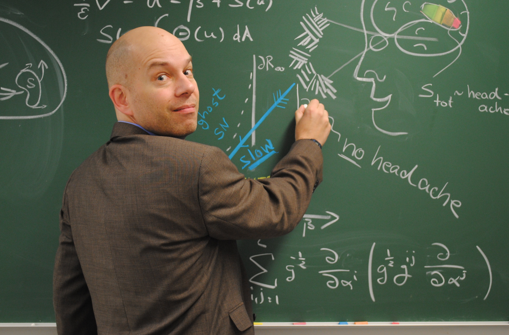
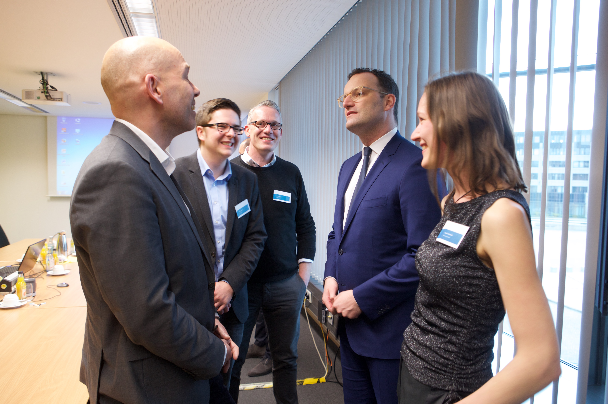

Link: vita-markus-dahlem
Date: 01/22/2023
Menu: no

# Vita — Markus A. Dahlem
Seit Anfang der 1990er Jahren forsche ich über Migräne. Studiert habe ich Physik. Mein Ziel ist, mathematische Modelle zu entwickeln, die im Computer nachvollziehen, was im [Migränegehirn](https://www.altamirage.de/inhaltsangabe-migraenegehirn) vor sich geht und diese Modelle dann in klinisch anwendbares Wissen zu übersetzen. 2016 habe ich die Hochschule verlassen, um ein eigenes Unternehmen zu gründen.   

_Discovery_ und _Translation_ treiben mich als Wissenschafter bzw. Unternehmer an.  

Studiert habe ich in Aachen, Göttingen, Magdeburg Physik sowie in Salt Lake City (USA) mathematische Biologie. Danach hat mich meine Forschung in unterschiedlichste Fachgebiete verschlagen: unter anderem war ich am Max-Planck-Institut für Ernährungsphysiologie in Dortmund, in der Biomedizintechnik an der Landesuniversität von Campinas (Brasilien), an der Fakultät für Psychologie, Stirling University (Großbritannien), an der Universitätsklinik für Neurologie der Otto-von-Guericke Universität und am Zentrum für Lern- und Gedächtnisforschung, beide in Magdeburg, am Mathematical Biosciences Institute der Ohio State University, Columbus (USA), Gastdozent für Dynamische Krankheiten an der Technischen Universität Berlin und Humboldt Universität zu Berlin sowie zuletzt am Max-Planck für Physik komplexer Systeme. 

Jeder Ort, jedes Fachgebiet, wo ich tätig sein durfte, trug ein wenig zu meinen Fragen bei: wie kann ich am Computer Migräne simulieren, wie kann man Migräneattacken vorhersagen und was können wir therapeutisch daraus lernen?

Im Jahr 2003 habe ich mit Dr. med. Kluas Podoll die **Migräne Aura Stiftung** gegründet. Die Stiftung erstellt medizinische Informationen und Materialien, die Migränepatienten dabei helfen, ihre neurologischen Symptome während der Migräne zu erkennen und zu verstehen und so mehr Verantwortung für ihre Gesundheit zu übernehmen. Als die Allgemeine Datenschutzverordnung (GDPR) in Kraft trat, mussten wir die Website der Stiftung vorsorglich offline nehmen.

Anfang 2016 habe ich mit Stefan Greiner, Simon Scholler und Martin Lysk das Berliner Startup **Newsenselab** gegründet. Wir entwickelten eine digitalen Therapie für Migräne und Kopfschmerzen, die als DiGA **M-sense Migräne** (eine "App auf Rezept") im Dezember 2020 zugelassen wurde — für 15 Monate. Eine klinische Studie zeigt nicht die erwarteten Ergebnisse. Ende 2023 musste ich Insolvenz anmelden — mein Fazit: in 8 großartigen Jahre viel an Erfahrung gewonnen.

<!--
[Innovation trifft Politik](https://www.bundesgesundheitsministerium.de/ministerium/meldungen/2019/innovation-trifft-politik-in-bonn.html)
-->

<!--
Anfang der Jahrtausendwende postulierte ich den Nutzen und Zugewinn an Bedeutung von Algorithmen, sei es in der Neuromodulation, für sogenannte Elektrozeutika (auch als bioelektronische Arzneimittel umschrieben) oder digitaler Therapeutika (DTx, in Deutschland besser bekannt als DiGA: Digitale Gesundheitsanwendung). Es sind die algorithmischen Funktionen einer Software in Medizinprodukten, die auf intelligente Art und Weise Krankheiten therapieren können. Das Wirkprinzip entspringt also nicht der Hardware allein. Ganz im Gegenteil, in einige Fällen ist eine spezielle Hardware als Medizinprodukt gar nicht notwendig und der Erkrankte kann einfach sein Smartphone nutzen. Die Software selbst wird zum Medizinprodukt. In diesem Fall sprechen wir nicht mehr von Elektrozeutika, sondern von digitalen Wirkstoffen oder einfach von digitalen Pillen, die der Arzt als “App auf Rezept” verschreibt.     

Als ein Beispiel führe im neusten, internationalen Lehrbuch der Migräne[^1] einen weiteren Vorteil  von Computermodellen an, nämlich den gegenüber den Tiermodellen der Migräne. Tiermodellen eröffnen keinen personalisierten Weg zu Elektrozeutika und digitalen Wirkstoffen. Nicht nur in den Fachgesellschaften, auch in den Medien sind meine Forschungsarbeiten vielfach beachtet worden (s. Auflistung [Medienresonanz](https://www.altamirage.de/medienresonanz)).

Über 50 eingeladene Vorträge habe ich in den letzten 10 Jahren über Migräne gehalten, mehr als 40 Fachpublikationen und mehrere Buchbeiträge veröffentlicht. Seit 2009 schreibe ich mit viel Freude das Wissenschaftsblog Graue Substanz mit über 200 Beiträgen über Migräne aus der Forschungsperspektive.

## Fußnoten

[^1]: Neurobiological Basis of Migraine, Dalkara und Moskowitz [Herausgeber], John Wiley & Sons Inc, Erscheinungsdatum 25. Juli 2016.

-->