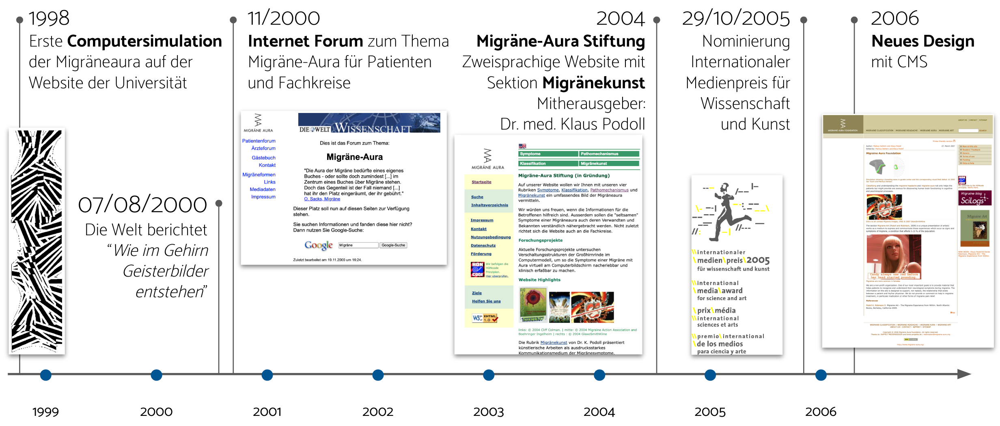

Link: migraene-aura-stiftung

# Migräne Aura Stiftung

1998 stelle ich erstmals eine Computersimulation zu Migräneaura ins Interent und seit 2004 wurde daraus die _Migräne Aura Stiftung_. Gegründet habe ich diese gemeinsam mit dem Neurologen Dr. Klaus Podoll (Uniklinik Aachen), der leider 2019 völlig unerwartet verstarb. 

 Die Stiftung stellt Zeichnungen und Animationen der visuellen Migräneaura sowie viele andere Dokumente über die Migräneaura im Internet zusammen und erstellt auch eigene medizinische Informationen, die Migränepatienten dabei helfen, ihre neurologischen Symptome während der Migräne zu erkennen und zu verstehen und so mehr Verantwortung für ihre Gesundheit zu übernehmen. 
 
 Als die Allgemeine Datenschutzverordnung (GDPR) 2016 in Kraft trat, mussten wir die Website der Stiftung vorsorglich offline nehmen.

Die Website wird gerade überarbeitet und soll noch in diesem Jahr wieder online gehen.

