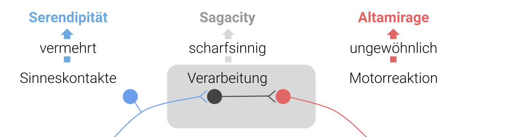
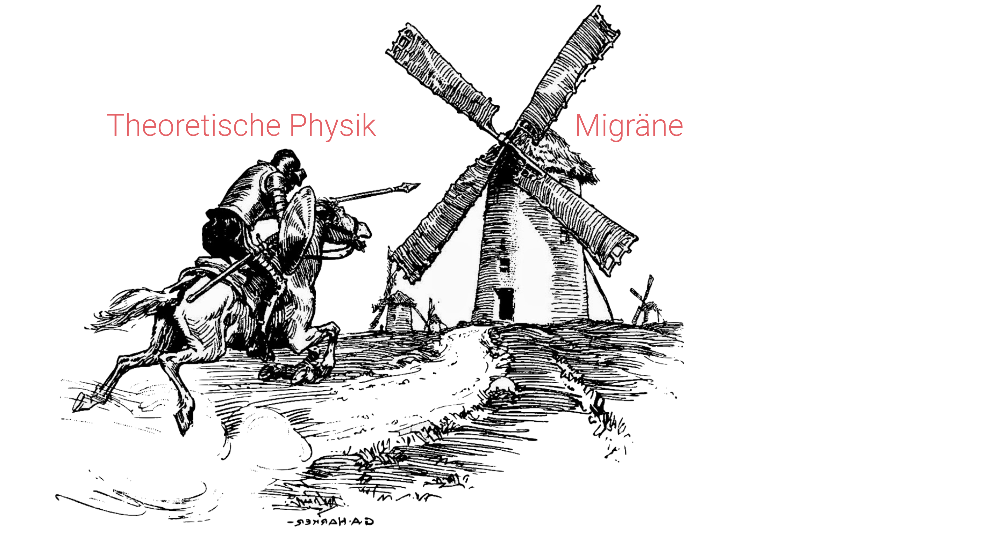

Date: 01/29/2023
Link: was-ist-altamirage
Bibliography: /altamirage_bibliography.bib

# Was ist Altamirage? 

**Altamirage ist eine Variante der glücklichen Entdeckungen, die bei ungewöhnlichen Tätigkeiten entsteht. Altamirage ist nicht nur weniger bekannt als die verwandte Idee der Serendipität, sondern kommt bisher fast nur im Bereich der Neurologie vor, wo sie ihren natürlichen Ursprung hat.**

Der Begriff Altamirage wurde vom Neurologen und Zen-Praktizierenden James H. Austin eingeführt, um eine Variante des glücklichen Zufalls zu beschreiben, die entsteht, wenn jemand ausgefallenen Tätigkeiten nachgeht und dabei über Serendipität hinaus geht.[^1] Serendipität bezeichnet das Zufallsprinzip, bei dem unerwartete Entdeckungen gemacht werden. 

Ein typisches Beispiel für Serendipität ist die Entdeckung Amerikas auf der Suche nach einem neuen Seeweg nach Indien. Eine andere Variante von Serendipität benötigt zudem Scharfsinn, um "zufällig" zu entdecken, dass gerade etwas interessantes passiert ist. Mit anderen Worten, die überraschende Wendung offenbart sich nicht von allein. Beispiele findet man, wenn man nach Penicillin, Mikrowellen, Post-it u.v.m. sucht.[^2] Als Neurologe verstand Austin, dass Serendipität, die gewöhnlich durch Exploration und Scharfsinn hervorgerufen wird, nicht alle Variationen der zufälligen Entdeckungen abdeckt. 

## Zufallsentdeckungen durch Sensorik und Motorik

"_Neurologen fühlen sich mit diesem Konzept_ \[Altamirage\] _wohl, da ein Großteil des Nervensystems, mit dem wir arbeiten, aus anatomisch getrennten sensorischen und motorischen Einheiten besteht._" schreibt Austin.[^3] Betont wird also, dass eine Entdeckung als Verarbeitungsprozess durch das Gehirn[^4] im ersten Schritt zwar immer auf der sensorischen Aufnahme von Signale beruht. Doch muss auf die Verarbeitung abschließend auch eine motorische Reaktion folgen, um den Informationsfluss zu vervollständigen: Man sieht die Ampel von rot auf grün umschalten, erkennt die Bedeutung und überquert die Straße.[^5]

Wenn die entscheidende Rahmenbedingung die spezifische Motoraktion ist — Austin spricht von "_highly individualized action_" mit der Betonung auf Aktion nicht Reaktion — nennt man zufällige Entdeckungen Altamirage. 

Für die Beispiele oben (Penicillin, Mikrowellen, Post-it u.v.m.) wird vor allem Scharfsinn benötigt. Dieser Scharfsinn wird in dem Zusammenhang als Sagacity bezeichnet.[^6]  Die Entdeckung Amerikas war hingegen möglich aus der "Bewegung" allein. Columbus hatte jedoch nicht bloß blankes Glück, sondern war ein umtriebiger und mutiger Mensch. Eine Entdeckungsfahrt benötigt beides. An sich ist eine Reise aber keine ungewöhnliche Tätigkeit, sondern im Gegenteil der Modus Operandi für die Entdeckung eines neuen Erdteils oder auch für Entdeckungen in einer Terra incognita. 

## Neurologie kombiniert mit  Literatur und Physik

Altamirage grenzt sich genau hier von den beiden Arten der Serendipität ab, weil es die Rolle der ungewöhnlichen Tätigkeit voraussetzt. Altamirage ist das Glück, das man erfährt, wenn man sich ein eigenes Terra incognita erst selbst erschafft und dann auch eintritt. Bisher ist das Konzept vor allem in der Neurologie bekannt.

Der Neurologe Andrew J. Lees ist mit dem Konzept der Altamirage durch seine Bücher "_Brainspotting_" und "_Mentored by a Madman_" in Verbindung gebracht worden.[^7] Oder auch der Neurologe [Oliver Sacks](https://www.altamirage.de/oliver-sacks-1933-2015). Beide hielten sich nicht  an die klassisch evidenzbasierte Beschreibung der Krankheiten publiziert ausschließlich in Peer Review Journalen, sondern orientierten ihre ärztliche Tätigkeit auch immer an der Persönlichkeit des Patienten und schrieben populärwissenschaftlich erscheinende Bücher, die jedoch zurückwirken auf die Neurologie. So kommt Lees zu dem Schluß: "_Es ist an der Zeit, dass die Grenze zwischen Wissenschaft und Literatur, eine rein willkürliche Grenze, aufgehoben wird._"

Auch mein Beispiel — meine berufliche Tätigkeit und warum ich dieses Blog so nenne, hängt mit der Neurologie zusammen. Es geht aber nicht um eine Verbindung über Literatur – auch wenn ich gerne schreibe –, sondern um Physik. Wenn ich mit theoretischer Physik als methodische Rahmenbedingung die Migräne erforsche, ist das sicher erstmal eine ungewöhnliche Tätigkeit.[^8]  

Wohin soll das führen, mag man fragen? Nun ist das Nicht-Wissen natürlich das Wesen der Forschung. Altamirage ist jedoch unter anderem auch dieses quixotische Abraham-Maslows-"Law of the Instrument"-zum-Feature-erheben. Wenn man nur einen Hammer hat, sehen alle Probleme wie ein Nagel aus. Altamirage sagt: Na und? Feature it! Wenn man zum Beispiel versucht, mit einem Hammer, statt mit einem Maßband, Längen zu messen, sind alle zufällige Entdeckungen während dieser Tätigkeit im Bereich der Altamirage und nicht der Serendipität.[^9] 

Am Ende kann ich das Wesen der Unterscheidung vielleicht auch so zusammenfassen:  
- Serendipität ist, wenn der Zufall das Leben prägt.   
- Altamirage ist, wenn das Leben den Zufall prägt.

Die vier Variationen des Glücks, einschließlich des blanken Glücks, werden [hier](die-vier-variationen-des-gluecks).

Das Fazit überlasse ich Austin — vielleicht nicht so sehr Austin, den Neurologen, sondern Austin, den Zen-Praktizierenden — mit diesem von mir verdichteten Zitat aus seiner Publikation in Medical Hypotheses:

"_Verlasse dich nicht auf dein Glück.  Schließe Glück auch nicht aus. 
Das Wissen um die Arten des Glücks kann beitragen, dass man nichts tut, 
was Glück abschreckt._"   
— James H. Austin, Neurologe und Zen-Praktizierender

## Fußnoten

[^1]: Austin, JH. 1979. “The Varieties of Chance in Scientific Research.” Medical Hypotheses 5 (7): 737–41.
[^2]: Für mehr zu "Serendipität" siehe [Wikipedia](https://de.wikipedia.org/wiki/Serendipit%C3%A4t) oder auch Rheinberger, Hans-Jörg. 2014. “[Über Serendipität–Forschen Und Finden.](https://www.fink.de/display/book/edcoll/9783846756232/B9783846756232-s012.xml)” In Imagination, 233–43. Brill Fink.
[^3]: Eigene Übersetzung, im Original: "_Neurologists may be a little more comfortable with the concept because so much of the nervous system we work with exists as anatomically separate sensory and motor divisions._"
[^4]: Beachte die Wichtigkeit der Präposition "durch"; eine effektive Informationsverarbeitung endet nie _im_ Gehirn, sondern geht als Prozess durch das Gehirn _hindurch_.
[^5]: vgl. Baehr, Mathias, and Michael Frotscher. 2003. “Duus Neurologisch-Topische Diagnostik: Anatomie, Funktion, Klinik.” 
[^6]: Der Zusammenhang der über "Sage", den Weisen, verdeckt etwas den direkten etymologischen Zusammenhang zu den scharfen Sinnen.  
[^7]: Araújo, Rui. 2022. “Altamirage and the Art of Clinical Neurology.” The Lancet Neurology 21 (6): 510.
[^8]: Und vielleicht noch ein bisschen ungewöhnlicher, wenn bedenkt, dass ich selbst nicht an Migräne erkrankt bin. 
[^9]: Man könnte zum Beispiel das Konzept der [fraktale Dimension](https://de.wikipedia.org/wiki/K%C3%BCstenl%C3%A4nge#Vergleich_mit_Fraktalen) entdecken, wenn man mit zwei Hämmern unterschiedlicher Größe eine Küstenlinie in Vielfachen der beiden Längen der Hämmer abmessen wollte. Man bekommt zwei unterschiedliche Ergebnisse. Neugierig nimmt man einen dritten, noch kleineren Hammer, misst erneut und entdenkt vielleicht das Konzept der fraktalen Dimension — wenn es nicht schon längst entdeckt worden wäre.