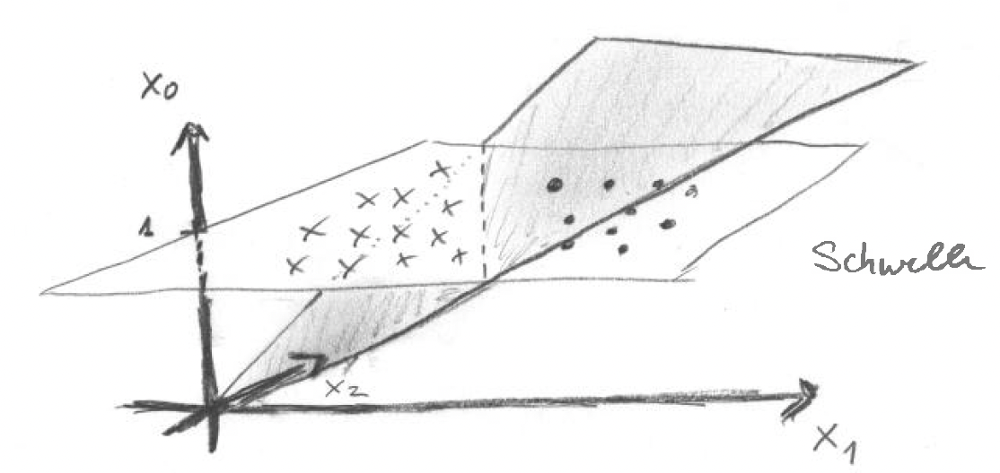

Link: statistische-physik-und-das-gehirn
Bibliography: /altamirage_bibliography.bib

# Statistische Physik und das Gehirn

**Die Teilgebiete der Physik enstanden ursprünglich, um die Sinneswahrnehmung zu verbessern. Akustik verbessert Hören. Optik verbessert Sehen. Physik verbessert das Gehirn – dies wirft eine Frage auf: Kann ein Teilbereich der Physik entstehen, dessen zentrale Aufgabe es wäre, eine neurologische Fehlfunktion zu therapieren? Die Antwort lautet: Ja, er ist bereits entstanden. Impressionen einer Vorlesung zu der Thematik.**

Natürlich werden in der modernen Physik Teilgebiete nicht mehr nach Anwendungsgebieten eingeteilt. Das Teilgebiet der Physik, das uns eine Methodik an die Hand gibt, um neurologische Fehlfunktion zu therapieren, existiert schon lange: es ist die Thermodyanmik. Fern des thermodynamischen Gleichgewicht können sogenannte dissipative Strukturen entstehen, deren Entstehung und Zerstörrung von der Physik erklären werden kann. Die Migränewelle ist so eine 
dissipative Struktur.

Dieser Zweig der Physik ist heute für einen aufkommender Industriezweig hochspannend: Digital Therapeutics (DTx). DTx nimmnt in Deutschland mit den digitalen  Gesundheitsanwendungen (»App auf Rezept«) eine Vorreiterrolle ein. <!--Welche Ausbildung durchlaufen Menschen, die künftig in Forschung und Entwicklung (FuE) solcher DTx Unternehmen arbeiten werden? -->

Ein DTx Unternehmen ist in erster Näherung ein digital pharmazeutisches Unternehmen. Statt bei der gezielten Suche nach Wirkstoffen auf eine Molekularstruktur zu schauen, muss FuE anderes "lesen" können: Objekte im Phasenraum. Denn DTx koppelt nicht Moleküle an Rezeptoren, sondern sensorische Reize an [physiologische Regelkreise](https://www.altamirage.de/physiologie-lehrbuch), die im Sinne einer Systemwissenschaft in Phasenräumen beschrieben werden.

Daher ist aus meiner Sicht[^1] eine Ausbildung in der Physik oder angewandten Mathematik eine solide Grundlage. Mehr als visuelle Impressionen, die diese These stützen, sollen an dieser Stelle nicht geliefert werden.

Zwei Beispiele zu Beginn. Weitere folgen dann [hier](https://www.altamirage.de/tagged/impressionen).

## Beispiel neuronales Netzwerk

Als Einstieg nehme ich ein neuronales Netzwerk. Das ist eine einfache Version: $$y_k=\Theta(\sum^m_{j=0}\omega_{kj}x_j)$$.

Kann die Abstraktion so einer Formel ein mentales Bild erzeugen? In machen Lerntypen sicher, wobei das Konzept der Lerntypen sehr vereinfacht erscheint.[^2]

Mir hilft eine mathematische Gleichung für das Verständnis erst nach viel Übung und in Komination mit an sich redundanter Information, die ich aber durch eine Visualisierung der Gleichung in einer Graphiken leichter verarbeite.

Wer also, wie ich, visuell-graphisch Informationen besser aufnimmt, der erkennt in der folgendes Zeichung schneller, was mit der Einführung einer Schwelle in einem neuronalen Netzwerk passiert. 

In der Zeichnung wird veranschaulicht, wie eine Schwelle, die mathematisch über die Bedinung  $$x_0\equiv 1$$ definiert wird, in einem neuronalen Netzwerk "funktioniert" und warum sie nötig ist. 

Ohne jetzt den Anspruch zu erheben, es exakt herzuleiten: Mit so einer Schwelle können neuronale Netze lernen, Kategorien (Kreuze und Punkte), die linear separierbar sind, zu trennen. Neuronale Netze basieren auf Matrizenmultiplikation. Matrizenmultiplikation sind vereinfacht gesagt immer Drehungen, wobei der Drehpunkt im Ursprung des Koordinatensystems liegt. Nun muss die Trennlinie durch die Kategorien nicht durch den Ursprung laufen. Schon bekommt das neuronale Netz ein Problem — es sei denn, wir heben die Daten auf eine höhere Ebene, auf $$x_0\equiv 1$$.[^3] Jetzt kann die Trennebene (grau schattiert) die Ebene $$x_0\equiv 1$$ mit einer Trennlinie (gestrichelt) durchschneiden, die nicht durch den Ursprung laufen muss, und so die Kategorien linear separiert.

Soetwas "sehe" ich nicht, wenn ich auf $$y_k=\Theta(\sum^m_{j=0}\omega_{kj}x_j)$$ schaue. Leider.

## Beispiel Phasenraum

Die Mathematik für das Beispiel oben des neuronales Netzwerk lernt man in vielen Studiengängen. Das nächste ist schon spezifischer für Physik. 

Die Physik arbeitet ständig mit Zustands- bzw. Phasenräumen. Insbeosndere in der Mechnsik aber auch in der Thermodynamik gibt es Größen, wie die innere Energie, die eine Funktion auf dem Phasenraum eines thermodynamischen Systems sind. 

Wieder kann an dieser Stelle keine Herleitung erfolgen. Es soll aber eine Analogie aufgezeigt werden. In der Pharmaindustrie wird die Medikamentenfähigkeit (english drugability) untersucht. In einem DTx Unternehmen als digitales Pharmaunternehmen entspricht die drugability der DTx-ability oder dtxability (ausgesprochen tics-ability) und bezieht sich auf Strukturen im Phasenraum. Schon der erste Beitrag in der Grauen Substanz berichtete von einer solchen Struktur: »[Geist einer Sattel-Knoten-Verzweigung](https://www.altamirage.de/geist-einer-sattel-knoten-verzweigung)«

## Die Vorlesung

Im Wintersemeseter 2011/2012 las ich an der TU Berlin die Vorlesung Statistische Physik I, die genau solche Konzepte sich erarbeitete.

Im letzen Fünftel der stand die Anwendung der statistischen Physik auch dynamische Erkrankungen. Migräne und viele andere Erkrankungen des nervensystems sind dynamische Erkrankung.

Viele Teilgebeite der Physik enstanden, um das Funktionen des Menschen zu verbessern, insbesondere die seines Gehirns. Die Akustik verbessert das Hören. Die Optik verbessert das Sehen. Die Mechanik die Muskelkraft. Sogar die Thermodyanik war inspireit über die Wärmeproduktion im Körker und die Verbindung der Muskelkontraktion. Kann die statistische Physik Kopfschmerzen verbessern?

Weiter visuelle [Impressionen](https://www.altamirage.de/tagged/impressionen) aus der Vorlesung.

## Literatur

- W. Nolting, Theoretische Physik 6, (Springer)
- L. D. Landau, E. M. Lifschitz, Statistische Physik (Akademie Verlag)
- Modern Thermodynamics: From Heat Engines to Dissipative Structures, Dilip Kondepudi, I. Prigogine (Wiley;)
- Probability and Heat: Fundamentals of Thermostatics, Friedrich Schlögl (Ballen Booksellers)
- Mathematical Foundations of Neuroscience, G. Bard Ermentrout & David H. Terman (Springer)
- Mathematical Physiology, James Keener, James Sneyd (Springer)
- Nonlinear Oscillations, Dynamical Systems, and Bifurcations of Vector fields, J. Guckenheimer, P. Holmes (Springer)
- Statistical Physics: Statics, Dynamics and Remormalization, Leo P. Kadanoff, World Scientific
- Statistical Mechanics: Rigorous Results, David Ruelle, World Scientific
- Lectures On Phase Transitions And The Renormalization Group (Frontiers in Physics), Nigel Goldenfeld, Westview Press

## Fußnoten

[^1]: Also die Meinung von jemandem, der selbst ein DTx-Unternehmen gegründet und aufgebaut hat. <!-- eine FuE Abteilung eines der weltweit größten DTx Unternehmen leitet--> 
[^2]: Aufenanger, Stefan. 2022. “Verführerisch Simpel: Der Mythos von Den Lerntypen.” On. Lernen in Der Digitalen Welt 2022 (10): 32–33.
[^3]: Ohne diesen Trick gäbe es keine schnellen animierten Computergraphiken; siehe homogene Koordinaten bzw. projektive Geometrie. 