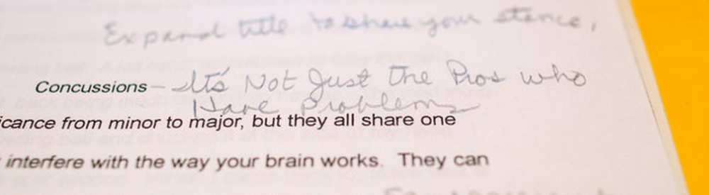
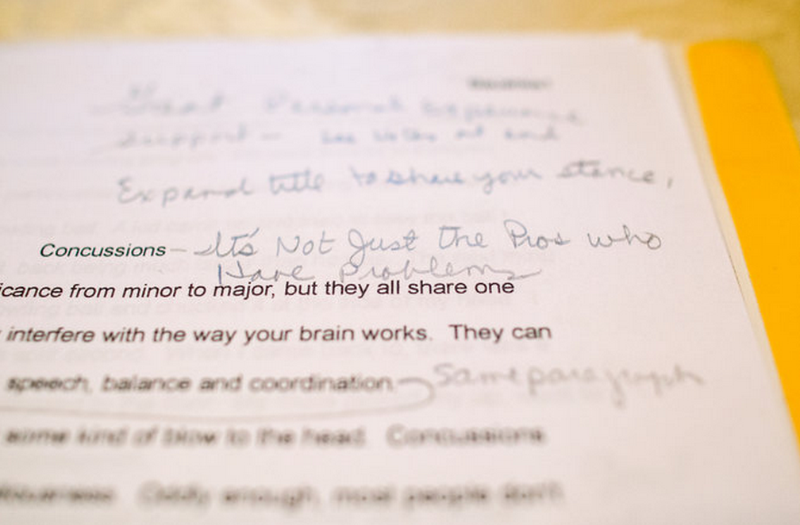

Date: 06/23/2015
Link: gehirnerschuetterungen-im-sport-nicht-nur-profis

# Gehirnerschütterungen im Sport – Nicht nur Profis haben Probleme

Gehirnerschütterungen, so überschrieb Curtis Baushke seinen Aufsatz und fügte später handschriftlich hinzu: „Es sind nicht nur die Profis, die Probleme haben.“ Gestern berichtete die New York Times über Curtis: Er spielte Fußball, weil er Fußball für den vermeintlich sichereren Sport hielt. Curtis stellte seine – richtige, wie sich im nachhinein herausstellte – Selbstdiagnose nach Informationen aus dem Internet. Und Curtis starb vor einem Jahr, am 16 Juni, 2014, im Alter von 24 Jahren.

Als fünf Jahre vor seinem Tod Curtis Baushke diesem Aufsatz über Gehirnerschütterungen schrieb, erinnerte er sich, dass er in den 14 Jahren, die er Fußball spielte, dreimal bewusstlos wurde, zweimal nachdem er zum Kopfball ansetzte und – „WHAM“ – stattdessen mit einem anderen Spieler kollidierte. Die anhaltenden Nebenwirkungen, schrieb er, schlossen „schreckliche Migräne-Kopfschmerzen“ ein, so erfahren wir es [aus der New York Times](https://www.nytimes.com/2015/06/22/sports/an-athlete-felled-by-concussions-despite-playing-a-safer-sport.html).

Curtis Baushke starb an einer versehentlichen Überdosis verschreibungspflichtiger Medikamente. Die New York Times geht näher auf seine Kranken- und Behandlungsgeschichte ein. Doch ist es nicht angebracht, nun auf Basis letztlich unvollständiger Informationen diese auszurollen.

Fakt ist, dass seine Familie Curtis’ Gehirn einem Forschungszentrum in Boston zur Erforschung der chronisch traumatischen Enzephalopathie (CTE) zukommen lies. Dieser Gehirnbank [spendeten schon mehrere Sportler ihr Gehirn](https://www.altamirage.de/sportler-spenden-ihre-gehirne). Dort wurde das Ausmaß der Schädigung von Curtis Gehirn als CTE Stadium II klassifiziert (von insgesamt vier Stadien). In diesem Stadium treten Kopfschmerzen auf, aber auch Aufmerksamkeits- und Konzentrationsstörungen, Stimmungsschwankungen, Kurzzeitgedächtnisverlust und Sprachprobleme. Weniger häufig können auch Selbstmordgedanken aufkommen. In der Regel beginnen diese Störungen 8-10 Jahre nachdem wiederholende, leicht traumatische Hirnverletzungen durch Gehirnerschütterungen auftraten [1].

In der Öffentlichkeit ist CTE noch weitgehend unbekannt. Im Juni 2014 schrieb ich meinen ersten Blogbeitrag über CTE und die Sportler, die ihr Gehirn spendeten. Mit Fußball verband ich das Thema zunächst nicht, obwohl gerade die WM lief. Auch ich hielt Fußball für vergleichsweise harmlos. Aufmerksam wurde ich, weil CTE auf dem 56. Jahrestreffen der amerikanischen Headache Society (AHS) ein Thema war und auch [auf dem Workshop, den ich gerade für Juli 2014 organisierte](http://www.fields.utoronto.ca/programs/scientific/14-15/neurovascular/depression/), würden mathematische Modelle für die Schäden durch Gehirnerschütterung vorgestellt.

Im Oktober schrieb ich dann nochmal einen Beitrag, nachdem ich einen Bericht im „New Yorker“ las. Dort wurde CTE als die „[Kosten der Kopfbälle](https://www.altamirage.de/kosten-der-kopfbaelle)“ bezeichnet und der Bericht brachte die populärste Sportart der Welt ins Spiel – und auch die Multi-Milliarden-Dollar-Industrie, die dahinter steckt. Später folgten zwei weitere Blogbeiträge über CTE: Die Kultur in der Welt des Sports spielt die Bedeutung der Gehirnerschütterungen herunter, so der Vorwurf eines Betroffenen; mein eigenes Fazit war, nachdem ich alle Vereine der ersten Bundesliga anschrieb, dass die neue FIFA-Regel niemand wirklich zu interessieren scheint. Sie wurde nach der WM zum Schutz vor CTE eingeführt. Diese „Drei-Minuten-Regel“ gilt jedoch bisher nur für internationale Spiele und selbst bei diesen habe ich noch nie gehört, dass von ihr Gebrauch gemacht wurde.

Die Einführung der „Drei-Minuten-Regel“ geht wohl insbesondere auf ein zentrales Ereignis zurück. Als Christoph Kramer im WM-Finale nach seinem Zusammenprall und Kopf-gegen-Kopf-Stoß mit Ezequiel Garay Zusammenbrach, sahen allein in Deutschland 34,65 Millionen Menschen wie Hans-Wilhelm Müller-Wohlfahrt und der Physiotherapeut Klaus Eder ihn mehr getragen als gestützt vom Platz brachten. Es war eigentlich völlig klar, Christoph Kramer hätte in dem Moment nie und nimmer wieder wieder zurück auf den Platz gedurft. Ich maße mir hier nicht an, die Diagnose zu beurteilen. Aber Fußballprofis sind Vorbilder. Jugendliche sehen, dass Profis einfach weiterspielen. Kramers Frage: „Schiri, ist das das Finale?“ wird dann nur allzu leicht in eine Situationen umgedeutet, in der man seinen Mann stehen muss, als dass Jugendliche es für das sehen, was es wirklich ist, das traurige Bild eines Schwerverletzten. Curtis Baushke kannte sich mit dem den Folgen von Gehirnerschütterungen gut aus. Er forscher selber nach und wollte Sportreporter werden. Am Tag als er starb, spielte die USA ihr erstens Gruppenspiel in der WM 2014.

