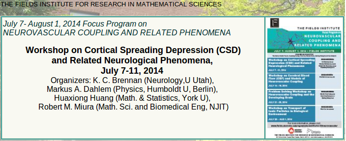

Link: klopfschmerzen-nach-gehirnerschuetterung-im-sport
Date: 06/27/2014

# Kopfschmerzen nach Gehirnerschütterung im Sport

**Sehe ich bei der WM Thomas Müllers Platzwunde am Kopf, fällt es mir wieder mal auf. Das Thema Gehirnerschütterung, posttraumatischer Kopfschmerz und Migräne ist im deutschen Fußball noch tabu. Bei mindestens hunderttausend sportbezogenen Gehirnerschütterungen pro Jahr in Deutschland sollte sich das ändern. Bisher wird man aber nur in Amerika nach einem Migräneanfall vom Fußballplatz getragen.**

Der Bezug zur WM darf auch auf einer Kopfschmerztagung nicht fehlen. Er kam mit der vierten Twitter-Umfrage beim 56th Annual Scientific Meeting der American Headache Society gestern Abend.<!--(siehe vorherige Beiträge hier und hier).-->

<blockquote class="twitter-tweet">
Q4: If even retired <a href="https://twitter.com/NFL?ref_src=twsrc%5Etfw">@NFL</a> players are having difficulty finding good <a href="https://twitter.com/hashtag/migraine?src=hash&amp;ref_src=twsrc%5Etfw">#migraine</a> care, is there any hope? <a href="https://twitter.com/hashtag/AHS14LA?src=hash&amp;ref_src=twsrc%5Etfw">#AHS14LA</a>
&mdash; American Headache Society (@ahsheadache) <a href="https://twitter.com/ahsheadache/status/482345171166580737?ref_src=twsrc%5Etfw">June 27, 2014</a></blockquote> 

„_Wenn selbst NFL-Spieler im Ruhestand Schwierigkeiten haben, eine gute Versorgung bei Migräne zu bekommen, gibt es da noch Hoffnung?_“ So lautet eine von sieben ausgewählten Fragen über Kopfschmerzen, die auf dem Jahrestreffen der amerikanischen Kopfschmerzgesellschaft öffentlich über Twitter an Experten auf der Konferenz gestellt wurden.

Warum werden die Spieler der NFL (US-amerikanische Profiliga im American Football) so zentral erwähnt? Süß die Hoffnung auf einen Retweet? Die NFL schlägt mit 6,8 Millionen Followern immerhin den Papst mit 4,18 Millionen deutlich.

## Nur in Amerika wird man nach einem Migräneanfall vom Fußballplatz getragen

So ganz abwegig, wie sie in Deutschland klingen muss, ist die Frage nicht. Im Gegenteil, die Aufmerksamkeit, die offensichtlich bezweckt werden sollte, ist nicht nur lobenswert, sondern in den USA im Sport nicht ungewöhnlich.

Es fällt mir nämlich schon seit langem auf, dass ich nahezu jede Woche in den US-Nachrichten von einem Profisportler lese, der wegen Migräne ausfällt. Im deutschen Fußball aber nie. Worüber ich schon [vor drei Jahren bloggte](https://www.altamirage.de/superheros-fight-migraines) und es hat sich bisher nicht geändert.

Einmal berichtete der Spiegel online 2009, dass der Schwede Fredrik Ljungberg nach einem Migräneanfall vom Platz getragen wurde. Aber da spielte Ljungberg auch schon in der nordamerikanischen Profiliga.

## Deutsches Tabuthema?

Hierzulande würde darüber nicht öffentlich berichtet werden. Ohne es anders als mit der Statistik belegen zu können, gehe ich davon aus, dass Vereine und/oder Manager in Deutschland anders als in den USA Spielern raten, eine Migräneerkrankung nicht öffentlich zu machen. Dabei stehen gerade Gehirnerschütterungen und Migräne in einem Zusammenhang. Was die Spieler vielleicht selbst nicht wissen. Eine Migräneerkrankung kann sich durch Gehirnerschütterungen verschlimmern und sich danach schlechter behandeln lassen.[^1]

Bei geschätzt hunderttausend bis eine Million schwer bis leichten, sportbezogenen Gehirnerschütterungen in Deutschland,[^2] sollte das Thema in der Öffentlichkeit stehen.

<blockquote class="twitter-tweet">
Angeschlagene Boxer sind die gefährlichsten Boxer :-) Jetzt geht`s in der KO-Runde richtig los. Ein Gruß an alle Fans <a href="http://t.co/3bJosZ50Dq">pic.twitter.com/3bJosZ50Dq</a>
&mdash; Thomas Müller (@esmuellert_) <a href="https://twitter.com/esmuellert_/status/482436041664909312?ref_src=twsrc%5Etfw">June 27, 2014</a></blockquote> 

Nicht nur auf dem gerade stattfindenden Jahrestreffen der American Headache Society steht das Thema wieder im Vordergrund. Auch auf unserem Workshop, den ich mit Kollegen in Toronto nächste Woche organisiere, schauen wir auf Gehirnmodelle, die diesen Zusammenhang beleuchten. Das Thema wird in der Forschung in Canada von den Sportligen unterstützt. (Wobei unser Workshop allein von dem Fields Institute finanziert wird.)

Dass in den USA Sportler dem Thema Migräne und Gehirnerschütterung eine hoher Aufmerksamkeit schenken, erklärt sich letztlich auch durch deren eigenes, langfristiges Interesse, denn die Forschung hinkt in diesem Feld hinterher.

[^1]: Seifert TD. Sports concussion and associated post-traumatic headache., Headache. (2013) 53:726-36. [doi:10.1111/head.12087](https://headachejournal.onlinelibrary.wiley.com/doi/10.1111/head.12087)

[^2]: Eine Publikation geht von 300,000 Gehirnerschütterung in der NFL aus und die in Fußpote 1zitierte Arbeit spricht von 3.8 Millionen sportbezogene Gehirnerschütterungen pro Jahr in den USA. Somit ergibt sich meine schnelle Schätzung für Deutschland.