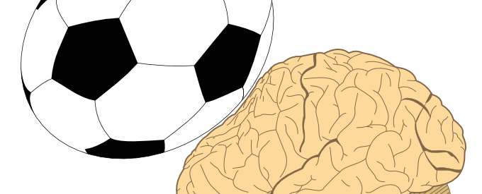

Link: kosten-der-kopfbaelle
Date: 10/05/2014

# Kosten der Kopfbälle

Falls Miro Klose 2038 verstirbt, könnte die Todesursache immer noch ein Arbeitsunfall gewesen sein. Es würden sich 2033 vielleicht erste Hirnschäden bemerkbar machen. So war der Zeitverlauf der chronisch traumatischen Enzephalopathie bei Jeff Astle, der wie Klose Spezialist für Kopfbälle war.

Die chronisch traumatische Enzephalopathie (CTE) ist heute noch weitgehend unbekannt in der Öffentlichkeit. Im „The New Yorker“ erschien gerade ein Bericht über die Kosten der Kopfbäll in einer Multi-Milliarden-Dollar-Industrie und bringt diese mit CTE in Verbindung. CTE ist auch bekannt als Boxer-Syndrom. Bleiben wir beim Fußball, erinnert man sich an Thomas Müllers Platzwunde am Kopf.

<blockquote class="twitter-tweet">
Angeschlagene Boxer sind die gefährlichsten Boxer :-) Jetzt geht`s in der KO-Runde richtig los. Ein Gruß an alle Fans <a href="http://t.co/3bJosZ50Dq">pic.twitter.com/3bJosZ50Dq</a>
&mdash; Thomas Müller (@esmuellert_) <a href="https://twitter.com/esmuellert_/status/482436041664909312?ref_src=twsrc%5Etfw">June 27, 2014</a></blockquote> 

Unvergessen in der deutschen Fullballgeschichte wird auch „Schiri, ist das das Finale?“ bleiben, also wie Christoph Kramer in der 17. Minute mit Ezequiel Garay zusammengeprallte  – und weiterspielte.

Punch-Drunk ist so ein Begriff, der CTE bildlich trifft.

Man muss diagnostische Feinheiten beachten. Muhammad Alis Leibarzt Ferdie Pacheco schreibt explizit in seinem Buch „Fight Doctor“, dass Ali nicht an CTE litt sondern an der Parkinson-Krankheit (Link). Dass CTE überhaupt eine erwiesene Krankheit sei, erscheint Autoren zumindest eines Artikels eine verfrühte Festlegung (Curr Sports Med Rep. 2014), die, solange nicht bessere epidemiologischen Daten vorliegen, in Frage gestellt werden sollte. Mir fehlt die Expertise, um den epidemiologischen Stand wirklich beurteilen zu können.

Noch weniger kenne ich mich im Fußball aus. Ob man nun Kopfbälle verbietet oder, wie z.B. in der Zeitschrift Forbes vorgeschlagen (If FIFA Cared, Here’s How They’d Fix This), erlaubt mehr als drei Spieler auszutauschen sowie einen unabhängigen Arzt am Spielfeldrand einzusetzen, das ist die eine Sache.
Dass Christoph Kramer fast eine Viertelstunde weiterspielte und dies nie eine ernsthafte öffentliche Diskussion hierzulande um diese Entscheidung im Besonderen und im Allgemein um die Sicherheit der Spieler hervorrief, ist mir unverständlich. Und vielleicht noch mehr, warum diese Diskussion gerade in einer amerikanischen Zeitschrift geführt wird. Oder ist das vielleicht doch nicht so unverständlich? Fußball oder Soccer ist dort sehr beliebt, wahrscheinlich einer der meist gespielten Sportarten überhaupt – bei Kindern, nicht im Profisport. In den USA gibt es die überfürsorgliche „soccer mom“.  Vielleicht deswegen?

Es geht dort um die Kosten der Kopfbälle für Kinder. Das sollte auch in Deutschland den Fußballvätern zu denken geben.

<blockquote class="twitter-tweet">
He is one hundred percent the best dad ♥ Noah and Luan have such a luck :) <a href="https://twitter.com/miroslavklose__?ref_src=twsrc%5Etfw">@miroslavklose__</a> <a href="https://twitter.com/sylwiaklose?ref_src=twsrc%5Etfw">@SylwiaKlose</a> <a href="http://t.co/tV9Gedb4kS">pic.twitter.com/tV9Gedb4kS</a>
&mdash; Miroslav Klose fp♥ (@Miro_Klose_fp) <a href="https://twitter.com/Miro_Klose_fp/status/491677123019829248?ref_src=twsrc%5Etfw">July 22, 2014</a></blockquote> 