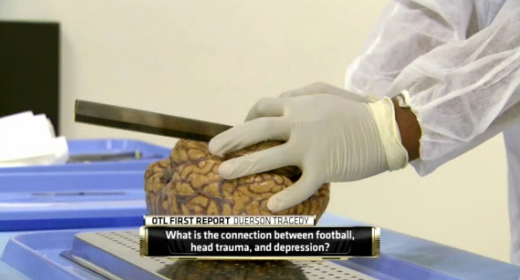

Link: sportler-spenden-ihre-gehirne
Date: 06/29/2014

# Sportler spenden ihre Gehirne

Posttraumatische Kopfschmerzen können einer Migräne ähneln. Sportler spenden ihre Gehirne einer Gehirnbank in Boston zur Erforschung der chronisch traumatischen Enzephalopathie.

David Duerson schickte eine SMS an seine Familie. Darin teilte er ihr mit, dass er sein Gehirn für die Forschung einem Zentrum in Boston vermacht. Dann schoss er sich in die Brust. David Duerson war Profisportler und starb im Alter von 50 Jahren wahrscheinlich an den Folgen seiner wiederholten, im Sport erlittenen Gehirnerschütterungen.

Duerson kannte das Zentrum zur Studie der traumatischen Enzephalopathie in Boston, dem mittlerweile viele ehemalige Athleten nach dem Tod ihr Gehirn vermacht haben.

Über eine neue Studie aus diesem Zentrum wurde nun auf der Jahrestagung der amerikanischen Kopfschmerzgesellschaft (American Headache Society, AHS) berichtet.

<blockquote class="twitter-tweet">
Dr Goldstein discussing former <a href="https://twitter.com/ChicagoBears?ref_src=twsrc%5Etfw">@chicagobears</a> &amp; Muncie, IN native Dave Duerson death &amp; hx of CTE <a href="http://t.co/eNPwHnspo9">http://t.co/eNPwHnspo9</a>
&mdash; American Headache Society (@ahsheadache) <a href="https://twitter.com/ahsheadache/status/482962024884748288?ref_src=twsrc%5Etfw">June 28, 2014</a></blockquote> 

Allan Purdey, der neu gewählte Präsident der AHS, bezeichnete diesen Vortrag über chronisch traumatische Enzephalopathie (CTE) als einen Höhepunkt der Tagung, was einmal mehr zeigt, Kopfschmerzen können nicht isoliert betrachtet werden. Posttraumatische Kopfschmerzen können z.B. ein migräneähnliches Krankheitsbild aufweisen. Was ist die Verbindung?

Die chronisch traumatische Enzephalopathie gehört zu den Tauopathien, d.h. es ist ein neurodegeneratives Krankheitsbild, das durch die Ansammlung des Tau-Proteins im Gehirn gekennzeichnet ist. Die Alzheimer-Krankheit ist auch so eine Tauopathie und man denkt wahrscheinlich sofort an Muhammad Ali.

Der SWR2 berichtete über Gehirnerschütterung im Sport schon vor einem Jahr und fasst weitere Sportarten zusammen. Ob nun Sportler oder nicht, nach einer Gehirnerschütterung gehört man zur Beobachtung ins Krankenhaus.