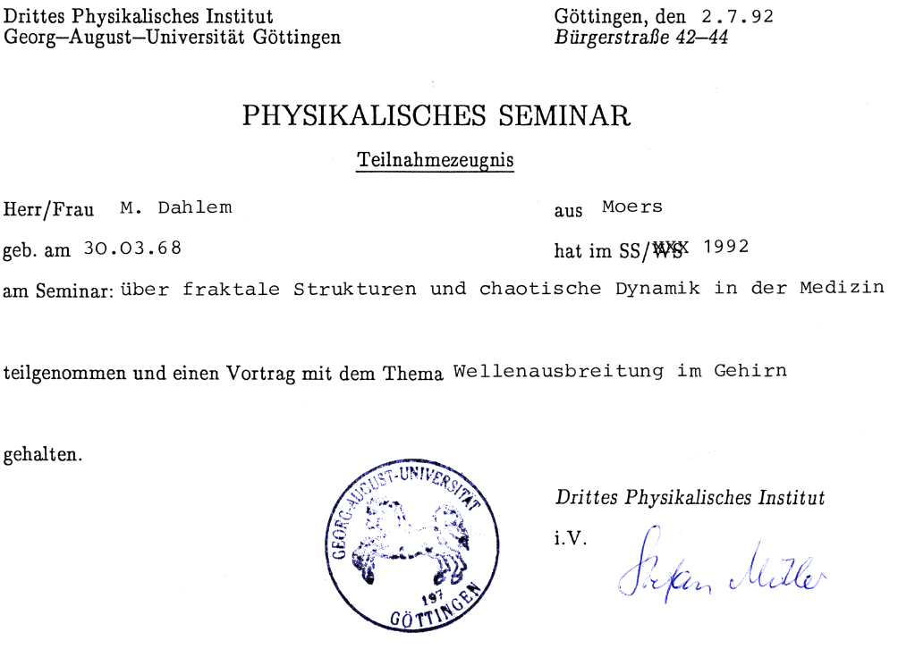
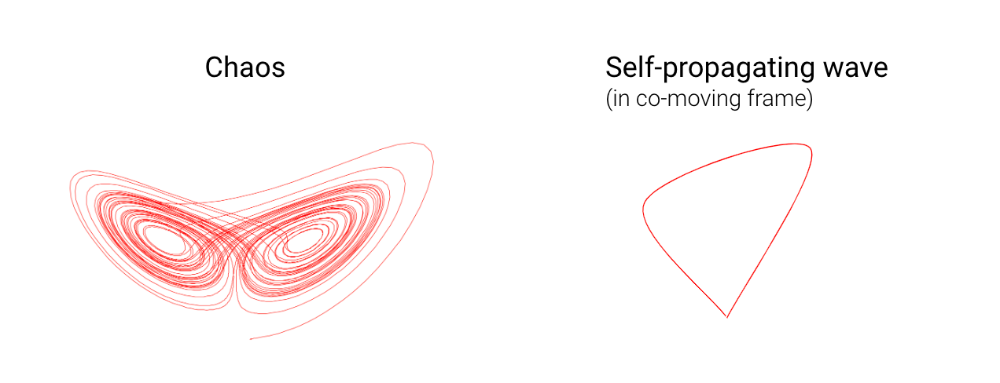
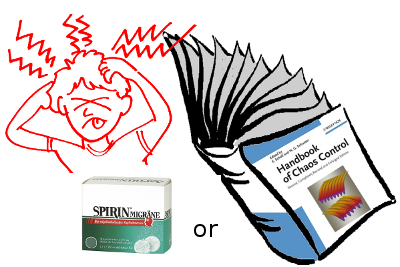

Link: migraine-and-choas
Date: 11/25/2009

# Migraine and Chaos

**Neural dynamics in the brain during migraine attacks is actually not chaotic but a self-organising pattern formation process. Chaos, that is, a situation where small changes lead to big consequences und thus unpredictable behavior, enters migraine research by investigating methods that were originally developed to describe (and later control) chaos. These methods can be adapted to control also the formation of other self-organising patterns, and therefore to explore novel migraine treatments.**

If you google the terms "_migraine_" and "_chaos_", you get a lot of hits like

- Migraine new perspectives from chaos theory
- Chaos Theory and Migraine Pathophysiology
- Chaos, Solitons & Fractals : Fractal rigidity in migraine

And you may get a link to my original blog post that I wrote on July 2nd, 2009 on my "M.A.D. Lab Blog". This new post here is essentially an updated version, as I first moved to SciLogs and many years later to Altamirage.[^1]

Both chaos theory and migraine are right in the focus of my research interest. So let me explain what chaos got to do with migraines from my point of view.

## Interdisciplinary migraine research

Let me start with how I entered this interdisciplinary research field. Interdisciplinary research is much driven by people being open minded. I own much gratitude to many people for their inspiring influence. One is Stefan C. Müller, who turned 60 this year. To honor his interdisciplinary work the journal Physica D just published a Festschrift, a Special issue: Emerging Phenomena, in which I wrote [a research article about self-propagating waves during migraine and stroke](http://dx.doi.org/10.1016/j.physd.2009.08.009). 

I learned about these self-propagating waves in the brain and its relation to migraine in 1991 from a theoretical physicist, Konrad Kaufmann, who was working with the late Otto D. Creutzfeldt at the Max Planck Institute for Biophysical Chemistry in Göttingen. The interdisciplinary approach in Creutzfeldt's lab fascinated me. Creutzfeldt talked about "the physics of the brain" when he meant its functional and anatomical structure. Thus, I started my master thesis on this topic.

At that time, Stefan C. Müller was working on this Habilitation in Göttingen. His lab, however, was at the Max Planck Institute for Molecular Physiology in Dortmund (at that time being called Max-Planck Institute for Nutrition Physiology). Stefan is an expert on self-propagating waves in chemical systems. When I asked him whether he would co-supervise my masters thesis, he agreeed and suggested that I should give a talk in Göttingen about such "brain waves". He organized a seminar about fractal structures and chaotic dynamics in medicine. After Creutzfeldt died early in 1992, I moved from Göttingen to Stefan's lab in Dortmund. 

On July 2nd, 1992, I got a "Seminarschein" (credit) on the topic "Chaotic dynamics in medicine: Wave propagation in the brain" from Göttingen University. It was my first talk given on migraine waves, a topic that never lost my interest.

## Chemical waves and brain waves

Before we can talk about chaos, I will first compare self-propagating chemical waves with a special self-propagating wave in the brain. The latter is called "cortical spreading depression" or simply the "migraine wave".

Chemical waves in the Petri dish and migraine waves in the cerebral cortex have one interesting property in common: their speed. These waves propagate both with a speed of several millimeters per minute. This is about 5 orders of magnitude slower than normal communication between neurons via nerve fibers with so-called action potentials. So if the normal transmission of a pain signal was that slow, it would take about half a day to feel the pain when something heavy falls on your foot. It does take about 20 minutes if this particular wave propagates at this pace through your visual cortex. This actually happens during migraine causing the so-called visual migraine aura symptoms before the headache starts. 

But what is a chemical wave? Chemical wave are concentration changes of reactants in a chemical solution that propagate as waves. For example, if these reactants are filled in a Petri dish. The local reaction dynamics of these reactants needs to be excitatory. Excitatory means that under the influence of a stimuli, the chemical reactions starts, meaing it changes concentrations but eventually the chemical reaction ends and – and this is the critical feature – all concentration are back to their pre-stimulation values! The Belousov–Zhabotinsky reaction is a classical example of such a excitable reaction. The details can only be understood within the theory of nonlinear dynamical systems.[^2]

Nonlinear dynamics is also the theoretical field we need to describe the phenomenon of "chaos" in mathematical terms. This is the link between chaos theory and migraine. And nothing more. There has in the last two decades to the best of my knowledge no indication surfaced that chaotic dynamics occur during migraine. Only the mathematical framework in which self-propagating waves and chaos are described is the same.

By the way: the second edition of Oliver Sacks book Migraine, published in 1992, has a whole new section called »Migraine as a Universal«. It was written together with Ralph M. Siegel. This sections is devoted to exploring migraine in relation to chaos and pattern-forming dynamics.

## Migraine, chaos,  mockingbirds, and the king of animals

So saying that migraine dynamics is chaotic is like saying the king of the animals is the mockingbird based on the following argument:

The king of the animals, when he becomes mature, leaves his family and takes over a new pride to mate, causing gene flow. Genetic flow is the transfer of genes from one population to another, a mechanism Charles Darwin noticed observing mockingbirds. Thus the king of the animals is the mockingbird.

At some point, you got it wrong.

Now imagine you are a scientist working on evolution theory and you happened to be specialized in lions and mockingbirds. One day you goggle "king of animals and mockingbirds" and find some surprising hits stating "the mockingbird is the king of the animals". Quickly, you realize the mistake being made. Things got mixed up as both species are excellent examples demonstrating gene flow. But then you dig deeper. You find complex arguments supporting the statement like, "yes it is true, you know, birds are ancestors of the dinosaurs, these creatures were really strong animals ..." and no mentioning of gene flow anywhere.

At that point you decide to write a blog post "The king of animals and the mockingbirds".

## (Almost) everything is non-linear or "_non-elephant zoology_"

Now we need also the elephant. But first back to self-propagating waves and chaos.

A self-propagating wave and chaos are just two different species living in what we phycisists call phase space. If you are unfamiliar with this terminology, you may as well thing of species in the savanna. The savanna is a space I actually do not know well. Anyway, for both species to exist certain mathematical properties must be given, foremost having nonlinear dynamics. Like both lions and mockingbirds need gene flow to evolve. In phase space, chaos (left in figure) looks different from waves (right). In the savanna, lions look different from mockingbirds. It is not that complicated, is it?[^3]

Well, chaos theory is often just used as another term for nonlinear dynamics. This is a bit like saying: survival of the fittest is natural selection. Both statements are incomplete and misleading. But they are not as wrong as saying the king of the animals is the mockingbird, or migraine dynamics is chaotic. Chaos is simply a trademark of nonlinear dynamics, it is well known to the public.

## So what is nonlinear dynamics?

First of all, the term is rather vague for most of nature's dynamical phenomena are nonlinear. With the same reasoning we could thus say non-elephant zoology, as pointed out by Stanislaw Ulam, a polish mathematician. So don't even try to read to much into the word nonlinear, it's about the dynamics of a system. So nonlinear dynamics is just a term—not as fashionable a term as chaos theory is—for the field describing by which mechanisms patterns and complexity arise in nature but also in physical systems like lasers. For more on that, I like to refer you to another blog [Complexity Simplified](https://raimalarter.blogspot.com/) by Raima Later.

To date, the relevant issues, when converging the fields of migraine research and nonlinear dynamics, are wave pattern formation and their control. Surprisingly, methods that were invented to control chaos are also useful in controlling self-propagating waves. Well, maybe not so surprising, as you are now an expert. Think about, yes, the mockingbirds and lions. As both rely on gene flow, if you have a way to control the lion population interfering with their gene flow, the very same method might be adaptable to mockingbirds.

## From bifurcation to bench and bedside

I investigate methods of chaos control in migraine. With all the above, you perfectly understand that I do not at all imply that migraine dynamics is itself chaotic.

My focus is on theoretical and computational methods with the objective of developing quantitatively accurate models of nonlinear dynamics in the brain and formulating experimentally testable paradigms that open up novel preventative and therapeutic approaches based on chaos control.

The above seen Handbook of Chaos Control is edited by Eckehard Schöll and Heinz G. Schuster. Together with Eckehard, we work on a bifurcation analysis of migraine conrol. Bifurcation analysis is another trademark of nonlinear dynamics, though less well known. With such a theory we can describe how the dynamical processes in the brain can bifurcate into a migraine state—and hopefully one day how to control the back transition in a clinical setting.

This is a research field that is still in its infancy. We continue research on this at the Technische Universität Berlin.

 

## Footnotes

[^1]: In 2023, the blog post has moved to _Altamirage_. _SciLogs_' English edition is no longer available online. My original blog _M.A.D. Lab Blog_ is still [here](http://mdlabblog.blogspot.com/). I also edited this version for better readability in 2023. The original version of my post from _SciLogs_ is being archieved  [here](https://web.archive.org/web/20120924111629/http://www.scilogs.eu/en/blog/gray-matters/2009-11-25/migraine_and_chaos).

[^2]: In this post, I mainly use language from applied mathematics. Wihtin the disciplin of physics, the subject area of self-propagating waves falls under non-equilibrium thermodynamics and such waves are called "dissipative structures".

[^3]: What you see on the left is called the chaotic attractor. On the right, you see a homoclinic orbit. In the appropriate co-moving frame, waves are time-independent periodic orbits, and a single pulse is a homoclinic orbit. Migraine waves are single pulses, so they are not really classical waves. But such pulses are also called excitation waves or selfpropagating waves. 

