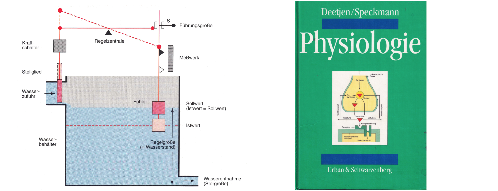

Eine Chance für Deutschland wäre, die nächste Generation von Ingenieuren, Mathematikern und Physikern auch in Physiologie auszubilden.  Wir könnten — anders als in der Photovoltaik — den Anschluß langfristig halten. In einem Bereich, in dem wir gerade  eine Weltneuheit auf den Markt gebracht haben.  Genauer gesagt, Deutschland hat einen vereinfachten Marktzugang als Weltneuheit eingeführt: Die »_DiGA_« — die Digitale Gesundheitsanwendung. [^1] 

Eine DiGA ist eine App auf Rezept. Die aufstrebende Branche der Hersteller von »_digital Therapeutics_« (DTx) - so der internationale Name von DiGA - ist durch das Digitale-Versorgung-Gesetz in Deutschland gut ausdifferenziert. Darauf sollten wir setzen.

Wir brauchen moderne Lehrbücher der Physiologie für die DTx Technologie der nächsten Generation. Das werden DTx Produkte sein, die den Anspruch erheben, über sensorische Stimulation relevante physiologische Wirkung zu erzeugen. Das Beste ist, wir brauchen bloß die Lehrbücher, die wir schon vor 30 Jahren einmal hatten! 

Der "Speckmann" hat ein Kapitel 0, das in der ersten Auflage einen Wasserstandsregler erklärte. Pysiologische Regelkreise am Beispiel eines Wasserstandsreglers zu erklären, hat mich als junger Physiker überzeugt, physiologische Prozesse zu studieren. Ich konnte dieses technische Beispiel verstehen. Hätte ich damals ein "neues" Lehrbuch über Physiologie aufgeschlagen, hätte ich mich vielleicht von diesem Fachgebiet abgewandt, ohne überhaupt einmal näher hinzuschauen.

Das Kapitel 0 wird bei jeder Neuauflage neu gestaltet. Von allen Ausgaben, die ich gesehen habe, hat die erste Auflage bei weitem das beste Kapitel 0. Es hat meine Sichtweise auf die Physiologie verändert und wie ich heute über digitale Therapeutika denke. In der Physiologie geht es um geschlossene Regelkreise, und wir können nicht über digitale Therapeutika nachdenken, ohne über Regelkreise zu denken

## Fußnoten

[^1]: Gerke, Sara, Ariel D Stern, and Timo Minssen. 2020. “Germany’s Digital Health Reforms in the COVID-19 Era: Lessons and Opportunities for Other Countries.” NPJ Digital Medicine 3 (1): 94.
