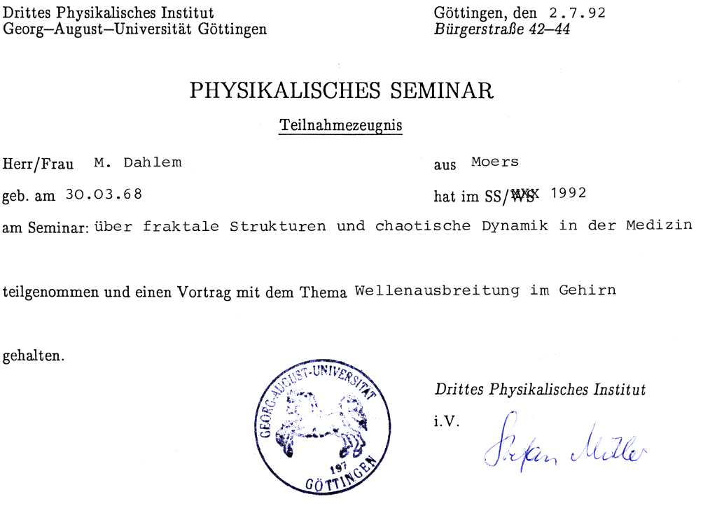
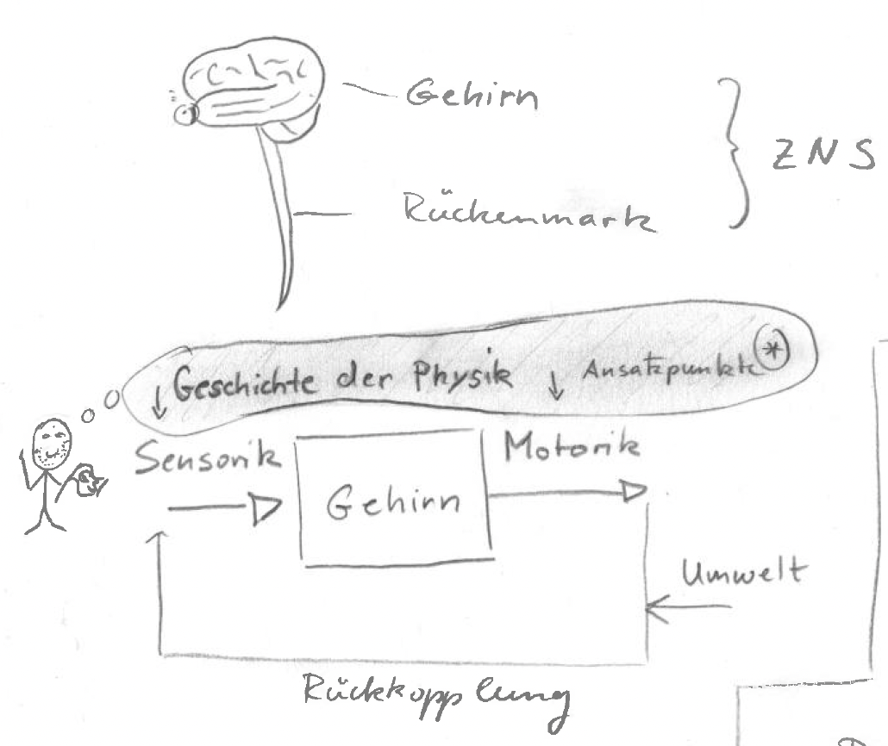

Natürlich werden in der modernen Physik Teilgebiete nicht mehr nach Anwendungsgebieten eingeteilt. Das Teilgebiet, das uns eine Methodik an die Hand gibt, um neurologische Fehlfunktion zu therapieren, existiert schon lange: die Thermodynamik. Fern des thermodynamischen Gleichgewichts können sogenannte dissipative Strukturen entstehen, deren Entstehung und Zerstörung die Physik erklären kann. Die Migränewelle ist so eine dissipative Struktur.

Dieser Zweig der Physik ist heute für einen aufkommenden Industriezweig hochspannend: Digital Therapeutics (DTx). DTx koppelt nicht Moleküle an Rezeptoren, sondern sensorische Reize an [physiologische Regelkreise](https://www.altamirage.de/physiologie-lehrbuch), die im Sinne einer Systemwissenschaft in Phasenräumen beschrieben werden.

Daher ist aus meiner Sicht[^1] eine Ausbildung in der Physik oder angewandten Mathematik eine solide Grundlage. Mehr als visuelle Impressionen, die diese These stützen, sollen an dieser Stelle nicht geliefert werden.

## Beispiel neuronales Netzwerk

Als Einstieg nehme ich ein neuronales Netzwerk. Das ist eine einfache Version: $y_k=\Theta(\sum^m_{j=0}\omega_{kj}x_j)$.

Kann die Abstraktion so einer Formel ein mentales Bild erzeugen? Bei manchen Lerntypen sicher, wobei das Konzept der Lerntypen sehr vereinfacht erscheint.[^2]

Wer, wie ich, visuell-graphisch Informationen besser aufnimmt, erkennt in der folgenden Zeichnung schneller, was mit der Einführung einer Schwelle in einem neuronalen Netzwerk passiert.

In der Zeichnung wird veranschaulicht, wie eine Schwelle, die mathematisch über die Bedingung $x_0\equiv 1$ definiert wird, in einem neuronalen Netzwerk „funktioniert" und warum sie nötig ist.

Mit so einer Schwelle können neuronale Netze lernen, linear separierbare Kategorien zu trennen. Neuronale Netze basieren auf Matrizenmultiplikation, und Matrizenmultiplikationen sind — vereinfacht gesagt — Drehungen um den Ursprung. Nun muss die Trennlinie nicht durch den Ursprung laufen. Also heben wir die Daten auf eine höhere Ebene, auf $x_0\equiv 1$.[^3]

So etwas „sehe" ich nicht, wenn ich auf $y_k=\Theta(\sum^m_{j=0}\omega_{kj}x_j)$ schaue. Leider.

## Beispiel Phasenraum

Die Physik arbeitet ständig mit Zustands- bzw. Phasenräumen. In einem DTx-Unternehmen entspricht die *drugability* der Pharmaindustrie der *dtxability* und bezieht sich auf Strukturen im Phasenraum. Schon der erste Beitrag in der Grauen Substanz berichtete von einer solchen Struktur: »[Geist einer Sattel-Knoten-Verzweigung](https://www.altamirage.de/geist-einer-sattel-knoten-verzweigung)«.

## Die Vorlesung

Im Wintersemester 2011/2012 las ich an der TU Berlin die Vorlesung *Statistische Physik I*, die genau solche Konzepte erarbeitete.

Im letzten Fünftel stand die Anwendung der statistischen Physik auf dynamische Erkrankungen. Migräne und viele andere Erkrankungen des Nervensystems sind dynamische Erkrankungen.

Viele Teilgebiete der Physik entstanden, um Funktionen des Menschen zu verbessern, insbesondere die seines Gehirns. Die Akustik verbessert das Hören, die Optik das Sehen, die Mechanik die Muskelkraft. Kann die statistische Physik Kopfschmerzen verbessern?

[^1]: Also die Meinung von jemandem, der selbst ein DTx-Unternehmen gegründet und aufgebaut hat.
[^2]: Aufenanger, Stefan (2022). „Verführerisch simpel: Der Mythos von den Lerntypen." *On. Lernen in der digitalen Welt* 2022 (10): 32–33.
[^3]: Ohne diesen Trick gäbe es keine schnellen animierten Computergraphiken; siehe homogene Koordinaten bzw. projektive Geometrie.
