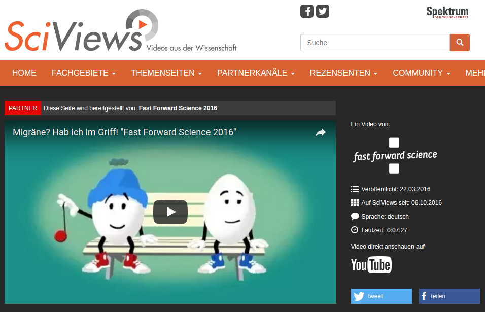

Anfang des Jahres erschien ein Animationsfilm gegen Migräne und Kopfschmerzen für Kinder und Jugendliche. Ein Migräne-„Ei“ mit blauer Mütze erklärt in einfacher Sprache verständlich was bei Migräne passiert und gibt viele Tipps. Dieses Video zählt zu den 24 Finalisten des Fast-Forward-Science-Videowettbewerbs 2016. In diesem Wettbewerb werden die besten Webvideos zu wissenschaftlichen Themen ausgezeichnet. Mitmachen und abstimmen!

Noch bis zum 31. Oktober 2016 könnt Ihr im Online-Voting über das beste Webvideo unter den Finalisten abstimmen. Eure Stimme geht in die Wertung ein, wenn Ihr eines der Videos auf YouTube liked. [Hier](https://www.youtube.com/watch?v=eWXd9shL3JE) geht es zum Animationsfilm gegen Migräne und Kopfschmerzen für Kinder und Jugendliche.

Mehr zum Hintergrund des Films findet Ihr im Blogbeitrag, den ich [Anfang des Jahres schrieb](https://scilogs.spektrum.de/graue-substanz/animationsfilm-migraene-hab-ich-im-griff/).
