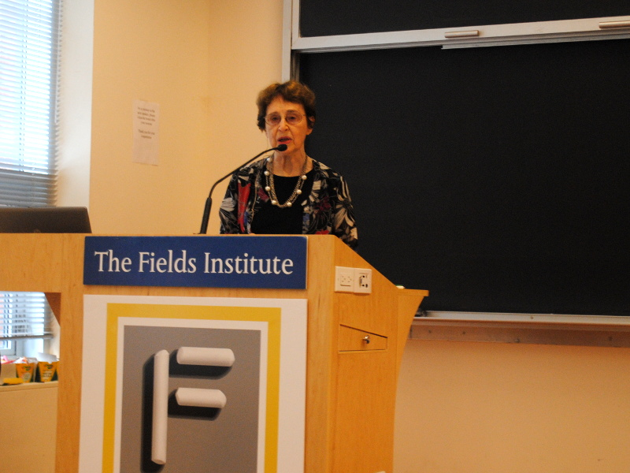
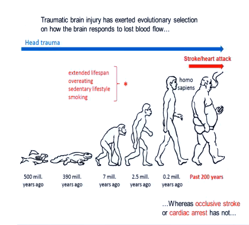
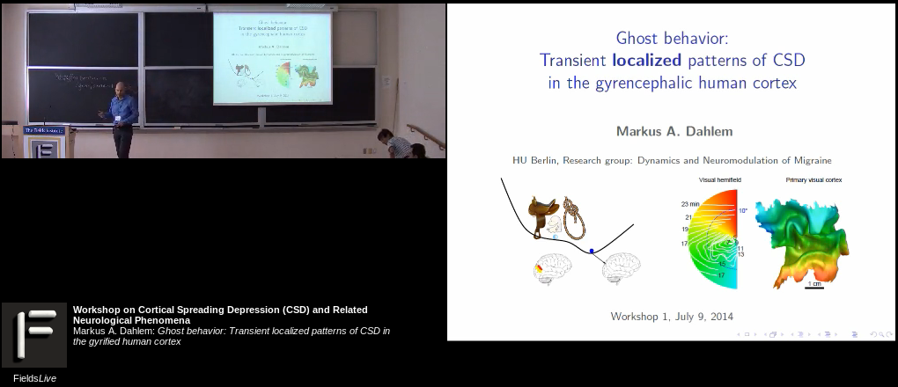
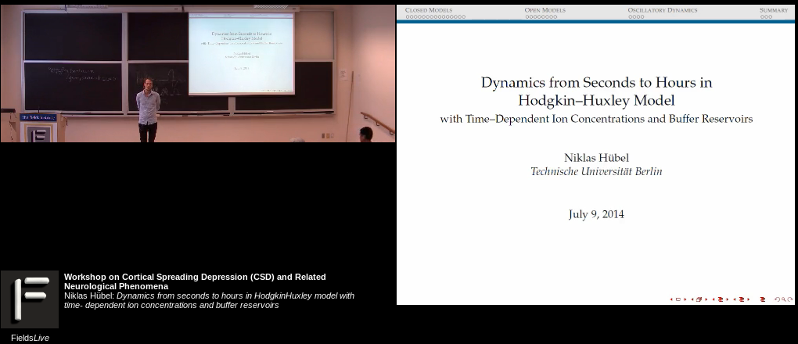
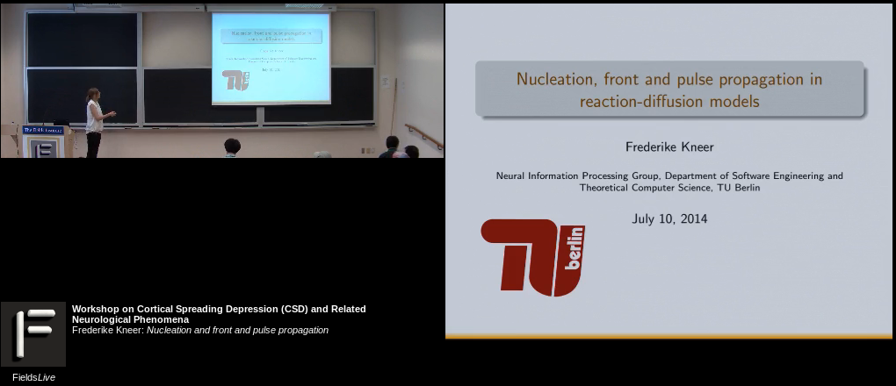

Der Workshop „Cortical Spreading Depression (CSD) und verwandte neurologische Phänomene“ im Fields Institute in Toronto, Kanada, ist zu Ende. Alle Vorträge sind [hier](http://www.fields.utoronto.ca/video-archive/event/294/2014) online verfügbar.

 Als historischen Einstieg kann ich den ersten Vortrag von Bernice Grafstein empfehlen. Dr. Graftsein ist eine ehemalige Präsidentin der Gesellschaft für Neurowissenschaften, z.Z. ist sie Vizepräsidentin der Grass Stiftung und Professorin für Physiologie und Biophysik (Vincent und Brooke Astor Distinguished Professor) am Weill Cornell Medical College, New York City, USA.

Dr. Grafstein spricht über die Anfänge der CSD-Forschung ab den 1940iger Jahren und über die verschiedene Menschen, die wichtige Beiträge in diesem Gebiet geleistet haben. Sie berichtet unterhaltsam über Aristides Leão, der CSD entdeckte, über Albert M. Grass, der Multikanal-Elektroenzephalographen (EEG) entwickelte, über Benedikt Burns, ihren Betreuer der Doktorarbeit, der nicht auf ihren Papern als Ko-Autor dabei sein wollte, was Dr. Grafstein mit einer spitzen Bemerkung zu der Unsitte heute veranlasst, über die Nobelpreisträger Alan Lloyd Hodgkin, der das erste mathematische Modell zu CSD entwarf, und Eric Kandel, für den CSD-Forschung eine „Strafe“ war.

Der vielleicht [unterhaltsamste Vortrag war von David Andrew](http://www.fields.utoronto.ca/video-archive/2014/07/294-3469), der sich seine ganz eigenen Gedanken zur evolutionären Entwicklung gemacht hat und dabei sich tausend Filme im Internet ansah, in denen Menschen niedergeschlagen wurden.

Es wird in diesen und fast allen anderen Vorträgen deutlich, dass es bei CSD nicht allein um Migräne geht sondern um die Verbindungen zwischen Migräne, Schlaganfall und Epilepsie.

Wer sich insbesondere für Biophysik und Mathematik interessiert, dem sei der [Vortrag von Yoichiro Mori](http://www.fields.utoronto.ca/video-archive/2014/07/294-3494) empfohlen. Natürlich will ich auch die drei Vorträge aus meiner eigenen Gruppe hier verlinken.

## [Ghost behavior: Transient localized patterns of cortical spreading depression in the gyrencephlic human cortex](http://www.fields.utoronto.ca/video-archive/2014/07/294-3466)

## [Dynamics from seconds to hours in Hodgkin-Huxley model with time- dependent ion concentrations and buffer reservoirs](http://www.fields.utoronto.ca/video-archive/2014/07/294-3465)

## [Nucleation and front and pulse propagation](http://www.fields.utoronto.ca/video-archive/2014/07/294-3467)

