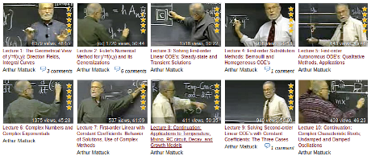
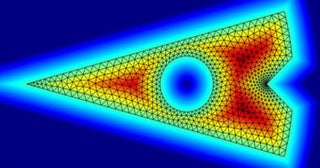
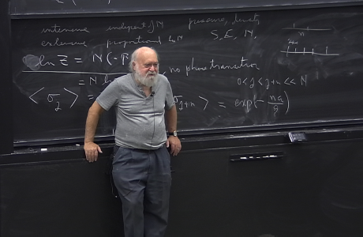

„Wenn ich nicht mehr lehren könnte, würde ich sterben“ sagt Walter Lewin. Er hat es mit einem Portrait  [in die „Zeit“ geschafft](http://www.zeit.de/2008/20/Walter_Lewin) und ist wahrscheinlich der bekannteste Hochschullehrer, der über seine Onlinekurse (*video lectures*) weltweit bekannt wenn nicht gar berühmt wurde – und als Lehrer unsterblich.

Ich will fünf andere vorstellen, meine zur Zeit liebsten Vorbilder und alle Vorlesungen sind meine Empfehlungen für Studenten, die interdisziplinär quereinsteigen, etwa aus der Medizin oder Biologie kommend, in meinen Forschungsbereich, der Nichtlinearen Physik mit Anwendung in der Medizintechnik und Computational Neuroscience.

Was Sie mitbringen müssen ist Kenntnis in Differentialgleichungen, Linearen Systeme, Wissenschaftlichen Rechnen und in Statistischer Physik, insbesondere Phasenübergänge. Und das alles bekommt man auch im Netz (wobei man eine hohe Selbstdisziplin mitbringen muss und Übungsaufgaben rechnen sollte).

In dieser Reihenfolge vorgestellt:

## Differentialgleichungen

[Differential Equations](http://videolectures.net/mit1803s06_differential_equations/) von Arthur Mattuck

## Lineare Systeme

[Linear Systems and Optimization |  Introduction to Linear Dynamical Systems](http://see.stanford.edu/see/lecturelist.aspx?coll=17005383-19c6-49ed-9497-2ba8bfcfe5f6) von Stephen Boyd

## Wissenschaftliches Rechnen

[Computational Science and Engineering I](http://ocw.mit.edu/courses/mathematics/18-085-computational-science-and-engineering-i-fall-2008/) von Gilbert Strang

## Statistische Physik

### Statistische Mechanik

Statistical Mechanics von Leonard Susskind

(Nur hier ein Kommentar: diese Reihe ist Teil eines Bildungsprogramm für Erwachsenen und keine Vorlesung nach üblichen Universitätsstandard. Ein solider Überblick und Intuition steht im Vordergrund dieser kurzen, es sind nur 10 Vorlesungen, Reihe.)

### Statistische Mechanik mit Schwerpunkt Phasenübergänge

[Statistical Mechanics](http://pirsa.org/C11021) von Leo Kadonoff

---

Alle fünf sind in meinen Augen aus einer Spitzengruppe herausragende Lehrer. Ich will deswegen gar nicht mehr zu den einzelnen Vorlesungen schreiben.

Trotzdem will ich drei von ihnen besonders hervorheben, Leo Kadanoff (University of Chicago) war 2007 Präsident der American Physical Society (APS) und Gilbert Strang (MIT) war Präsident der Society for Industrial and Applied Mathematics (SIAM). Als solche nehmen sie eine Vorbildfunktion ein. Dass in dieser Position auch erstklassige Lehrende waren, ist erfreulich (sie alle haben auch fundamentale Forschungsarbeiten gemacht). Leonard Susskund (Stanford) ist als einer der Väter der String-Theorie ebenso weit über sein Forschungsgebiet bekannt und hat viel zur aktiven Wissenschaftskommunikation beigetragen.
