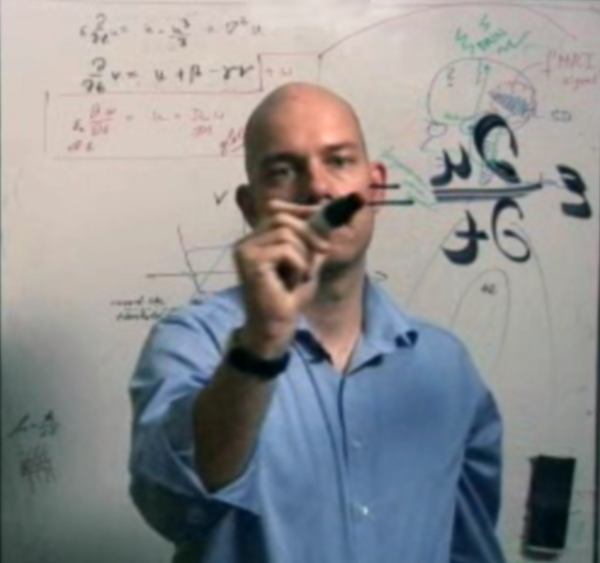
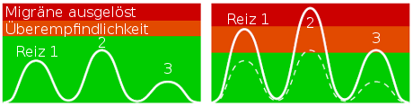
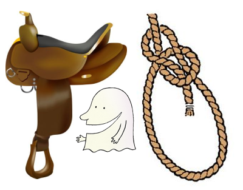
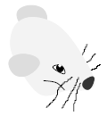

Auch die „Titanic“ hat [Neues aus der Gehinforschung](http://www.titanic-magazin.de/vffk.html) zu vermelden.

> D1353 M1TT31LUNG Z31GT D1R, ZU W3LCH3N GRO554RT1G3N L315TUNG3N UN53R G3H1RN F43H1G 15T! 4M 4NF4NG W4R 35 51CH3R NOCH 5CHW3R, D45 ZU L353N, 483R 91TTL3W31L3 K4335T 77 145 50 8D364C65833 5C7738 441F1 03T5T37, 8123 44 5455 4TT4L 9455 35 1134 97LK 565F8932 785 H729 H58D 815 06651 0965 01758 54555440440541 N4844 77CH4RT 29501 896029 /%\*\*§\$«(!‘## 1D10T!

In der „Grauen Substanz“ geht es zwar nicht immer so [kinderleicht zu, wie im letzten Beitrag über Entropie](https://scilogs.spektrum.de/blogs/blog/graue-substanz/2012-01-06/wiege-und-wege-des-wissen), doch etwas verständlicher als oben zitiert hoffentlich schon (man kann den Anfang wirklich lesen! Zumindest bis „*… 91TTL3W31L3 K4335t …*“, das  heißt wohl „*… mittlerweile klappt/kannst …*“,  weiter komme ich zumindest nicht. Irgendwer?).

Ich überschreite bewusst die [Bunt-Hirn-Schranke](https://scilogs.spektrum.de/blogs/blog/graue-substanz/2011-04-09/bunt-hirn-schranke) und versuche über Migräne aus der naturwissenschaftlichen Forschungsperspektive zu bloggen. Das ist nicht immer leicht und ich fürchte, das ein oder andere mal habe ich den Laien in der Mitte des Beitrages ähnlich abgehängt, wie die „Titanic“ mich ab 91TTL3W31L3. Bunte Bilder zu zeigen reicht mir aber nicht und flache Erklärungen oder gar fragwürdige medizinische Ratschläge verbietet sich von selbst. Zumal alle flachen Erklärungen einander ähnlich sind; aber jede tiefergehende Erklärung ist auf ihre besondere Art spannend.1 Das gilt für Migräne besonders, scheint mir, und diese Erkrankung verdient Aufmerksamkeit.

Mit diesem schrieb ich seit November 2009 bis heute 50 Beiträge allein über mein Fokusthema: Migräne. Da will ich mich gerne vorab bei Lars Fischer bedanken, er lud mich zu den SciLogs ein – charmant wie immer, wie ich noch lernen sollte:

> … ich möchte Sie einladen, mit Ihrem Blog zu uns auf die Seite zu ziehen. Geld zahlen wir nicht, aber … [d]afür gibt es auch keine Verträge …. Wir stellen die Seite und den technischen Support, alles andere ist Ihre Sache.  
> (Aus Email vom 30. September 2009. @Lars: Es bleibt nichts geheim.)

Support gratis, es wird nicht redaktionell reingeredet, den Rest für Ruhm und Ehre. Letzteres ist fragwürdig zumindest in Deutschland, wenn hier zur Zeit sogar diskutiert wird, ob [Wissenschaftskommunikation und Medienpräsenz der akademischen Karriere nicht eher schadet?](http://www.scienceblogs.de/astrodicticum-simplex/2012/01/schadet-wissenschaftskommunikation-und-medienprasenz-der-akademischen-karriere.php) Wie bitte? Vorab mache man sich klar: auch Universität und Fördergeber stellen nur den Support, also (Dritt)Mittel und meist – nein nicht immer2 – auch noch einen Arbeitsvertrag. Alles andere ist Sache der Forscher. Reinreden ist nicht erwünscht.

Genau deswegen müssen wiederum Forscher ihre Forschung rechtfertigen. Nicht alle werden dies öffentlich machen, das gehört auch nicht notwendigerweise zum Profil eines Forschers: dessen Pflicht und Kür heißen methodische Stärke und Kreativität. Aber wenn sich jemand mit Zusatzqualifikation Texter oder Rampensau unter den Forschern findet, wird er den Weg nach seiner Pflicht und Kür in die Öffentlichkeit sowieso gehen. Alles andere wäre dumm. Und es ist nicht umsonst, ich blogge nicht nur gern, es wirkt auch zurück auf meine Forschung und Lehre. Soviel sei nach 50 Beiträgen mal vermerkt.

Was gab es in den 50 Beiträgen über Migräne zu lesen?

Zum Beispiel neulich erst, dass [Lichtreize spezialisierte Gehirnzellen resonant ansprechen](https://scilogs.spektrum.de/blogs/blog/graue-substanz/2011-10-04/satte-spezialisten-ueberreizen-das-gehirn) können und im Gehirn eines Migränikers ein sowieso schon überempfindliches Netzwerk außer Kontrolle geraten lassen, auch die FAS berichtete daraufhin Mitte Dezember unter dem Titel „Wem das Geld zu Kopf steig“ – [verfügbar hinter einer Bezahlwand](http://www.seiten.faz-archiv.de/fas/20111218/sd1201112183329207.html). Ironie ist nochmal schöner, wenn sie unbeabsichtigt daherkommt.3

Die Physik solcher [Kipp-Punkte im Gehirn](https://scilogs.spektrum.de/blogs/blog/graue-substanz/2011-09-12/kipp-punkte-im-gehirnklima), in denen die physiologische Selbstregulation (Homöostase) versagt, wird [im Computermodell erforscht](https://scilogs.spektrum.de/blogs/blog/graue-substanz/2011-09-01/gesunde-kranke-neue), dazu nehme ich dann auch schon mal an, dass das [Gehirn ein Schwimmreifen ist](https://scilogs.spektrum.de/blogs/blog/graue-substanz/2010-08-23/das-gehirn-ist-ein-torus), um in Zukunft mit Hilfe einer [Modell-basierten Steuerungstechnik](https://scilogs.spektrum.de/blogs/blog/graue-substanz/2011-09-03/migraene-ctrl-alt-del) zu versuchen, abnormale Muster der Aktivität in neuronalen Netzwerken zu kontrolieren, vielleicht sogar mit [einer Gehirnprothese](https://scilogs.spektrum.de/blogs/blog/graue-substanz/2012-01-01/besser-mit-gehirnprothese).

Ob das zu einer Renaissance der [nicht-medikamentösen Behandlung von Kopfschmerzen](https://scilogs.spektrum.de/blogs/blog/graue-substanz/2010-11-12/blitzableiter-fuer-hirngewitter) führt, darf man skeptisch beurteilen. Ich will keine Hoffungen schüren und schon gar nicht für morgen. Aber dieser Forschungsbreich, [Neuromodulation](https://scilogs.spektrum.de/blogs/blog/graue-substanz/2010-03-02/neuromodulation) genannt, ist auf dem Vormarsch. Ob es der [Magnetschlag auf den Hinterkopf](https://scilogs.spektrum.de/blogs/blog/graue-substanz/2010-05-11/magnetschlag-auf-hinterkopf) sein wird, der den [Geist einer Sattel-Knoten-Verzweigung](https://scilogs.spektrum.de/blogs/blog/graue-substanz/2009-11-02/geist-einer-sattel-knoten-verzweigung) zähmt, oder doch eher die [Genetik der Migräne](https://scilogs.spektrum.de/blogs/blog/graue-substanz/2010-10-01/genetik-der-migraene) zu neuen, pharmarkologischen Ansätzen führt und wir deswegen [gepant (sic) auf Migräneforschung](https://scilogs.spektrum.de/blogs/blog/graue-substanz/2010-08-17/gepant) sind, wird sich in Zukunft erst zeigen.

Aufklärung ist heute schon wichtig, gerade auch bei so seltsamen Erscheinungen wie die der Migräneaura, [worüber man nicht gerne spricht](https://scilogs.spektrum.de/blogs/blog/graue-substanz/2011-08-05/darueber-spricht-man-nicht) und die vielleicht sogar [unbemerkt](https://scilogs.spektrum.de/blogs/blog/graue-substanz/2010-08-30/unbemerkte-aura), zumindest aber oft unerkannt bleiben kann.

Ich berichte Neues aus meiner Forschung, wie gesagt, gerne und hoffentlich V3R5T11N0LICH. Ansonsten gibt es ja noch immer die Kommentare zum Nachfragen.

**Fußnote**

1 Frei nach Tolstoi (Anna Karenina).

2 Nicht nur bei SciLogs, auch von meiner Universität bekommme ich keinen Arbeitsvertrag – trotz mehrfachen Zusagen, das unterscheidet sie von Lars; [mein Dank hierfür](https://scilogs.spektrum.de/blogs/blog/graue-substanz/2011-11-23/die-umgehung-der-12-jahres-regelung) [sowohl an die](https://scilogs.spektrum.de/blogs/blog/graue-substanz/2011-11-23/die-umgehung-der-12-jahres-regelung) [Berliner Gesetzgebung, die diesen Umweg scheinbar erlaubt, als auch an die Zählebigkeit der alten Strukturen](https://scilogs.spektrum.de/blogs/blog/graue-substanz/2011-11-23/die-umgehung-der-12-jahres-regelung).

3 Vielleicht erscheint ja mal ein Artikel „Wenn Universitäten Migräne verursachen“, der dann vom Geld handelt. Denn die Lage an den Hochschulen liegt für den wissenschaftlichen Nachwuchs [auf der Maus-Grimassen-Skala bei 5](https://scilogs.spektrum.de/blogs/blog/graue-substanz/2011-07-15/auf-der-maus-grimassen-skala-eine-4) (Augenkneifen 2 Punkte, Nasen- und Backenwölbung 2 bzw. 1 Punkt, Ohrenposition und Schnurrhaare 0 Punkte).
