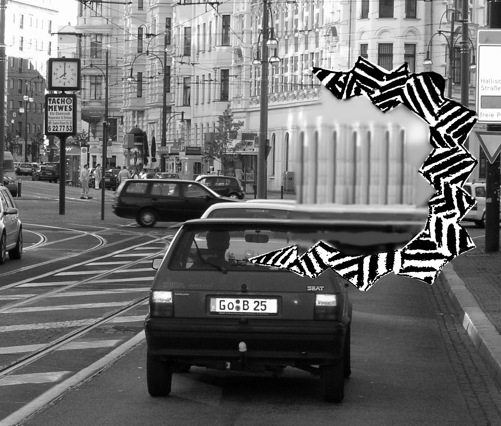

Ist der menschliche Faktor ein Störfaktor? Betrachtet man, wenn Mensch und  Maschine aufeinander treffen, mögliche Störungen,  ist es nicht minder abwegig, dass der Störfaktor die Maschine ist, von der gar ein Risiko für Menschen ausgehen kann. Ein Beispiel wird unten angeführt. Letztlich soll der Begriff „Faktor Mensch“ aber gar nicht im Sinn eines Störfaktors interpretiert werden sondern allgemein betonen, dass Maschinen und Technik von Menschen für Menschen hergestellt werden, auch wenn diese Konnotation vielleicht noch nicht durchdringt.

Bisher habe ich den Begriff „menschlicher Faktor“ in meinen Beiträgen über Migräneforschung nicht gebraucht. Und das, obwohl viele meiner Beiträge sich darum drehten, um Medizintechnik und Maschinen und den Faktor Mensch im weitesten Sinne seiner „von Menschen für Menschen“-Bedeutung.

Diese Bedeutung, die eine Beziehung der relevanten Beiträge untereinander herstellt, wäre jedoch ohne entsprechendes Vorwissen oder zumindest zusätzlichen Erklärung kaum zu verstehen gewesen. Denn Faktor klingt zunächst (und ist auch in seiner ursprünglichen mathematischen Bedeutung) eindimensional. Ein Faktor legt als Einflussgröße eher eine enge Interpretation nahe.\*

In diesem Beitrag will ich einige Verbinden zwischen einzelnen vorangegangenen Beiträgen aufzeigen – “connecting the dots” zu einem Gesamtbild des Faktors Mensch mit Bezug zur Migräne.

## Störung diesseits und jenseits der Mensch-Maschine-Interaktion

Also zugegeben, der Begriff „menschlicher Faktor“ ist unglücklich gewählt. Mir verbot er sich geradezu, jedoch aus einem etwas anderen Grund. Ich schreibe über sensorische und kognitive Beeinträchtigungen, die bei Migräne zusätzlich zu den Kopfschmerzen kurzzeitig auftreten können. Es werden also Störungen in meinen Beiträge thematisiert, aber nicht Störungen in Maschinen sondern normaler Gehirnfunktionen.

In bestimmten episodischen Phasen der Migräne kommt dem „Faktor Mensch“ daher in der Tat eine Bedeutung zu, die als „Risikofaktor“ im Umgang mit Maschinen gesehen werden muss. Doch das ist eben nur ein Aspekt.

Völlig neue Aspekte werden offen gelegt, wenn immer anspruchsvoller werdende Mensch-Maschine-Interaktionen nicht allein das beschränkte sensorische, motorische und kognitive Leistungsvermögen erweitern sollen sondern auch auf dessen Störungen und dessen Störanfälligkeit treffen – wohlgemerkt, die des Menschen nicht der Maschine.

Dies ist weder in der Produktentwicklung ausreichend berücksichtigt noch wissenschaftlich ausreichend erforscht.

## Maschine-Mensch-Interaktionen

Darüber hinaus gibt es Mensch-Maschine-Interaktionen, die speziell auf die Behebung sensorischer, motorischer und kognitiver Störungen zielen, sogenannte Neurostimulatoren. Beispiele sind das Cochleaimplantat (Hörimplantat), Tiefenhirnstimulation (Zittern und Bewegungsarmut werden gebessert) und Elektrokrampftherapie (zusammen mit medikamentöser Therapie und Psychotherapie werden psychische Störungen behandelt). Es bedient dann nicht der Mensch die Maschine sondern umgekehrt die Maschine bedient den Menschen. Offensichtlich ist in dem Bereich Medizintechnik der „Faktor Mensch“ ebenso vielfältig und vor allem in seiner Wechselwirkung zu berücksichtigen, bzw. es gilt noch zu erforschen, wie er einfließt und zurückwirkt und dementsprechend zu berücksichtigen ist.

## Leistungsvermögen viergeteilt

Für eine umfassende Auslegung des menschlichen Faktors ist es unerlässlich, das menschliche Leistungsvermögens differenziert zu betrachten. Wobei  außerdem implizit gegeben ist, dass immer Leistungsvermögen im Zusammenhang mit Maschinen betrachtet wird. Auch das steckt im Begriff „Faktor“. Als Einflussgröße muss etwas beeinflusst werden, in diesem Fall Maschinen.

Zunächst zum menschlichen Leistungsvermögen. Dieses umfasst vier Bereiche: sensorische Wahrnehmungsfähigkeiten, körperliche Leistungsfähigkeiten, kognitive Leistungsfähigkeiten und soziale Leistungsfähigkeiten sowie komplexe Wechselwirkungen daraus. Faktor Mensch ist also ein Sammelbegriff für Einflussfaktoren aus diesen vier Bereichen in Mensch-Maschine-Systemen.

Was genau eine Maschine ist, kann an dieser Stelle im Vagen bleiben. Eine wesentliche Rolle spielt dies erst, wenn die Struktur und Funktion kognitiver Systeme, technische eingeschlossen, betrachtet wird.

## Beispiel Fahrerassistenzsysteme

Ein schönes Beispiel sind Fahrerassistenzsysteme. Alle vier Bereiche des menschlichen Leistungsvermögens sind betroffen. Durch spezielle Fahrfunktionen kann zum Beispiel die Verkehrssicherheit erhöht werden, in dem die Fahrstabilität während eines menschliches Ausweichmanövers durch zusätzliche maschinelle Lenk- und Bremseingriffe aktiv gesteuert wird. Vorausschauende Assistenzsystemen dienen nicht nur der Sicherheit. Ein Stauassistent dient z.B. dem Komfort – wenn er bedienerfreundlich ist und genutzt wird. Es geht also auch um Usability und Akzeptanz, wenn wir über den Faktor Mensch reden.

Bei all dem wird zunächst von normalen menschlichen Leistungsvermögen ausgegangen. Eventuell berücksichtigt man eine älter werdende Gesellschaft, die graduell diese Norm verschiebt. Das beeinflusst vielleicht die Marktchancen, zum Beispiel weil ein erhöhter Bedarf und höhere Akzeptanz an Mensch-Maschine-Interaktionen entsteht. Solche graduellen Änderung erfordern jedoch keine, wie im folgenden besprochen, grundsätzlich neue Qualität im Konzept Faktor Mensch.

## Rückschau auf alte Beiträge

Im Kontext älterer Beiträge tritt ein neuer Faktor Mensch hinzu. Zunächst als Risikofaktor, in anderen Beispielen dagegen als risikotragender Faktor und in weiteren komplexen Zusammenhängen.

## Autofahren mit Erkrankungen

Ein Autofahrer, der unter Epilepsie litt, verlor die Kontrolle über sein Fahrzeug, dies fuhr daraufhin mit geschätzten 100 km/h bei Rot über eine Ampel und landet in einer Menschenmenge (s. „[Autofahren mit Migräne](https://scilogs.spektrum.de/graue-substanz/autofahren-mit-migraene/)“ und „[Verurteilt wegen fahrlässiger Tötung](https://scilogs.spektrum.de/graue-substanz/veruteilt-wegen-fahrlaessiger-toetung/)„). Deutlich subtiler als ein epileptischer Anfall, aber nicht unbedingt weniger gefährlich, verlaufen die kurzzeitigen Einschränkungen des Leistungsvermögens bei einer Migräneattacke.

:   Aus: Dahlem MA, Chronicle EP. „A computational perspective on migraine aura“, Prog Neurobiol. 74, 2004.

Bei der Migräne mit Aura sind in einem Zeitraum von etwas 5-60 Minuten sensorische Wahrnehmungsfähigkeit, körperliche Leistungsfähigkeit und kognitive Leistungsfähigkeit eingeschränkt. Ein wichtiger Unterschied zu einem epileptischen Anfall ist allerdings, dass die Störungen nicht nur deutliche geringer sind, sondern auch langsam einsetzen. So bleibt Zeit, entsprechend verantwortlich zu reagieren.

Allerdings können die Störungen unbemerkt bleiben und trotzdem massiv sein. Es können isoliert sogenannte negative Symptome (Ausfallerscheinungen, siehe im Bild unten blau markiert ein blinder Bereich im Gesichtsfeld) auftreten, so dass Betroffene diese eingeschränkte sensorische Wahrnehmungsfähigkeit in der Regel gar nicht oder doch erst zu spät bemerken.

:   Meist treten positive Reizerscheinungen (rot markiert, links) und negative Ausfallerscheinungen (blau markiert, rechts) in Kombination auf. Sie können aber auch isoliert auftreten.

Ein anderes Beispiel aus dem Bereich Verkehr: Vor etwa einem Jahr wurde eine  [Boeing 747 von Lufthansa umgeleitet und notgelandet](https://scilogs.spektrum.de/graue-substanz/lufthansa-ko-pilot-mit-migr-ne-in-boing-474/), weil der Ko-Pilot angeblich einen Migräne-Anfall erlitt. Im dem Moment wo nicht mehr der Individualverkehr betroffen ist, ist nicht nur das Risiko erhöht, sondern es betrifft auch allgemein den Arbeitsplatz und damit zusätzliche Faktoren und Fragestellungen (s.u.).

## Wenn Maschinen Migräne auslösen

Die Rolle Risiko- oder Störfaktor in der Mensch-Maschine-Interaktion kann auch vertauscht sein. Beispiel Online-Banking mit Hilfe von Chip-TANs. Am 18. Dezember 2011 berichte die Frankfurter Allgemeine Sonntagszeitung über das Risiko einen epileptischen oder Migräne-Anfall zu bekommen, wenn man Überweisungen am Bildschirm erledigt.

Solche potentiell Anfall auslösende visuelle Reize sind heute fast schon allgegenwärtig insbesondere auch in Kinofilmen und Werbespots. Dieser Faktor Mensch, der Menschen mit erhöhter Anfälligkeit für sensorische Reize betrifft, bleibt bisher zu oft unberücksichtigt und ist in der Tat noch weitgehend unerforscht.  Zitiert aus der F.A.S. ([hinter Bezahlwand](http://www.seiten.faz-archiv.de/fas/20111218/sd1201112183329207.html)):

> Markus Dahlem schätzt das [Potential einen Anfall auszulösen] etwas kritischer ein. Er sieht generell eine Kultur der optischen Reizüberflutung am Werk, bei der die Effekte immer weiter hinsichtlich ihrer Wirksamkeit auf das menschliche Gehirn optimiert werden – mit entsprechenden neurologischen Nebenwirkungen. „Die meisten Regisseure versuchen, den ultimativen Adrenalin-Kick filmisch einzufangen. Die dabei häufig eingesetzten blitzartigen Muster sind auffallend stereotyp.“ Man könnte auch sagen: Sie sind bestens dazu geeignet, den modularen Aufbau der Hirnrinde zu kitzeln. Mit nicht ganz vorhersagbaren Folgen.

Dazu schrieb ich mehr im Beitrag  „[Kultur optimaler Reizüberflutung](https://scilogs.spektrum.de/graue-substanz/kultur-optimaler-reiz-ueberflutung/)„.

## Am Arbeitsplatz

Wie innovativ Betroffene sich am Arbeitsplatz, wo sie in der Regel die Reize nicht einfach meiden können, versuchen zu schützen, wurde in „[Migräneprophylaxe am Arbeitsplatz – Post it](https://scilogs.spektrum.de/graue-substanz/migraeneprophylaxe-am-arbeitsplatz/)“ beschrieben. Der Faktor Mensch ist gerade auch ein Bereich der Arbeitswissenschaft. Das klassische Gebiet der Ergonomie wird erweitert und öffnet sich hin zu anderen Disziplinen durch die immer anspruchsvoller werdenden Mensch-Maschine-Interaktionen. Die sensorische Reizüberflutung bei Migräne ist z.B. vor allem auch ein Forschungsfeld der Neurophysik. Der Faktor Mensch hat einen inhärent interdisziplinären Charakter.

Erwähnenswert im Zusammenhang mit einem Arbeitsplatz ist die Diskussion, ob[eine US-amerikanische Präsidentin mit Migräne](https://scilogs.spektrum.de/graue-substanz/eine-us-amerikanische-praesidentin-mit-migraene/) tragbar sei, oder der Risikofaktor zu hoch?

## Therapeutische Verfahren

Als letztes Beispiel einer Mensch-Maschine-Interkation verweise ich nur auf einem Beitrag und die Links darin.  Ich habe ich im Beitrag „[Zukunft der Kopfschmerzen](https://scilogs.spektrum.de/graue-substanz/zukunft-der-kopfschmerzen/)“ vier invasive und drei nichtinvasive neuromodulierende Verfahren beschrieben, die u.a. bei der Migränebehandlung erforscht wurden. Maschinen versuchen außer Kontrolle geratene Gehirnaktivität zu bändigen. Hinzu kommen Biofeedback-Methoden, bei den Maschinen auf Menschen treffen und deren Körpersignale unmittelbar erlebbar machen.

## Fazit

Es ist leicht aber auch oberflächlich den Faktor Mensch auf den Störfaktor zu reduzieren. Der Faktor Mensch, d.h. die sensorische, körperliche, kognitive und soziale Leistungsfähigkeit in Hinblick auf Mensch-Maschine-Interaktionen, ist zum einen deutlich vielschichtiger. Zum anderen darf er auch nicht allein an der Norm und deren Standardabweichung bemessen werden. Im Gegenteil, Mensch-Maschine-Interaktionen müssen unbedingt Erkrankungen und die damit verbundenen Gegebenheiten berücksichtigen. In den erwähnten, konkreten Beispielen von Fahrerassistenzsystemen über Bildschirmarbeit zur Medizintechnik zeigen sich viele unerforschte Bereiche komplexer Wechselwirkungen zwischen Mensch und Maschine.

## Fußnote

\*Auf Twitter bekam ich noch den Hinweis, dass die etymologische Prägung von „factor“ ist im Englischen eine andere als der „Faktor“ im Deutschen sei. Der *factor* ist dort der Macher, etwas Aktives.

> [@markusdahlem](https://twitter.com/markusdahlem) [@Evo2Me](https://twitter.com/Evo2Me) Die etymologische Prägung von „Factor“ ist im Englischen eine andere. Der Factor ist dort der Macher, etwas Aktives.
>
> — M0nika Mar¡a ([@3mausimhaus](https://twitter.com/3mausimhaus)) [November 4, 2013](https://twitter.com/3mausimhaus/statuses/397320562407505920)
