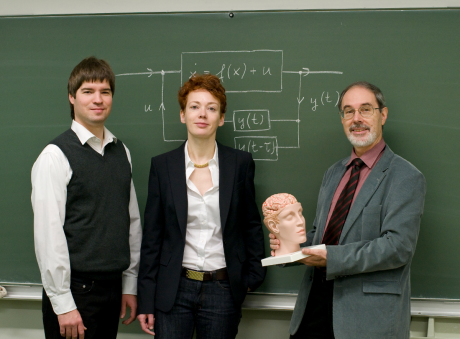
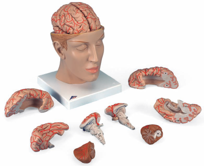

My deluxe brain made it on the homepage of my university, the Technische Universität Berlin. It is gone by now, but it was there for four days on the occasion of the anoucment of our new Collaborative Research Centre 910: Control of self-organizing nonlinear systems. The centre is funded with €7 million over a period of four years.

Well, it was only my brain anatomy model that you see above. I bought it some time ago and had to choose from over two dozen different models. The simplest (and cheapest) version would have sufficed for my usual purpose, that is, to demonstrate the path taken by a localized wave of overly excited neurons through the folded surface of the brain. This wave causes on its course neurological deficits in migraine called aura [1]. Anyway, I decided to go for the deluxe brain. Who wouldn't?

Having a deluxe version, with all the add-on stuff like the arteries, the brainstem, and the opened head base, I can also explain to my physics students the pathway of migraine headaches. And to you, I will now explain what motivates me following the proposed research agenda of one of the centre's research projects over the next four years.

Bye the way, the whole collaborative research centre encompasses 15 projects groups mainly from the faculties of physics and mathematics of  all three Berlin universities as well as groups from the Fritz Haber Institute of the Max Planck Society, Physikalisch-Technische Bundesanstalt, and Weierstrass Institute for Applied Analysis and Stochastics.

## Interrupting the migraine pathway

As a matter of fact, the neural pathway involved in migraine is not easy to see from pictures of an anatomy model—a 3D model is not really of great help in a 2D blog. It made a nice opening picture, though. Fortunately, I also have a whiteboard in my office. I shot this picture from it (yes old style, there are also these fancy e-whiteboards, but not in my office).

Before I explain the picture, more about migraine first. Our recent understanding of migraine headaches suggests that a self-organizing nonlinear processes in the cortex, a reaction-diffusion wave called spreading depression (SD), could cause not only the migraine aura, e.g. visual disturbances [1], but also the migraine pain. The still controversial evidence is summarized in reference [2].

Without controversy is that all sensory information, including pain, from the face and also from the dura mater (the outermost layer of the meninges surrounding the brain) is sent to the trigeminal nucleus. This nucleus is a structure that extends throughout the entire brainstem. During a migraine, it gets abnormally activated.

One reason for the abnormal activation of the trigeminal nucleus could be that SD in the cortex (1, see the picture on the whiteboard) by releasing noxious substances that diffuse into the dura matter (2) activates pain-sensitive nerve fibers in the brainstem (3) from where then, further along the remaining pain pathway, signals are send via the thalamus (4) back into the sensory cortex (5). In the sensory cortex the sensation of pain is created.

Let's draw an even simpler picture than the one on my whiteboard. The pathway (1)-(5) is summarized in reference [2] with the scheme below.

Researchers that favor another scenario how migraine pain and migraine aura are generated argue that the abnormal activity in the brainstem can trigger both SD and pain. If so, we have the following picture.

To summarize the two current views in migraine pathogenesis, the headache pain is either activated by SD, or the brainstem independently triggers downstream the pain pathway the pain sensation in the sensory cortex and—upstream the pain pathway—events that lead to SD and thus migraine aura. In the latter case, targeting SD would not at all help in migraine pain treatment. In the first scenario, however, each of the five steps (1)-(5), in particular also (1) and (2) could be a potential target to block migraine headache.

SD is the target we investigate in our newly funded research centre. What is the trigger of SD and how can SD be controlled? These are questions we ask. SD is a self-organizing nonlinear process. Its emergence can be well described in mathematical models. These models, we hope, will guide us finding answers to clinically relevant questions. For example, how to compensate for a failure in neural control mechanisms. This will not only be relevant to optimize new migraine treatments but also for other SD-related pathologies [3].

With these figures and my explaining words, I hope you understand the summary of our proposed research agenda that I developed together with Eckehard Schöll, the coordinator of the research centre:

We aim to investigate theoretically how internal control mechanisms in the brain prevent the emergence of nonlinear excitation waves based on reaction-diffusion, i.e.,  spreading depression (SD), and how, if they fail, SD waves can be suppressed by external feedback control. SD is  a pathological activity of the human cortex, and is related to migraine, stroke, and various kinds of brain injury.  Control of SD by external neuromodulation is of clinical importance because SD causes transient neurological deficits and subsequently headache (migraine) or permanent brain damage (stroke and brain injury).
For more information, see the centre's website or my homepage.

## Literature
[1] Dahlem, MA and Hadjikhani, N,  Migraine Aura: Retracting Particle-Like Waves in Weakly Susceptible Cortex. PLoS ONE 4(4): e5007. doi:10.1371/journal.pone.0005007 (2009).

[2] Ayata, C, Cortical Spreading Depression Triggers Migraine Attack: Pro, Headache, 50,72 (2010).

[3] Dahlem, MA, Schneider, FM, and Schöll, E, Failure of feedback as a putative common mechanism of spreading depolarizations in migraine and stroke, Chaos 18, 026110 (2008).
