Weihnachten steht vor der Tür. Einige beglücken uns täglich mit einem Kalender, andere wählen [Stresstest](https://scilogs.spektrum.de/wblogs/blog/sprachlog/kultur/2011-12-17/dreh-den-stresstest-auf) hintersinniger als aktuelles Thema. Weihnachten steht vor der Tür und mir fällt dazu nur eins ein: Migräne – und die Stadt Gottes im Gehirn.

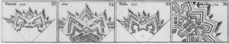

Ich habe mir eine gewagte These zum Anlass überlegt. Es geht darum, wie wir Dinge ungewöhnlich schmücken. Nicht den Weihnachtsbaum. Der hat ja ursprünglich nichts mit dem Christenfest zu tun. Unsere Städte schmücken wir. Und wieder nein, nicht Lichterketten über Straßen, Stadtmauern und die Festungsbaukunst ist mein weihnachtliches Migränethema.

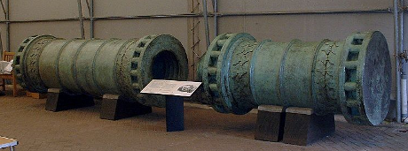

[Die Kanonen des Christen Urban](http://de.wikipedia.org/wiki/Belagerung_von_Konstantinopel_%281453%29#Die_Kanonen_des_Urban) bei der Belagerung Konstantinopels 1492 standen am Anfang einer neuen Architectura Militaris, die den eskalierenden Kräften der Feuerwaffen standhalten musste. Es entstanden Fortifikationen, die, dass sehen wir hier an vielen Beispielen, unsere Städte auch schmücken, zumindest aus der Vogelperspektive.

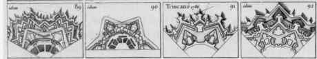

Oder so.

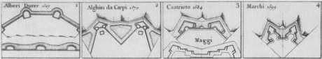

Oder auch so.

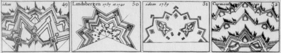

Man nennt diese aber auch die älteren, einfachen (ungezackten) Wehranlagen Fortifikationen.

In der Neurologie bezeichnet man mit Fortifikation einen partiellen Gesichtsfeldausfall mit charakteristisch gezacktem Rand. Der Ursprung des Names ist sofort offensichtlich.  Dieses neurologische Symptom gehört zu dem Symptomkomplex der Migräne mit Aura.

In der Migräne-Literatur wird nun häufig erwähnt, daß bereits die Nonne Hildegard von Bingen (1098 bis 1179) diese halluzinatorischen Fortifikationen sah und diese als Aedificium der Stadt Gottes deutete. Das führt bis heute zu einer Verwechslung, denn im 12ten Jahrhundert waren Wehranlagen natürlich nicht so schön gezackt!1

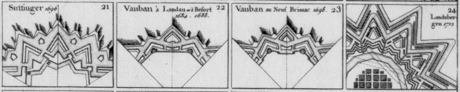

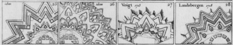

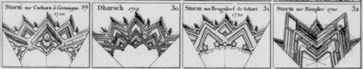

Zunächst zu meiner gewagten These bevor ich das mit Hildegard aufkläre: Nachdem ich die Strukturen der Teils sehr verschiedenen Fortifikationen genauer studierte, drängte sich mir folgender Gedanke auf.  Die Verbindung zwischen Architektur und Neurologie sei möglicherweise nicht nur in der einen, der namensgebenden Richtung verlaufen, sondern auch umgekehrt.

Könnten die Formen einiger dieser sehr ungewöhnlichen Festungsanlagen durch migränöse „Visionen“ der jeweiligen Baumeister inspiriert  sein? Ein Zusammentreffen legt allein schon die Häufigkeit der Migräne mit Aura nahe. Man bedenke insbesondere welchen tiefen Eindruck diese Visionen bei den damaligen Menschen gemacht haben muss.

Wenn hier ein Zusammenhang aufzuzeigen wäre, hieße das, die spezifisch gezackten Festungsanlagen spiegeln indirekt neuronale Verschaltungen in der menschlichen Großhirnrinde wider.  Meine Forschungsarbeiten haben gezeigt, dass visuelle Halluzinationen den Betroffenen einen im wahrsten Sinne des Wortes *Einblick* in ihr Gehirn ermöglicht.

Natürlich sind Aufzeichnungen von solchen Gesichtsfeldstörungen daher für den Neurowissenschaftler von enormen Wert. Obwohl ich viele Zeichnungen von Patienten weltweit bekomme, wäre es für mich doch auch unglaublich spannend, zusätzlich geschichtliche Aufzeichnungen mit in meine Forschung einzubeziehen.  Diese Parallele zwischen Militärarchitektur und Gehirnforschung aufzuzeigen, könnte für beide Disziplinen ungemein anregend sein. Einen Zusammenhang zu vermuten, ist aber wie gesagt gewagt.

Was meinte denn nun die Nonne Hildegard von Bingen? Gucken wir auf ihre Aufzeichnungen. Es gibt Zeichnungen, die an Burgzinnen erinnern. Die Zinnen als Zacken zu sehen, wäre eine These.

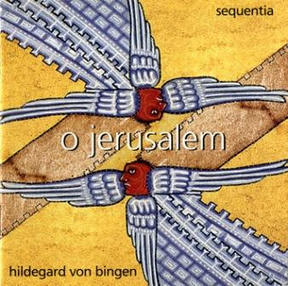  
Plattencover mit visionären Zeichnungen.

Aber ich denke, Hildegard von Bingen meinte etwas anderes, was in dieser Zeichnung zu sehen ist.

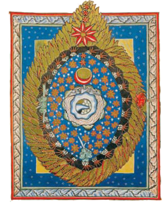

Das Aedifizium wird auch als Radleuchter symbolisiert. Der Flammenrand ist das, was den Strukturen bei Halluzinationen im Gesichtsfeld auch sehr nahe kommt.

Wahrscheinlich meinte Hildegard das „himmlische Jerusalem“ (=Paradies), wie es in der Apokalypse, der Offenbarung des Johannes beschrieben wird, deren Aedifizium wird symbolisiert, z.B. in Kirchen, als Radleuchter oder eben als Bild einer Stadt der Glückseligen.

Ähnliche Vermutungen gibt es auch über die Apostelgeschichte 9,1-9 in der Bibel.

*Damit wollte er [Saulus] die Anhänger des Weges, Männer und Frauen, gefangen nach Jerusalem führen.*   
*Während der Wanderschaft, als er sich bereits Damaskus näherte, geschah es ihm, dass plötzlich ein Licht vom Himmel ihn umleuchtete. […] Er fiel auf den Boden und hörte eine Stimme.* *Als Saulus von der Erde aufstand, öffnete er seine Augen. Er sah nichts. Sie nahmen ihn bei der Hand und führten ihn nach Damakus hinein. Es dauerte drei Tage, dass er nicht sah.*

Das die Ereignisse während der Bekehrung des Saulus zum Paulus mit Migräne zusammenhängen, vermuten Hartmut Göbel und Kollegen in der Zeitschrift Cephalagia „[Headache classification and the Bible: Was St Paul’s thorn in the flesh migraine?](http://www3.interscience.wiley.com/journal/119248782/abstract?CRETRY=1&SRETRY=0)„.

Ich wünsche nun einfach einen schönen 4. Advent und besinnliche Feiertage in denen uns unsere Sinne keine solche Streiche spielen.

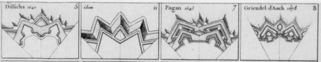

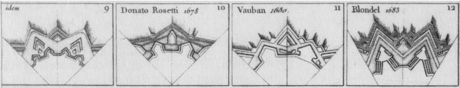

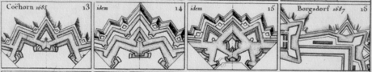

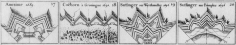

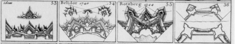

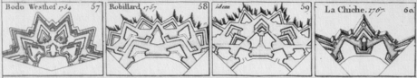

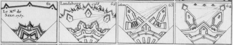

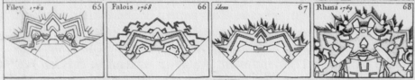

**Nachtrag**

Wie in den Kommentaren schon angeführt, gibt es hier eine [Antwort im Blog Con Text](https://scilogs.spektrum.de/chrono/blog/con-text/allgemein/2011-12-18/ein-wenig-wehrtechnik).

**Fußnote**

1 Wirklich charakteristisch für unser Stadtbild wurden Fortifikationen erst nach dem Dreißigjährigen Krieg (1618-48). Da zerfiel Deutschland in über 300 selbstständige Territorialstaaten. Die Städte verloren ihre Selbstständigkeit und unterstanden nunmehr den Landesfürsten. Als absolutistische Herrscher sichern sie die Städte durch Festungsanlagen, die heute an die Migräne mit Aura erinnern.

Teile dieses Beitrages habe ich erstmals 2004 [hier](http://www.migraine-aura.org/de/Festungsbaukunst.html) veröffentlicht.

© 2011, Markus A. Dahlem, die Kanonen des Urban sind [gemeinfrei](http://de.wikipedia.org/w/index.php?title=Datei:Great_Turkish_Bombard_at_Fort_Nelson.JPG&filetimestamp=20081107220100).
