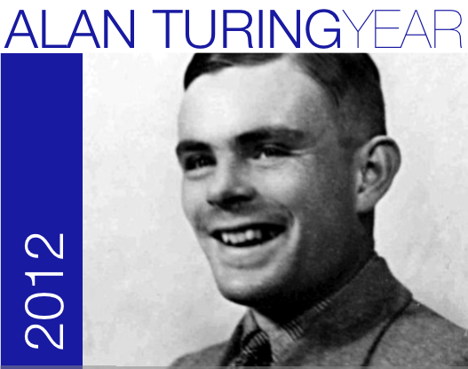
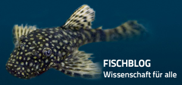

Zu Ehren des hundertsten Geburtstages eines genialen Mathematikers wird nächste Woche in Oxford, am Isaac Newton Institute for Mathematical Sciences, ein Workshop veranstaltet. Sein Name ist Alan Turing und der Name hat den Menschen überlebt: [Turingmaschine](http://de.wikipedia.org/wiki/Turingmaschine), [Turing-Test](http://de.wikipedia.org/wiki/Turing-Test), [Turing-Mechanismus](http://de.wikipedia.org/wiki/Turing-Mechanismus) und die [Turing-Bombe](http://de.wikipedia.org/wiki/Turing-Bombe). (Letzteres ist unter diesem Namen weniger bekannt, was dahinter steckt dafür umso besser: die Entzifferung der deutschen Funksprüche im zweiten Weltkrieg, die mit der Enigma verschlüsselten wurden; Turing knackte den Kode. Es gab Historiker, die seine Mathematik für kriegsentscheidend hielten.) 

Nun also ein Workshop von sicher zahlreichen weltweit. Ich bin eingeladen. Er trägt den Titel „[Pattern Formation: The inspiration of Alan Turing](http://www.newton.ac.uk/programmes/SAS/sasw08.html)“. Turing war nicht nur in der Computertechnologie Vorreiter, auch die theoretische Biologie, insbesondere die Morphogenese, die Entstehung der Form, verdankt ihm einen fundamentalen Impuls: den Turing-Mechanismus. Dieser Mechanismus hat auch mit der Entstehung der Migräneaura zu tun – zumindest ist das meine Vorhersage. Auch Oliver Sacks hat in seinem Buch über Migräne diesen möglichen Zusammenhang schon 1992 erkannt. Damals fing ich gerade an, mich mit dem Problem zu beschäftigen. Und viele andere zweifellos schon vorher. Allerdings habe ich erst jetzt den Zusammenhang formalisiert, so dass er nun konkret überprüfbar wird.

Ich bereite gerade meinen Vortrag vor und stelle daraus hier im Blog ein Video vor. Es visualisiert eine für mich sehr bedeutende Entdeckung, die ich in den letzten Monanten gemeinsam mit einer Doktorandin, Frederike Kneer, gemacht habe.

In einem vorangegangenen Beitrag „[Das Gehirn ist ein Torus](https://scilogs.spektrum.de/blogs/blog/graue-substanz/2010-08-23/das-gehirn-ist-ein-torus)“ habe ich schon kurz den Forschungsansatz erklärt. Ausschnitte der gewundenen Großhirnrinde können idealisiert durch Formen verschiedener Teilflächen eines Torus (Schwimmreifen) betrachtet werden. Daraus leiteten wir dann Aussagen ab, die auch verallgemeinert für real geformte Hirnrinden gelten sollten und die über die Keimbildung pathologischer Erregungszustände bei Migräne etwas vorhersagen. Hier kommt Turing ins Spiel.

Turing hat sich in seinen letzten Jahren, bevor er aufgrund seiner Homosexualität in den Tod getrieben wurde, mit Reaktions-Diffusions-Systemen und der spontanen (ohne Keim!) Strukturbildung beschäftigt. Sein Turing-Mechanismus muss heute noch für Fellzeichnungen im halben Tieralphabet, vom Leoparden bis zum Zebra, herhalten. Und wohl jeder Fisch, der nicht tief genug schwimmt und mindestens einem Fleck hat, dient als Beispiel, jedoch ohne dass dies je nachgewiesen werden konnte. Trotzdem ist der Turing-Mechanismus von fundamentaler Bedeutung im Verständnis der Morphogenese.

Vorsicht aber bei den Beispielen. Auch meine Vermutung muss erst mal nachgewiesen werden, obwohl wir in einer Fallstudie 2009 mit der funktionellen Kernspintomographie sehr gute Indizien fanden [1], die ich in meiner Dissertation 2001 vorhersagte und die nun die weiteren theoretischen Arbeiten anstießen. Das zeigt aber auch den Zeitrahmen, in dem Fortschritt gemacht wird.

## Der Keim in der Krümmung erstickt

Der Turing-Mechanismus spielt auch ein Rolle in der Entstehung einzelner lokalisierter Muster. Bumbs oder manchmal auch als Quasiteilchen und dissipatives Soliton bezeichnet. Das hängt etwas von der wissenschaftlichen Community ab, in der man gerade forscht. Der Mechanismus ist universell.

Wir fanden nun heraus, dass die bisher als rein instabil betrachteten Keime in Zwei-Komponenten-Reaktions-Diffusions-Systemen allein durch die Krümmung des Medium stabilisiert werden können. Ein fundamental neuer Mechanismus für lokalisierte Musterbildung, wie sie schon Turing interessierte. Turing fand aber nur periodische Muster in solchen Zwei-Komponenten-Systemen, was damit zusammenhängt, das Turing-Muster spontan einstehen, ohne Keimbildung. Die Wirkung unseres Mechanismus ist hier erstmals in dem Video gezeigt und er wird nächste Woche auf dem Workshop international präsentiert.

Was genau sie hier sehen, kann ich jetzt nicht erklären, aber soviel: wäre das Medium, in der diese rote Welle läuft, flach wie ein Brett und nicht gebogen wie der Torus (oder das Gehirn), dann würde sie gar nicht laufen sondern sogleich zerfallen oder sich einspiralen und ewig anwachsen, also nicht lokalisiert bleiben.

**Literatur**

[1]  Dahlem MA, Hadjikhani N (2009) [Migraine Aura: Retracting Particle-Like Waves in Weakly Susceptible Cortex](http://www.plosone.org/article/info%3Adoi%2F10.1371%2Fjournal.pone.0005007). PLoS ONE 4(4): e5007. doi:10.1371/journal.pone.0005007

© 2012, Markus A. Dahlem
