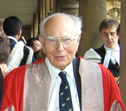

Am 30. Mai im Alter von 94 Jahren starb Andrew Fielding Huxley. Er bekam den [Nobelpreis](http://www.nobelprize.org/nobel_prizes/medicine/laureates/1963/huxley-bio.html) für Physiologie zusammen mit Alan Lloyd Hodgkin (1914-1998) und John Carew Eccles (1903-1997) für die Beschreibung der Erregungs- und Hemmungsvorgänge über der Zellmembrane. Das Hodgkin-Huxley-Modell der Nervenerregung ist heute das mit Abstand wichtigste mathematische Modell der Computational Neuroscience.

Ich bin sicher, es gibt kaum jemanden, der längere im Bereich der Computational Neuroscience arbeitet und nicht schon mal in der ein oder anderen Form diese Konversation gehört hat:

**Teilnehmer A**: Wir brauchen Erfolgsgeschichten, die zeigen, dass mathematische Modelle einen wirklichen Einfluss auf die medizinisch-biologische Forschung haben.

**Teilnehmer B**: Aber wir haben doch das Hodgkin-Huxley-Modell.

**Teilnehmer A**: Das sagen wir nun schon seit 50 Jahren und seit dem ist nichts dazugekommen.

**Teilnehmer B** [schweigt nachdenklich, nickt dann]

Berichte in der Presse: 

* [Andrew F. Huxley, Nobel Prize-winning physiologist, dies at 94](http://www.washingtonpost.com/national/health-science/andrew-f-huxley-nobel-prize-winning-physiologist-dies-at-94/2012/06/02/gJQAQLgo9U_story.html) (The Washington Post)
* [Andrew Huxley, Nobel-Winning Physiologist, Dies at 94](http://www.nytimes.com/2012/06/05/us/andrew-huxley-nobel-winning-physiologist-dies-at-94.html) (New York Times)
* (weitere folgen, für Hinweise bin ich dankbar)

Bildquelle: [Wikipedia](http://de.wikipedia.org/w/index.php?title=Datei:Andrew_huxley_trinity.png&filetimestamp=20070903164431)
