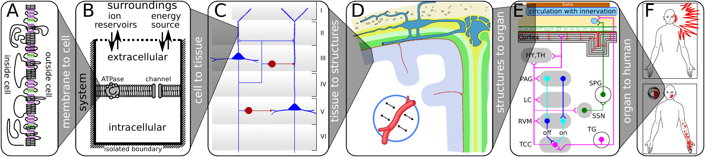

In welche Fragestellungen meine Forschung eingebunden ist, zeigt anschaulich eine Abbildung, die ich für einen geplanten Buchartikel und für [meine Webseite](https://sites.google.com/site/markusadahlem/) zusammengestellt habe.

(A) Auf der molekularen Ebene betrachten wir Funktionsveränderungen der Zellmembran, die u.a. durch genetische Mutationen hervorgerufen werden können. (B) Darauf aufbauend wird auf der zellulären Ebene die Elektrophysiologie und deren Einfluss auf den Ionenhaushalt des Gehirns modelliert. (C) Gehirnzellen formen kortikale Netzwerke und definieren so nicht nur Schaltkreise sondern auch Gewebeeigenschaften in den verschiedenen Schichten der Hirnrinde (Kortex). (D) Nervenzellen sind nicht die einzigen Zellen im Gehirn; als neurovaskuläre Einheit wird die funktionelle Interaktion mit anderen Zelltypen modelliert. Für großflächige Erregungsmuster der Hirnrinde muss dessen Faltung mit berücksichtigt werden. (E) Schmerznetzwerke erstrecken sich nicht nur über verschiedene Areale der Hirnrinden sondern werden auch subkortikal gesteuert. Insbesondere der Hirnstamm spielt eine große Rolle. (F) Die Modellierung visueller, somatosensorischer und anderer Halluzinationen bei Migräne mit Aura bildet schließlich die höchste Ebene.

Erklärtes Ziel ist es, diese Ebenen zu integrieren und Möglichkeiten der Intervention zu erforschen. [Dazu mehr in nächsten Beitrag](https://scilogs.spektrum.de/graue-substanz/arbeitsgebiete-ii-neuromodulation-bei-migraene/).
