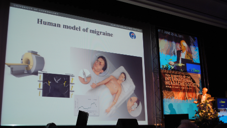

[Haben Mäuse Migräne?](http://www.brainlogs.de/blogs/blog/graue-substanz/2011-06-21/haben-maeuse-migraene) fragte ich neulich, einen Tag bevor ich auf dem [15. Kongress der Internationalen Kopfschmerzgesellschaft](http://www2.kenes.com/ihc2011/sci/Pages/Timetable.aspx) ging.  Mausmodelle der Migräne waren natürlich auch ein grosses Thema auf dem Kongress, so dass z.B. auf nature.com eine Woche später in der Rubrik *Spoonfull of medicine – musing on science, medicine and politics* ein [Bericht über ein Mausmodell der Migräne](http://blogs.nature.com/nm/spoonful/2011/06/new_animal_model_of_migraine_h.html) stand. Auch ich will das Thema noch mal aufgreifen.

Ob Mäuse Migräne haben, muss man sie, die Mäuse, fragen, schrieb ich.

> Denn Migräne ist eine Krankheit dessen Diagnose symptombasiert erfolgt. Das allein ist noch kein Problem. Aber die Symptome einer Migräne sind für Mitmäuse und Mitmenschen nicht klar sichtbar. Neuronale Korrelate, wie ein auffälliges EEG, gibt es nicht.

Da zur Zeit auf dem Forschungsmarkt mindestens zwei unterschiedliche neuronale Ursachen und zusätzlich vaskuläre Ursachen der Migräne hoch gehandelt werden1, gibt es ebenso viele Mausmodelle, die diese Ursachen und deren Wirkungskette zu belegen versuchen. Ob z.B. jede dieser vermeintlichen Ursachen überhaupt Kopfschmerzen auslöst oder vielleicht nur bestimmte Symptome der Migräne aber eben nicht den Kopfschmerz, ist eine der zentralen Fragen an diese Modelle, ergo an die Mäuse.

Dass man Mäuse aber nun nicht fragen kann, schien mir klar, wobei ich in einer Fußnote anmerkte, dass wir sie in einem gewissen Sinne schon „fragen“ können, oder besser gesagt, dass wir aus ihrem Verhalten Antworten ableiten können. Ist die Maus lichtscheut, nannte ich als Beispiel, ist sie wenig aktiv und zieht sich in ihr Häuschen zurück (die Migräniker wissen was ich meine). Klingt vielleicht komisch, ist aber Wissenschaft: Die Zuordnung von Reiz und Reaktion ist Teil der Tierpsychologie, wahrscheinlich sollte ich besser Verhaltensbiologie schreiben, ich mag aber den Begriff Tierpsychologie, diese ist durchaus eine seriöse Forschungsrichtung.

Auf dem Kongress hörte ich von der Maus-Grimassen-Skala (mouse grimace scale), eigentlich schon letztes Jahr in *Nature Methods* von Migräneforschern publiziert2, mir aber bisher entgangen.

> *Facial expression is widely used as a measure of pain in infants; whether nonhuman animals display such pain expressions has never been systematically assessed.*   
>  [Der Gesichtsausdruck wird weithin als Maß für Schmerzen bei Säuglingen verwendet, ob nichtmenschliche (sic) Tiere solche Schmerzausdrücke zeigen, ist noch nie systematisch untersucht worden. (Übersetzung M.A.D.)]

   
  von Markus A. Dahlem [CC BY-NC-SA 2.0](http://creativecommons.org/licenses/by-nc-sa/2.0/de/)

Auf einer Skala von Null bis Zehn wird der Gesichtsausdruck dieser nichtmenschlichen Tiere von menschlichen Tieren bewertet. Dabei gehen Fünf  – ähm – Gesichtspunkte ein: Augenkneifen (orbital tightening), Nasenwölbung (nose bulge), Backenwölbung (cheek bulge), Ohrenposition (ear position) und Änderung der Schnurrhaare (whisker change). Diese werden jeweils mit Null bis Zwei Punkten hinsichtlich ihrer Schmerzdeutung benotet. So kommt man auf maximal zehn Punkte.

Beispiel: wenn ich das Haltbarkeitsdatum einer verdächtigen Verpackung im Kühlschrank untersuche, sagt meine Frau, ich hätte auf der Maus-Grimassen-Skala eine 10. Dabei ist es objektiv nur eine 4 (zusammengekniffene Augen und Nasenwölbung, je zwei Punkte). So weit, so objektiv. Nur: es tut gar nicht weh. Allein die Mischung aus Argwohn und vorauseilenden Ekel zaubert mir diese Grimasse auf das Gesicht. Wenn ich dagegen über das [Wissenschaftszeitvertragsgesetz](http://de.wikipedia.org/wiki/Hochschulrahmengesetz#Kritik_von_Seiten_der_Wissenschaftler) nachdenke und dessen katastrophalen Folgen, erleide ich mittlerweile physische Schmerzen, mein Gesicht bleibt aber blank. So hat alles seine Fallstricke, wohl auch die Tierpsychologie. Was, wenn die Maus den Forscher mit den gleichen Hintergedanken anschaut wie ich verdächtige Lebensmittelverpackungen? Übel nehmen dürften wir ihr es nicht.

Nun kommen menschliche Tiere nicht nur auf die Idee mittels Wissenschaftszeitvertragsgesetz die Schmerzgrenze der Nachwuchswissenschaftler zu testen, auch Migräne kann am Menschen getestet werden. „*Human model of migraine*“ titelt Jes Olesen auf dem Kongress in einer seiner Folien, wahrscheinlich – sicher bin ich mir da nicht –  nicht ganz frei von Ironie.

Ein „Modell“, im strengen Sinne, wäre es wohl nur, wenn die Ergebnisse auf die nichtmenschlichen Tiere übertragen werden sollen. Der Maus kann es alle Male nur recht sein, wenn wir versuchen mögliche Ursachen der Migräne und deren Wirkungskette am Menschen zu untersuchen, soweit es eben geht. Wenn Mäuse wirklich Schmerzen ähnlich erleiden wie wir und, ja, auch ihr Gesichtsausdruck, vielmehr die Tatsache, dass wir diesen wirklich recht gut beurteilen können, ist ein Beleg hierfür, dann muss das uns zunächst bewusst machen, dass auch wir nur menschliche Tiere sind und es führt kein Weg daran vorbei weiter über Tierethik nachzudenken.

Übrigens, wie das Experiment ausgeht, in dem ich seit über einen Jahr Labormaus der Gattung *Rodentia Gastdocentia* bin und das mir traumatische Schmerzen zugeführt hat, wird sich hoffentlich in wenigen Wochen herausstellen. Wissenschaft, zumal mathematische Modelle, kann ich zum Glück überall auf der Welt machen. Wer dann welche Grimasse zieht, wird sich zeigen.

**Literatur**

1 Die Theorien sind gut erklärt im Oktoberheft 2009 Spektrum der Wissenschaft, Artikel [Migräne – leider keine Einbildung](http://www.wissenschaft-online.de/artikel/1005451) von David W. Dodick und J. Jay Gargus. Sie auch meinen Beitrag: [Unbemerkte Aura](http://www.brainlogs.de/blogs/blog/graue-substanz/2010-08-30/unbemerkte-aura).

2 [Langford DJ, et al. Coding of facial expressions of pain in the laboratory mouse. *Nat Methods* **7**:447-449 (2010)](http://dx.doi.org/doi:10.1038/nmeth.1455).   
 Leider hinter einer Bezahlwand, so dass ich den sehr guten [Bericht in Wired zustätzlich verlinke](http://www.wired.com/wiredscience/2010/05/mouse-pain-expression/).

**Link**

Kurze URL zum Beitrag

http://goo.gl/5xZIU
