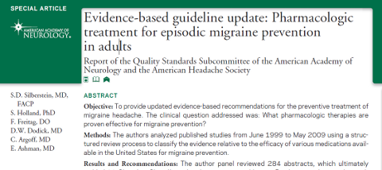

Vorbeugung und Behandlung sind klinische Themen, die in meinen forschungsorientierten Blog über die Pathophysiologie der Migräne eigentlich nie vorkommen. Nicht so sehr, weil ich kein Mediziner bin. Sondern weil diese Themen letztlich zwischen Arzt und Patient besprochen werden müssen. Blogs, die in diesem Bereich informieren, müssen eine Gratwanderung schaffen zwischen dem Ziel eines [mündigen und kompetenten Patienten](http://www.aerzteblatt.de/archiv/78431/Arztgespraech-Der-muendige-Patient-als-Herausforderung) und dem Vorschub der [Cyberchondrie](https://scilogs.spektrum.de/blogs/blog/graue-substanz/2012-02-07/cyberchondrie).

Natürlich sind gute Informationen für Patienten nicht nur interessant sondern auch sehr wichtig. Denn wenn sie das Gefühl haben, aufgrund ihrer eigenen Kompetenz – hier sind bzgl. Internet neben Blogs insbesondere auch Foren zu nennen, denn bei beiden kann und sollte man auch mal Rückfragen – die Entscheidung über ihre Behandlung mitgetroffen zu habe, halten sie sich auch eher an diese vereinbarte Therapie. Auch höre ich immer mal wieder von Ärtzen, die hier mit Interesse mitlesen.

Daher will ich auf eine aktuelle Studie zu Behandlung und Vorbeugung bei Migräne hinweisen, die gestern in der [Fachzeitschrift Neurology veröffentlicht wurde und frei zugänglich ist](http://www.neurology.org/content/78/17/1337.full.pdf+html).

In dieser Metastudie wurden 29 Studien genauer untersucht, selektiert aus einer fast zehnmal größeren Anzahl von Studien aus dem Zeitraum von 1999 bis 2007. Ausgeschlossen waren Studien, die

* die Wirksamkeit von Kopfschmerzmittel bei andere als episodischer Migräne bei Erwachsenen beurteilten;
* die Behandlung akuter Migräne, Migräne mit Aura (selbst wenn vorbeugend) oder nicht-pharmakologische Behandlungen (z. B. verhaltenstherapeutische Ansätze) beurteilen;
* nicht standardisierte Ergebnisse als primäre Wirksamkeits-Endpunkte nutzten, wie die Feststellung der Lebensqualität oder Grad der Behinderung;
* die Wirksamkeit von Medikamenten beurteilten, die nicht in den USA verfügbar sind.

Zunächst will ich festhalten, dass die Metastudie damit beginnt, darauf hinzuweisen, dass nur 38% der Migräniker überhaupt eine präventive Behandlung benötigen. Verhaltenstherapeutische Ansätze, die hier nicht beurteilt wurden, gehören sicher zu sehr sinnvollen präventiven Maßnahmen. Sie sind in dieser Studie nicht etwa ausgeschlossen, weil sie in irgendeiner Form zweitrangig sind, sondern weil es einfache keine (vergleichende) Studie darüber war.

Mir liegt es fern, nun die Ergebnisse der einzelnen Wirkstoffe hier zusammenzufassen. Fachleute können die Studie selbst besser lesen als ich und Patienten sollten sich schlicht bewusst sein, dass Hilfe existiert und auch ihren behandelnden Arzt über aktuelle Entwicklungen befragen (Hinweise dazu in dem schon oben verlinkten Ratgeber im Deutschen Ärzteblatt „[Arztgespräch: Der mündige Patient als Herausforderung](http://www.aerzteblatt.de/archiv/78431/Arztgespraech-Der-muendige-Patient-als-Herausforderung)„).

Abschließen will mit einem Zitat, mit dem die Studie am Ende auf den klinischen Kontext eingeht:

> Evidenz, die die pharmakologischen Behandlungsstrategien zur Vorbeugung bei Migräne untermauert, zeigt an, welche Behandlungen wirksam sein könnte, sie reicht aber nicht aus, um festzustellen, wie eine optimale Therapie auszuwählen ist. Folglich ist, obwohl Stufe-A-Empfehlungen für pharmakologische Vorbeugung von Migräne gegeben werden können, kein Beleg verfügbar, um dem Arzt zu helfen, welche der Therapien zu bevorzugen ist. Behandlungen müssen also von Fall zu Fall entworfen werden, was auch komplexe oder sogar nicht-traditionelle Ansätze einschließt. [Übersetzung M.A.D.]
>
> **Original**
>
> *Evidence to support pharmacologic treatment strategies for migraine prevention indicates which treatments might be effective but is insufficient to establish how to choose an optimal therapy. Consequently, although Level A recommendations can be made for pharmacologic migraine prevention, similar evidence is unavailable to help the practitioner choose one therapy over another. Treatment regimens, therefore, need to be designed case by case, which may include complex or even nontraditional approaches.*
