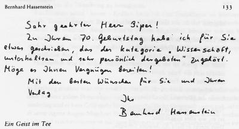
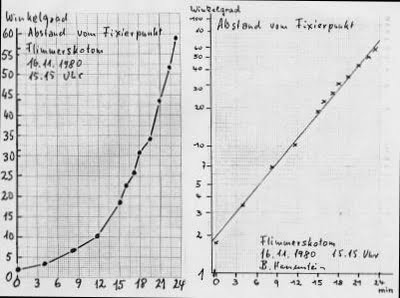

Hassenstein forschte, schrieb und dichtete über die Schrecken aber auch dem naturgegebenen Privileg der Migräne mit Aura und schlägt so visionär aus den 80er Jahren eine Brücke zur aktuellen Migräneforschung

Prof. Dr. Dr. h.c. Bernhard Hassenstein zählt zu den namhaften Forschern auf den Gebieten der Verhaltensbiologie und der biologischen Kybernetik. Er war unter anderem von 1968 bis 1972 im Wissenschaftsrat und von 1974 bis 1981 Vorsitzender der Kommission "Anwalt des Kindes" beim Kultusministerium Baden-Württemberg. Er ist Mitglied der Deutschen Akademie der Naturforscher Leopoldina.

Ihm verdanken wir nicht nur so schöne Worte wie Tragling, Spangenglobus und, weniger schön, Höchstwertdurchlassmodell. Hassenstein schrieb auch ein unterhaltsames Essay inklusive Gedicht über seine Migräne zum 70. Geburtstag des Verlegers Klaus Piper. Das war 1981. Hassenstein, geboren 1922, litt seit seiner Kindheit an Migräne mit neurologischen Symptomen, der Migräneaura.

Zum Anlass seines 88ten Geburtstags übertrage ich heute einen alten Blogbeitrag zu den SciLogs. Im Original habe ich diesen am 5. August 2009 zusammen mit dem oben genannten Essay mit der Erlaubnis von Hassenstein veröffentlicht. Das Gedicht, als Teil des Essays erscheint in einer von ihm korrigierten Form.

Hassenstein kommt schon 1981 zu den Schluss, seine

> … private Migräne könnte dereinst zur besseren Aufklärung […] beitragen und darauf folgend vielleicht sogar zur Linderung, Heilung oder Vorbeugung. Denn die Meßkurven beweisen, daß die Störung … im Gehirn abläuft.

Dazu dann noch etwas mehr im Anschluss an sein Essay.

  
 Widmung von Bernhard Hassenstein zum 70. Geburtstag des Verlegers Klaus Piper

Ein Geist im Tee  
 Von Bernhard Hassenstein

Zu welchem Thema kann ich etwas zugleich Unterhaltendes und Wissenschaftliches schreiben? lch wähle: "Fünf Variationen über meine Migräne".

**1934**   
 Diese Französisch-Arbeit erhielt die Note vier – damals bedeutete das "mangelhaft". Während wir zwölfjährigen Buben daran schrieben, hatte ich im linken Teil meines Gesichtsfeldes auf einmal kein Bild mehr gesehen, sondern einen grell silbern flimmernden Vorhang. So konnte ich nicht wie sonst nach links auf das Heft meines Nachbarn schauen, der viel mehr Vokabeln kannte als ich. Am Ende der Stunde begannen bohrende Kopfschmerzen in der linken Schläfe. Mir wurde schlecht, und ich wurde auf meine Bitten nach Hause geschickt.

Ein paar Tage später erfuhren wir die Noten. Eine Vier war für mich ungewohnt. Ich ging zum Lehrer, den ich liebte und verehrte, schilderte ihm das Vorkommnis und bat ihn, die Arbeit nicht zu werten. Er antwortete mit fester und freundlicher Stimme, so daß kein Widerwort möglich war; "Dann schreibe nächstes Mal eine bessere!"

**1946**   
 Inzwischen glaubte ich die Ursache der schmerzhaften Anfälle gefunden zu haben: Eine Tasse schwarzen Tees, so schien mir, bewirkte genau vierundzwanzig Stunden später eine Migräne-Attacke. Aber damals in den Nachkriegsjahren war Tee ein seltener Genuß, der um so eher kredenzt wurde, je lieber man dem Gast eine Freude machen wollte – ein Zeichen der Zuneigung. Ungern lehnte man die Gabe ab; aber die Sehstörungen und Schmerzen, die dann drohten, waren kein Vergnügen.

Um dem Dilemma zu entgehen, reimte ich ein Gedicht. Es gab der Zurückweisung des Tees eine liebenswürdige Form, und der Enttäuschung war vorgebeugt:  
 Migräne

Im Tee, wie gut er mir auch schmeckt,  
 da ist für mich ein Geist versteckt,  
 kommt mit dem ersten Schluck herein,  
 stößt sich gleich ab am Zungenbein,  
 schiebt sich die Tuba dann herauf,  
 macht das ovale Fenster auf  
 und schwimmt dann durch das innre Ohr  
 bis zu des Hörnervs Knochentor.

Nachdem er sich dort durchgequält,  
 ist er, wo alles ausgehöhlt.  
 Dort merkt er bald die dumpfe Schwüle,  
 und die erzeugt ihm Angstgefühle.  
 Da läßt ein Lichtschein ihn erhoffen,  
 am Sehnerv sei ein Türchen offen!  
 Doch wühlt er eine halbe Stunde  
 in dem verworrnen Faserbunde

und merkt dann, ganz darein verstrickt,  
 betrübt, sein Plan sei ihm mißglückt.  
 Dann steigt er in die linke Schläfe,  
 als ob er es dort besser träfe,  
 beginnt zu hämmern und zu bohren  
 vom Scheitelbein bis zu den Ohren,  
 bis er − nach Stunden − dann entfliegt.  
 Doch glaubt mir,daß es mir genügt.

Drum kann ich – mag’s Euch nicht verdrießen −  
 von Tee nichts als den Duft genießen.

Für den mit der menschlichen Anatomie nicht vertrauten Leser sei nachgetragen: Sollte wirklich ein "Teegeist" aus der Mundhöhle ins Innere der linken Schläfe reisen wollen, so böte sich ihm tatsächlich kein besserer Weg als vom Rachenraum durch die Tuba Eustachii ins Mittelohr, von dort durch das "ovale Fenster" ins Innenohr und schließlich auf der Bahn des Nervus acusticus ins Gehirn hinein.

Übrigens hat sich die Koppelung zwischen Migräne und Tee inzwischen gelöst; jetzt genieße ich schwarzen Tee, ohne es tags darauf zu bereuen.

**1956**   
 In den Jahrzehnten etwa vom 35. bis 55. Lebensjahr − heute nicht mehr − ging jedem Migräne-Anfall eine kuriose Erscheinung voraus: kurz vor Beginn des "Flimmerskotoms" fiel für eine oder zwei Minuten ein Teil des linken Gesichtsfeldes aus. Sah ich einen Menschen an, so fehlte ihm scheinbar das linke Auge; ich mußte hin- und herschauen, um die Täuschung zu korrigieren.

Ein Erlebnis stand bevor: Endlich hatte ich eine Einlaßkarte ins Berliner Bert-Brecht-Theater ergattert. Beim Abgeben des Mantels sah ich der Garderobenfrau ins Gesicht und erschrak: Ausgerechnet in diesem Augenblick kündigte sich ein Migräne-Anfall an. Er würde mir den Theaterbesuch gründlich verderben! Zum Glück für mich hatte ich "innen" und "außen" verwechselt: Die Garderobenfrau hatte ein zugeschwollenes Auge!

Hoffentlich war es nichts Schlimmes.

**1960**   
 In Freiburg erzählte man mir von dem alten Professor Hoffmann, dessen Forschungen über Reflexe jedem Physiologen bekannt sind: Nach dem Krieg, als alles zerstört darniederlag und es kein Geld mehr für wissenschaftliche Untersuchungen gab, erforschte er seine eigene Augen-Migräne: Er erzeugte auf einfachste Weise schnell wechselndes Licht und synchronisierte es mit dem Flimmern seines Migräneskotoms. So stellte er dessen Frequenz fest und fand, daß sie etwa den Alphawellen des Elektroencephalogramms entsprach.

Habe also auch ich vielleicht durch meine Augenmigräne das naturgegebene Privileg, in mein eigenes Gehirn hineinzuschauen?

**1979**   
 Schon seit Jahrzehnten folgen auf meine Flimmerskotome keine Kopfschmerzen mehr. Ich fürchte ihr Erscheinen darum nur noch in Lebenssituationen, in denen ich auf mein Vermögen, zu lesen, angewiesen bin.

Neuerdings aber dienen meine Migräne-Attacken sogar der Wissenschaft.

In der Sehrinde, der Oberfläche unseres Gehirns im Hinterkopf, ist unser Blickfeld Punkt für Punkt repräsentiert. Die Genauigkeit der Abbildung ist im Zentrum des Sehfeldes am größten und nimmt nach den Seiten hin ab. Ein Millimeter in der Sehrinde bildet ein kleines Stück der Netzhautmitte oder ein sehr viel größeres Stück des Netzhautrandes ab. Das ist für mich keine Theorie. Während der Migräne kann ich es sehen:

Beim Beginn des einzelnen Anfalls flimmert nur ein winziges Pünktchen in der Mitte des Blickfeldes. Allmählich nimmt es an Fläche zu und wird zum flimmernden Vorhang, der nach rechts oder links sich vergrößernd langsam über das Gesichtsfeld zieht und über dessen Außenrand verschwindet. Aus der Winkelgeschwindigkeit der Bewegung − so sagte mir vor zwei Jahren ein Nervenphysiologe − ließe sich vielleicht der Ort der Störung ermitteln. Seitdem suche ich nach dem Beginn eines Anfalls ein Stück Kreide, wähle einen festen Fixierpunkt und markiere alle zwei Minuten den scheinbaren Ort des Flimmerskotoms an einer Wandtafel, einer Schranktür oder auf dem Schreibtisch. Die Entfernung zur Zeichenfläche messe ich und halte sie konstant. Drei Messungen sind mir bisher gelungen. Das Ergebnis hat mich überrascht:

Die Winkelgeschwindigkeit der Erscheinung nimmt vom Zentrum zum Rande des Gesichtsfeldes zu, und zwar dermaßen gleichmäßig, daß ihre Aufzeichnung eine exakte Parabel ergibt. In halblogarithmischen Maßstab übertragen, wird die Kurve zu einer präzisen Geraden. Mein Kollege hat mich gelobt: Noch nie sei eine so saubere Messung gelungen. Jetzt darf ich vielleicht hoffen, meine private Migräne könnte dereinst zur besseren Aufklärung der Ursachen dieser für die meisten Patienten so quälenden Störung beitragen − und darauf folgend vielleicht sogar zur Linderung, Heilung oder Vorbeugung. Denn die Meßkurven beweisen, daß die Störung nicht, wie im Gedicht behauptet, in den Sehnerven, sondern im Gehirn abläuft.

**1981**   
 Habe ich Wort gehalten und Wissenschaft unterhaltsam dargebracht? Falls ja, hat sich ein Wahlspruch meiner Kindheit bewährt: Wer aus Schaden Nutzen zieht, hat ein fröhliches Gemüt. Meine Migräne ist nicht das einzige Exempel dafür, aber eines der besten.

---

*Aus: Pflieger M, Piper, ER (Hrsg.). Für Klaus Piper zum 7O. Geburtstag 27. März 1981. ‚ Piper-Verlag, Münschen 1981. © 2004 Bernhard Hassenstein, Nachdruck mit seiner Erlaubnis*

2004 schrieb Prof. Hassenstein mir

> Falls ich den Aufsatz heute noch einmal veröffentlichen würde, könnte ich noch zwei weitere ‚Variationen zum Thema‘ hinzufügen.

Ich traf Hassenstein erstmals Mitte der 90er Jahre auf dem Winterseminaren von Manfred Eigen "Biophysical Chemistry, Molecular Biology and Cybernetics of Cell Functions" im schweizerischen Klosters. Dort bestärkte er mich in dem Entschluss, meine Forschung nicht nur auf die Grundlagenforschung der Migräne zu beschränken, sondern mich auch mit den klinischen Symptomen einer Migräne mit Aura wissenschaftlich zu beschäftigen. Mich faszinierte, dass die genaue Beobachtung der Migränesymptome zu einer "besseren Aufklärung der Ursachen dieser für die meisten Patienten so quälenden Störung beitragen" kann und "darauf folgend vielleicht sogar zur Linderung, Heilung oder Vorbeugung".

Einer seiner zentralen Punkte war, dass seine "Meßkurven beweisen, daß die Störung nicht, wie im Gedicht behauptet, in den Sehnerven, sondern im Gehirn abläuft". Diesen Ansatz, also über die präzise Beschreibung der raumzeitlichen Entwicklung der Sehstörungen etwas über Entstehungsort aber auch Entstehungsmechanismus zu lernen, verfolge ich bis heute weiter.

**Brücke zur aktuellen Migräneforschung**

Meßreihe des Abstandes des Flimmerskotom vom Fixierpunkt. Bernhard Hassenstein, 16.11.1980, 15.15 Uhr.  
   
 In einem Brief an Stefan C. Müller, vom 7. März, 1996, beschrieb Hassenstein wie er seine Migräne-Attacken wissenschaftlich nutzte. Hier ein Auszug:

> Wie Sie sehen, sind mir vier Messungen gelungen. Im Augenblick des Beginns der Störung − einem winzigen flimmernden Punkt meist im Zentrum des Gesichtsfeldes − rief ich meine technische Assistentin, Frau Ursula Bock, damit sie sofort mit dem Registrieren beginnen konnte. Ich setzte mich vor eine Schrankwand in 3 m Entfernung in meinem Zimmer, und mein Blick fixierte den im Schlüsselloch steckenden Schlüssel. Frau Bock hatte ein Stück Kreide in der Hand. Etwa alle 2 Minuten hatte sie mit der Kreide am Schrank eine Stelle zu markieren, an der gerade das Flimmersoktom angekommen zu sein schien. Dabei steuerte ich sie; "nach rechts − noch weiter − halt, etwas zurück − jetzt markieren!" − oder so ähnlich. Der Zeitpunkt des Markierens wurde notiert. Nach Abschluß der Beobachtung maß Frau Bock die Entfernungen der Markierungen vom Schlüssel. Dann errechnete sie den scheinbaren Sehwinkel als arc tang der Entfernung vom Schlüsselloch, dividiert durch den 3 m-Abstand. Natürlich war, all dies nur in den "Glücksfällen" möglich; wenn sich ein Anfall gerade in der Dienstzeit abspielt und meine eingespielte Mitarbeiterin zur Verfügung stand.

Ähnliche Messungen und deren wissenschaftlicher Nutzen sind im Blogbeitrag "[Ich sehe was, was du nicht siehst](http://www.brainlogs.de/blogs/blog/graue-substanz/2009-12-01/migraenewellen)" genauer beschrieben.
