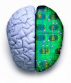

Ein deutsch- und englischsprachiger [YouTube-Kanal](http://www.youtube.com/user/BernsteinNetwork) zu meinen Fokus im Blog: Verbindungen zwischen Physik, Neurologie und Medizintechnik, ist mit dem ersten Video online. Diesen will ich hier kurz vorstellen. Es geht um lähmende Rhythmen bei Parkinson. Ein zusätzlicher Kurzfilm vom [Bernstein Center Freiburg](http://www.bcf.uni-freiburg.de/) über die Präzision der Verschaltungen im Gehirn ist als Feed in diesem YouTube Kanal auch schon zu sehen. In beiden Fällen helfen mathematische Modelle für das Verständnis der komplexen Vorgänge im Gehirn.

## Lähmende Rhythmen bei Parkinson

> Was geschieht bei Parkinson? Forscher des Bernstein Center Freiburg haben ein mathematisches Modell entwickelt, das die veränderte neuronale Aktivität bei Parkinson erklären kann. Auch für verbesserte Behandlungswege mit der Tiefen Hirnstimulation liefert das Modell neue Ansatzpunkte.

## Präzise Signale – Codierung in der Großhirnrinde

Dieser Kurzfilm-Beitrag ist vom Bernstein Center Freiburg erstellt und erscheint im Bernstein TV als Feed.

> Kurzfilm, der eine Methode beschreibt, mit der Nervenzellen in einer genau kontrollierten Weise mithilfe von Laserlicht und „Caged-Glutamat“ aktiviert werden können. Die Methode hilft zu verstehen, wie Signale von einzelnen Nervenzellen des Gehirns verarbeitet werden.
