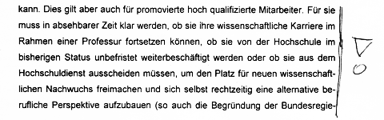

Als im Februar 2002 das neue Hochschulrahmengesetz (HRG) in Kraft trat, war die Aufregung groß. So fragte zum Beispiel die TAZ unter dem Titel „[Anleitung zum befristeten Glücklichsein](http://www.taz.de/1/archiv/archiv/?dig=2002/08/07/a0218)“ ab wann Wissenschaftler besser Taxi fahren sollten? Andere raunten, dies sei ein Berufsverbot.

Wissenschaftler sollen gezwungen werden, sechs Jahre nach abgeschlossener Promotion Platz zu machen für den neuen wissenschaftlichen Nachwuchs und sich rechtszeitig eine neue berufliche Perspektive aufbauen, wenn sie es bis dahin nicht zur Professur geschafft haben. So beschreibt die Lage damals Hannelore Kraft [in einer Reaktion auf einen polemischen Leserbrief](http://www.berndporr.me.uk/zwoelfender/zeit.html) in der Zeit („[Lockruf der Heimat](http://www.zeit.de/2004/11/B-Braindrain)„).

Nun, 10 Jahre später – mittlerweile gab es einige Korrekturen im HRG – bleibt die Frage, ob es in einigen Fällen zu einem faktischen Berufsverbot kam oder bald konkret so kommen wird?

Hierzu plant der Zeitenspiegel eine Reportage und sucht Kontakt zu betroffenen wissenschaftlichen Mitarbeitern an Hochschulen und Forschungseinrichtungen. Der Journalist [Jan Rübel](http://zeitenspiegel.de/en/autoren/jan-ruebel/) schrieb mich an und bat folgenden Aufruf hier zu veröffentlichen, dem ich sehr gerne nachkomme.

> *Ich plane einen Report über die Folgen des Wissenschaftszeitvertraggesetz. Im Fokus stehen die Befristungen für wissenschaftliche Mitarbeiter, die an Hochschulen und Forschungseinrichtungen etc. arbeiten. Ich will herausarbeiten, wie dieses Gesetz in diesen Fällen zu einem faktischen Berufsverbot führen kann.*
>
> *Daher meine Frage:  Ich suche Personen, über denen genau solch ein Damoklesschwert des Berufsverbots steht, welche die Befristungen erleben – und das absehbare Ende ihrer derzeitigen beruflichen Tätigkeit sowie die womögliche Notwendigkeit einer Neuorientierung .*
>
> *Als Journalist garantiere ich auf Wunsch Anonymisierung. Selbstverständlich werden alle Aussagen im vornherein autorisiert.*

Bei Interesse bitte sich direkt an [Jan Rübel](http://zeitenspiegel.de/en/autoren/jan-ruebel/) wenden.

Weitere Beiträge zum Thema:

* [Keine Leiharbeit in der Wissenschaft](https://scilogs.spektrum.de/blogs/blog/graue-substanz/2012-05-16/keine-leiharbeit-in-der-wissenschaft),
* [Lohnt sich Karriere an der Uni noch?](https://scilogs.spektrum.de/blogs/blog/graue-substanz/2012-04-20/lohnt-sich-karriere-an-der-uni-noch),
* [Wissenschaftszeitvertragsgesetz (WissZeitVG)](https://scilogs.spektrum.de/blogs/blog/graue-substanz/2012-01-29/wissenschaftszeitvertragsgesetz-wisszeitvg)

* und andere in der Kategorie [Hochschulpolitik](https://scilogs.spektrum.de/blogs/blog/graue-substanz/hochschulpolitik).
