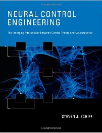

Sie werden assimiliert werden, Widerstand ist zwecklos. Es geht um *Assimilation* im Buch [Neural Control Engineering](http://www.amazon.de/Neural-Control-Engineering-Intersection-Computational/dp/0262015374/) von Steven J. Schiff.

Geben wir es zu. Wir sind längst Mischwesen, sogenannte Cyborgs, denn wir Menschen integrieren bereits nahtlos technische Geräte in unsere Lebensweise. Womit lesen Sie denn gerade diesen Beitrag und wie fanden sie hier her? Klick, klick. Damit nicht genug, bald wird der hunderttausendste [Hirnschrittmacher](http://de.wikipedia.org/wiki/Tiefe_Hirnstimulation) implantiert und solch körperfremde Technik Alltag sein. Wir müssen anfangen, über die Folgen nachzudenken.

Denn selbst wenn Ihr Körper noch eine *electronic virgin*1 ist – also elektronisch jungfräulich –, so sind wir alle doch längst *Natural-born Cyborgs*, so der Titel eines Buches von Andy Clark, das bereits vor neun Jahren erschien. In dem aktuellen Fachbuch von Steven J. Schiff geht es nun darum, ins Bett zu steigen mit der Technik. Die Jungfräulichkeit zu verlieren heißt in diesem Fall *data assimilation* (Datenassimilation), Mensch und Maschine vereinen sich durch elektronische Neuroprothesen. Im kleinen Inset links sehen Sie, wie eine Elektrode das Gehirn penetriert und dauerhaft implantiert wird. Wozu? Schiff nennt drei heilige Grale, aber dazu erst am Ende mehr.

Das Buch ist am 7. Dezember 2011 erschienen ([MIT Press](http://mitpress.mit.edu/catalog/item/default.asp?ttype=2&tid=12544)) und kam gestern, am letzten Tag des Jahres bei mir an. Heute habe ich es schon fast durchgelesen. Es ist ein Fachbuch, empfehlen kann ich es daher nur dem wirklich Interessierten, gleichwohl ist es so unterhaltsam geschrieben, dass es sich spannend wie ein Roman liest.

So beschreibt Steven Schiff gleich im ersten Kapitel auf Seite drei am Beispiel einer dramatisch verlaufenden Antarktisexpedition ([Endurance-Expedition 1914-1917](http://de.wikipedia.org/wiki/Endurance-Expedition)), wie die Polarforscher nach dem Prinzip des *data assimilation* (Datenassimilation) navigieren, um endlich wieder festen Boden unter den Füßen zu bekommen.

Durch dieses und viele weitere Beispiele (Entscheidungen am Obersten Gerichtshof der Vereinigten Staaten dienen als Beispiel, um die Singulärwertzerlegung zu erklären – nur um noch eins zu nennen2) hat der Leser immer festen Boden unter seinen Füßen.

Angesprochen werden in den ersten zwölf Kapitel Leser vom Gehirnchirurg bis zum theoretischen Physiker. Schiff, der beides ist, weiß, wie er sein Publikum erreicht: mit einer ungemein klaren Sprache und gut verständlicher Aufarbeitung des durchaus sehr komplexen Inhaltes: Medizintechnik und den ingenieurwissenschaftlichen Ansatz dort, der von der mathematischen Theorie bis in die letzte neuroanatomische Ecke reicht, der vielleicht spannendste Bereich der modernen Gehirnforschung.

Im letzten, dreizehnten Kapitel *Assimilating Minds* sucht der Autor dann die Philisophen. Das Konzept der Assimilation als intelligente Integration körperfremder Technik in körpereigene „Technik“, d.h. in unsere Organsysteme, soll auch aus Sicht der Psychophysiologie analysiert werden, im Sinne der Angleichung oder besser des „Zur-Deckung-Bringens“ von äußeren Eindrücken mit „präexistenten inneren Bildern“, wie es Wolfgang Pauli basierend auf der Tiefenpsychologie C. G. Jungs nannte. Dieses umfassende Thema, die philosophische und ethische Einbettung konnte nur angerissen werden. Grundsätzlich muss ich deswegen festhalten, dass dieses Fachbuch weniger als Klassiker taugt – viel zu dynamisch ist dieser Forschungszweig, um heute schon so etwas umfassendes hervorzubringen –, es ist eher ein Meilenstein. Der Autor Steven Schiff ist Vorreiter, der ihn setzt. Die Forschung wird seinem und ähnlichen Wegen folgen.

Ich hatte schon im Beitrag [Migräne Ctrl-Alt-Del](https://scilogs.spektrum.de/blogs/blog/graue-substanz/2011-09-03/migraene-ctrl-alt-del) aus einem Artikel des Autoren zitiert:

> An diesem Morgen erwachten Sie mit einer nicht unangemessenen Wettervorhersage. Es kann gut sein, dass das letzte Flugzeug, mit dem Sie flogen, durch eine automatische Steuerung ohne Eingreifen des Piloten landete. Beide dieser scheinbar ganz verschiedenen Tätigkeiten sind Beispiele für die Revolution, die es durch moderne Kontrolltechnik erlaubt,  komplexe Systeme zu beobachten (Wetter) und zu steuern (Flugzeuge). In beiden Fällen war ein Computermodell, das unsere *a priori* Wissen über das jeweilige System verkörpert, der Schlüssel zum Erfolg. [eigene Übersetzung]

Mit diesem Absatz als ersten Absatz im ersten Kapitel steigt Schiff nun auch in sein Buch ein (was ich damals nicht wusste). Ohne merklich trockener zu werden, wird in den folgenden Kapiteln ein Schätzproblem mittels Prädiktor-Korrektor-Verfahren formuliert (Kálmán Filter), das im Zentrum der intelligenten Neuroprothesen nach Schiff stehen soll. Verschiedene neuronale Modelle werden ausführlich erklärt und der Umgang mit deren Unzulänglichkeit angegangen. In den 13 Kapiteln lernen wir allgemein über den Sinn und ganz konkret über den Einsatz von Computermodellen kombiniert mit Prädiktor-Korrektor-Verfahren in elektronischen Neuroprothesen. Parkinson-Krankheit (Kapitel 10) und Epilepsie (Kapitel 12) sind die zentrale Beispiele für einen möglichen therapeutischen Ansatz.

Zusammen mit Steve, das muss und will an dieser Stelle im Sinne einer Full Disclosure nennen – ich bin befangen, wenn ich Buch und Thema lobe – arbeite ich an einen neuen, BMBF/NIH-geförderten Projekt, um diese Konzepte auch auf Migräne zu übertragen. Vor wenigen Tagen lief es schon über den [idw Ticker](http://idw-online.de/pages/de/news457308):

> Für Migräneanfälle sind vermutlich krankhaft langanhaltende Nervenentladungen in der Großhirnrinde verantwortlich. Dr. Markus Dahlem von der Technischen Universität Berlin möchte mit Kollegen der Pennsylvania State University, College State, herausfinden, ob sich diese durch den Einfluss Regelkreis-gesteuerter elektrischer Felder kontrollieren lassen. Dies werden sie sowohl im Computer- als auch im Tiermodell untersuchen.

Kapitel 2 und 11 im Buch behandeln diese Konzepte, mit denen wir versuchen werden, mit Hilfe von Regelkreis-gesteuerter elektromagnetischer Felder die Neurodynamik zu kontrollieren. Im Inset links sehen Sie eine potentielle Anwendung, den *migraine zapper,* an meinem Hinterkopf. Eine neue Generation dieser Geräte könnte Regelkreis-gesteuert sein. Dazu werde ich mehr schreiben in den kommenden Jahren und Jahre wird es dauern, hier den Schlüssel zum Erfolg zu finden, wenn es uns denn überhaupt gelingt.

Unabhängig davon braucht das Thema eine breite öffentliche Diskussion heute. Das wird spätestens klar, wenn der Autor die drei heiligen Grale der Neurotechnologie im Kapitel 9 *Brain-Machine Interfaces* konkret benennt: den medizinischen Gral, den militärischen Gral und den der Unterhaltungsindustrie.

Die Diskussion sollte meiner Meinung nach aber nicht allein anhand dieser Bereiche geführt werden. Neuroprothesen sollten wir nach ihrer Schnittstelle und der Sprache, die an dieser Schnittstelle gesprochen wird, erstmal einteilen:

* Das fängt eben schon an, im Sinne der *Natural-born Cyborgs*, mit Computer und Maus, mit iPad und Finger-Gesten-Sprache; kurzum mit *augmented reality*, wie es Pattie Maes in [MIT Media Lab](http://www.media.mit.edu/%7Epattie/) erforscht.

* Es geht weiter über Black-Box-Strategien mit denen das Decodierproblem (decoding problem) gelöst werden soll „ohne viel über das Gehirn zu wissen, das die Signale unter unseren Elektroden produziert („without knowing anything much about the brain that produces the signals beneath our electrodes“, Seite 215). Hier wird „Data Fitting“ und „Data Mining“ betrieben. (Hinweis: siehe z.B. den Beitrag drüben in MENSCHEN-BILDER:  [Können Hirnforscher bald Träume entschlüsseln?](https://scilogs.spektrum.de/blogs/blog/menschen-bilder/2011-09-28/hirnforscher-traeume-entschluesseln) und die Diskussion dort).
* Und endet mit intelligenten Neuroprothesen, die über das Konzept der *Data Assimilation* sich zum Ziel setzen, fremde Technik in unserem Körper modellbasiert zu integrieren (d.h. mittels Computermodellen, die *a priori* Wissen über das neuronale System verkörpern).

Das Spektrum reicht somit einerseits von nichtinvasiven über minimal-invasive zu hochinvasiven Techniken und andererseits von einer weitgehend natürlichen Sprache an der Schnittstelle über blindes Data Fitting dort, bis hin zu dem modellbasierten Data Assimilation (in Steves Buch geht es nur um letzteres). Dieses Spektrum gilt es bei der ethischen Bewertung der Anwendungsgebiete zu berücksichtigen.

Mit dieser Buchbesprechung kann ich nicht mehr leisten als zur Diskussion anzuregen.

Denn Widerstand ist nie zwecklos, braucht aber eine aufgeklärte Diskussion.

**Hinweis**

Aktuell im braincast passend zum Thema der Zukunft der Computer-Hirn-Schnittstelle ein Podcast: [Kurzgeschichte Das MI9000](https://scilogs.spektrum.de/blogs/blog/braincast/2011-12-31/kurzgeschichte-das-mi9000).

**Nachtrag 4. 1. 2012**

Ich hänge hier mal einen informativen Film von YouTube an über Tiefenhirnstimulation mittels einem Schrittmacher zur Behandlung eines [Essentiellen Tremors](http://www.charite.de/ch/neuro/klinik/patienten/ag_bewegungsstoerungen/index/info/Essentieller_Tremor/Essentieller_Tremor.htm) (Zittern).

Man findet dort auch über die Sichtwortesuche „[Deep Brain Stimulation on/off](http://www.youtube.com/results?search_query=deep+brain+stimulation+on+off&oq=Deep+Brain+Stimulation&aq=7&aqi=g10&aql=&gs_sm=e&gs_upl=391448l393312l0l398076l20l7l0l0l0l4l175l667l2.4l7l0)“ einige Video, die Teils etwas verstörend wirken könnten, wenn man diese Krankheiten nicht kennt. Dies aus Anlass der ersten Kommentare unten.

**Fußnoten**

1 In dem genannten Buch *Natural-born Cyborgs* von Andy Clark (Oxford Press) lautet gleich der erste Satz

> My body is an electronic virgin.

Als ein wesentliches Kennzeichen sollte Technik nahtlos und harmonisch unsere Lebensweise signifikant verändern. Ich schrieb in Beitrag [Die technische Art des Neuro-Enhancement](https://scilogs.spektrum.de/blogs/blog/graue-substanz/2009-11-18/moderne_therapeutische_neurotechnologie) (Nov. 2009) mehr dazu.

2 Nach dem Vorsitzenden Richter (*Chief Justice*) des höchsten Bundesgerichts (Supreme Court) wird dieser benannt. Im genannten Beispiel war dies William H. Rehnquist von 1994 bis 2002und so hieß das Gericht auch *Rehnquist U.S. Supreme Court*. In diese Periode fielen u.a. das Amtsenthebungsverfahren gegen Präsident Bill Clinton und der Gerichtsfall Bush gegen Gore. In einem PNAS Artikel von Lawrence Sirovich„[A pattern analysis of the second Rehnquist U.S. Supreme Court](http://www.pnas.org/content/100/13/7432.abstract), auf den Schiff Bezug nimmt, wird eine Analyse der Entscheidungen durchgeführt.

**Bildquelle**

Stereotaxiegerät zur Platzierung einer Stimulationselektrode aus [Wikidedia](http://de.wikipedia.org/wiki/Tiefe_Hirnstimulation), [GNU-Lizenz für freie Dokumentation](http://en.wikipedia.org/wiki/de:GNU-Lizenz_f%C3%BCr_freie_Dokumentation "w:de:GNU-Lizenz für freie Dokumentation").

© 2012, Markus A. Dahlem
