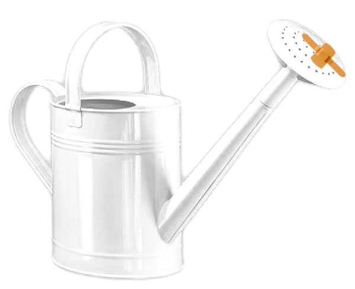

Leistung muß bewertet werden. Möglichst eine aktuelle Bewertung soll es sein. Selbstverständlich auch fair und objektiv. Was aus einer Bewertung folgt, steht auf einem anderen Blatt. Geben dem, der schon hat? Prinzip Gießkanne? Oder gar ausgleichen? Das sind Fragen, die sinnvollerweise erst nach der Bewertung wissenschaftlicher Leistung und der der Lehre gestellt werden können. Allein die Bewertung aber wirft schon Fragen auf. Zum Beispiel diese: Machen wir gerade den Gelehrten zum Gärtner?

**Bielefeld?**

Ja Bielefeld. Die [Universität Bielefeld](http://www.uni-bielefeld.de/) hat vier deutsche Elite-Unis hinter sich gelassen. Und das mit  Rang 173 in der gerade erschienen [World University Rankings-Liste der Zeitschrift *Times Higher Education*](http://www.timeshighereducation.co.uk/world-university-rankings/). Die RWTH Aachen kam auf Rang 182, die Universität of Konstanz auf 186, das Karlsruher Institut für Technologie gleich dahinter auf 187 und die Universität Tübingen finden wir zwei Plätze weiter auf 189.

Auch die Universität Bonn und die Humboldt Universität Berlin schlagen die Elite. Beide teilen sich Rang 178. Die Freie Universität Berlin (Elite!) hat es dagegen gar nicht in die Top 200 geschafft. Übrigens, meine TU Berlin leider auch nicht. Kann ich gar nicht verstehen. Ehrlich.

Jetzt ist die Times Higher Education-Zeitschrift nicht einfach irgendwer, der mal ein Ranking versucht. Sie haben sich diesmal sogar besonders viel Mühe gegeben. "*Objective and rigorous*" soll es sein.

> *We believe we have created the gold standard in international university performance comparisons.*

**Wer verklebt die Gießkanne?**

Nehmen wir einfach mal an, wir wollen dem geben der schon hat, also Elite-Unis. Oh Entschuldigung. Spitzen-Unis würden wir wollen in Deutschland. Ich kann mich dafür nicht recht begeistern. Dabei finde ich die Idee einiger weniger, aber gut geförderter Bundesuniversitäten durchaus attraktiv. All das lasse ich aber außen vor.

Was spricht eigentlich dagegen, jetzt wo die Jungs vom Times Higher Education sich schon so viel Mühe gegeben haben, diese Bewertung zu übernehemen? Wir könnten von den 227 Neubewerbungen für die Exzellenzinitiative einen Teil zur Seite legen und gar nicht lesen. Wir wählem zum Beispiel von den 22 universitären Zukunftskonzepten einfach die von Bielefeld, Bonn und der HU in Berlin ungelesen aus.

Nur die 98 Antragsskizzen für Graduiertenschulen und 107 für Exzellenzcluster schauen wir noch mal selbst objektiv und rigoros durch. Vielleicht nennen wir die Exzellenzcluster noch um in Sonderforschungsbereiche und lassen in Zukunft wieder jede Uni selbst entscheiden, zu welchen Zeitpunkt sie einen Antrag stellen will, statt diese alle an einem Tag einzusammeln.

Dann bliebe viel Bewährtes erhalten, nur dass wir von den 22 Löchern der Gieskanne 19 zugestopft haben, und zwar diejenigen die wir uns von einige Briten nach sorgfältiger Analyse vorgeschlugen ließen. Damit hätte ich kein Problem. Verzeihung liebe TU Berlin. Herzlichen Glückwunsch nach Bielefeld.

> ***Über gelehrten Geschäften ganz aufzuhören ein Gelehrter zu sein**.*  
>  Emil du Bois Reymond

Bielefeld, Bonn, Berlin. Der Vorteil wäre, dass wir als Wissenschaftler Anträge zu Zukunftskonzepten erst gar nicht schreiben müssen. Denn wissen Gelehrte wirklich wo die Zukunft blüht?

Ich halte übrigens das Ranking von [*Times Higher Education*](http://www.timeshighereducation.co.uk/world-university-rankings/) für fragwürdig. Aber darum geht es mir gar nicht, sondern um meine Eingangsfrage: Wie bewerte ich wissenschaftliche Leistungen und vor allem wer macht sich die Arbeit?

Einen Antrag zu schreiben ist sicher um ein vielfaches mehr Arbeit als ihn zu bewerten. Von den 227 Neubewerbungen für die Exzellenzinitiative werden die weitaus meisten nicht gefördert werden. Völlig zurecht werden sie nicht gefördert. Das Problem liegt nun darin, dass viele Forschungsverbünde zu diesem Zeitpunkt auch gar keinen Antrag haben stellen wollen, gäbe es nicht gerade jetzt die Exzellenzinitiative. Diese Forschungsverbünde hätten gleichwohl zu einem späteren Zeitpunkt vielleicht einen exzellenten Antrag stellen können. Dann aber gibt es gerade keine Initiative. Die Arbeit machen sie sich jetzt vielleicht nicht gänzlich umsonst, doch ist es schlicht zuviel des Guten.

Wenn wir so weiter Antrag über Antrag schreiben, besteht die Gefahr für einen Wissenschaftler eines Tages "über gelehrten Geschäften ganz aufzuhören ein Gelehrter zu sein". So klagte Emil du Bois Reymond schon im 19. Jahrhundert, als auch er an dass [nötige staatliche Fördergeld](http://www.brainlogs.de/blogs/blog/graue-substanz/2010-05-03/wandel-der-physiologie#Wandel) kommen wollte.
