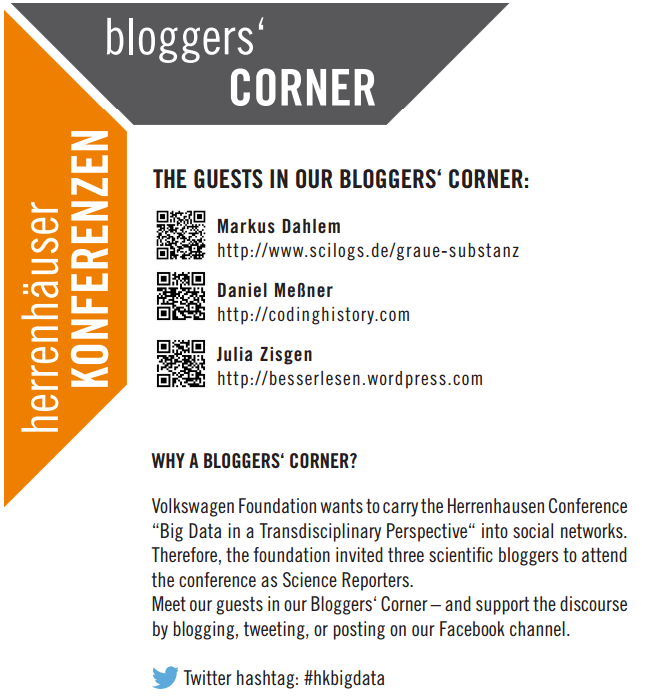

Googles Konzernchef Eric Schmidt bezifferte die Menge an Information, die von Beginn der Zivilisation bis zum Jahr 2003 erzeugt wurde, auf etwa fünf Milliarden Gigabyte und behauptet, dass sieben Jahre später die selbe Menge alle zwei Tage produziert worden sei.

## Big Data: Nicht Zahl sondern Zuwachs

Morgen wird solch eine Menge wahrscheinlich minütlich produziert und übermorgen sekündlich – ich meine das metaphorische Morgen und Übermorgen. So genau kommt es sowieso nicht darauf an. Eher ist noch der Hinweis berechtigt, dass die absoluten Zahlen, die die Menge an Information beziffern sollen, „totaler Quatsch“ sind (siehe: «[Eric Schmidt’s “5 Exabytes” Quote is a Load of Crap](https://blog.rjmetrics.com/2011/02/07/eric-schmidts-5-exabytes-quote-is-a-load-of-crap/)»).

Die zentrale Aussage ist eine andere. Schmidt Feststellung vereinfacht und kann damit das explosionsartige Anwachsen von Daten, aus denen Informationen abgeleitet werden sollen, veranschaulichen. Warum kann er nicht trotzdem dafür präzise Zahlen hernehmen?  Wer, wenn nicht Google, kennt zumindest die Größenordnungen im digitalen Universum? Ginge es allein um Daten in Dateien, die gespeichert werden, könnte man Größenordnungen wohl abschätzen. Aber Schmidt spricht von Informationen. Das Anwachsen von Datenmengen und das damit verbundene Problem, diese zu Informationen zu verarbeiten, lässt sich beides stichhaltig belegen aber letzeres nicht so einfach beziffern. Zusammen versteht man das unter *Big Data*.

Big Data ist das Prinzip Möhre an der Schnur vor dem Esel Datenverarbeitung. Big Data ist Diskrepanz, eine Datenmenge relativ zum Stand der momentanen Technik, mit der diese noch nicht verarbeitet werden kann. Deswegen kommt es auch nicht auf die genauen Mengen an und selbst nicht mal auf deren Größenordnungen. Schmidt sagte übrigens auch nicht „Milliarde Gigabyte“, sondern kürzte es zu „Exabyte“ ab. Denn irgendwann wird man dann von Millionen und Milliarden Exabyte sprechen müssen. Eine Million Exabyte sind ein Yottabyte, danach wird die Luft dünn; vorstellen kann ich mir diese Zahlen nicht, das Wachstum und die damit verbundenen Probleme sind dagegen greifbar.

## Zwei Veranstaltungen zu Big Data

Heute bin ich von der Volkswagenstiftung eingeladen und unterwegs zur ihrer Herrenhäuser Konferenz: [Big Data in a Transdisciplinary Perspective](http://www.volkswagenstiftung.de/veranstaltungen/veranstaltungskalender/veranstdet/news/detail/artikel/herrenhaeuser-konferenz-big-data-in-a-transdisciplinary-perspective/marginal/4525.html). Es gut darum, wie Big Data Gesellschaft, Wirtschaft und Wissenschaft verändert, so titelt Jens Rehländer in seinem [Post](http://www.volkswagenstiftung.de/servob/presse/pressedet/news/detail/artikel/herrenhaeuser-konferenz-wie-big-data-gesellschaft-wirtschaft-und-wissenschaft-veraendert/marginal/4576.html).

Das ist eine von zwei Veranstaltungen, die ich in der nächsten Zeit zum Thema Big Data besuchen werde. Laut Ankündigung der Volkswagenstiftung ist das Programm in folgende Sessions gegliedert:

* Big Data and Science – Idle Potentials
* Big Data in the Arts and the Humanities
* Big Data and Economic Challenges
* Coping with Big Data
* Big Data and Legal Framework

Als ich das las, dachte ich sofort: Da fehlt was. Vier Disziplinen werden genannt: Naturwissenschaft, Kunst, Geisteswissenschaft und Ökonomie, für eine transdisziplinäre Perspektive sicher genug – doch die Medizin fehlt.

Zu unrecht, wie ich finde, wenn man in die Zukunft gucken will. Denn wo kommt der Großteil der Exabytes her? Große Datenmengen werden ja nicht, wie dieser Blogpost, über eine Tastatur erzeugt. Big Data kommt aus Geräten mit Sensoren („embedded telematics devices“). Und wird daraus ein Zweiwegesystem mit innovativer Software und Cloud-Diensten, spricht man auch von intelligenten Systemen. Rohdaten werden zu Informationen.

Zwar beziehen „embedded telematics devices“ heute noch nicht zu einem wirklich großen Teil medizinische (Roh)Daten. Doch muss man nicht viel Weitsicht haben, um vorauszusehen, dass medizinische Daten, genauer: physiologischen Daten beim nächsten steilen Anstieg einen großen Teil ausmachen werden. Wahrscheinlich sogar den größten Teil.

Die Entwicklung der Genomik und die dort anfallenden Daten waren das Big Data von gestern und sind heute schon datentechnisch besser handbar. Die Wearables hingegen sind – aus meiner Sicht – als das zukünftige „embedded telematics device“ ganz sicher die größte heranwachsende Möhre. Man braucht auch nicht viel Fantasie, um sich vorzustellen, dass bald hat jedes Unterhemd einen solchen physiologischen Flugschreiber integriert hat. Es ist dann die Aufgabe von mobilen Gesundheitsdiensten daraus Informationen abzuleiten. Das Zweiwegesystem ist auch längst bekannt unter einen alten Namen: Biofeedback – was einmal mehr dafür spricht, dass dieser Bereich nur auf den Einstrom von Big Data seit 40 Jahren gewartet hat, während andere Bereiche vielleicht zur Zeit doch eher hochgespielt werden.

Mit den (heranwachsenden) mobilen Gesundheitsdiensten wird vor allem die Dynamik von Krankheiten erfasst, [worüber ich vor einem Monat schrieb](https://scilogs.spektrum.de/graue-substanz/krankheit-und-dynamik-in-zeiten-mobiler-gesundheitsdienste/); am selben Tag hatte ich mich für die Teilnahme an der Herrenhäuser Konferenz beworben. Diese Aspekte stehen hier im Blog unter der neuen Kategorie [Big Data](https://scilogs.spektrum.de/graue-substanz/category/big-data/). Jetzt lasse ich mich einfach überraschen, ob und, wenn ja, in welcher Session die Medizin auftauchen wird.

Spätestens im Mai steht sie im Mittelpunkt: „[Die Vermessung des Menschen – Big Data und Gesundheit](http://www.ethikrat.org/veranstaltungen/jahrestagungen/die-vermessunng-des-menschen)“, heißt das Thema der Jahrestagung des Deutschen Ethikrates.

Dem ungeachtet klingt das Programm der Herrenhäuser Konferenz spannend und ich werde weiter darüber meine Gedanken schreiben, hier sowieso auch bei [Twitter](https://twitter.com/markusdahlem) mit [#hkbigdata](https://twitter.com/hashtag/hkbigdata).
