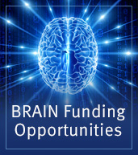

Die kritischen Stimmen sind für mich leicht voraussagbar. Denn neu ist Big Science in der Hirnforschung nicht. Wo ich hinhörte, die etwas über eine Milliarde Euro für das *Human Brain Project* (HBP) löste überwiegend große Skepsis aus. Zuletzt (und mehr als Randnotiz) auf dem 18. Berliner Kolloquium der Daimler und Benz Stiftung „MenschMaschine-Visionen – Technik, die unter die Haut geht“. Keine Konferenz ohne Abfälliges zum HBP zumindest in der Kaffeepause. Oder hier [auf SciLogs](https://scilogs.spektrum.de/gedankenwerkstatt/das-wahre-leben-simulierter-gehirne/).

 Unbekümmert ziehen die USA nun mit 4.5 Milliarden US Dollar nach und am HBP vorbei.  Es kommt die *[Brain Research through Advancing Innovative Neurotechnologies Initiative](http://www.nih.gov/science/brain/index.htm)* – mit neuem Akronym BRAIN.\*

Ich denke man kann und muss es auf diesen einen Nenner bringen, das scheint von jetzt an der einzige noch verbleibende Weg überhaupt Geld von der Politik zu bekommen. Big Science schmückt Politiker. Und diese Bemerkung greift nur in einem Aspekt zu kurz. [Big Science ist BMBF-Förderung](http://www.bmbf.de/de/1398.php), sie wird von der Politik strukturell gedacht. Big Science ist nicht Wirtschaftsförderung, Big Science rückt aber Wissenschaft, Wirtschaft und Staat zusammen.

## Kreativität als Ware

Schauen ich aus der Sicht des Forschers, stelle ich fest, natürlich sind solche Ankündigungen wie nun BRAIN handlungsstimulierend. Man nennt das wohl [Kontextsteuerung](https://www.google.de/url?sa=t&rct=j&q=&esrc=s&source=web&cd=7&cad=rja&uact=8&ved=0CGUQFjAG&url=http%3A%2F%2Fbwv.verlag-online.eu%2Fdigibib%2Fbwv%2Fapply%2Fdownload%2Ffile%2FL3BhZ2VzLzliL2RkL2QwMDA3NDY0L2hvbWUvaHRkb2NzL21zd2ViL2h0dHAvdmVybGFnLW9ubGluZS5ldS9zdWIvYnd2L3VzZXIvZGF0YS9kb3dubG9hZC9wZGYvMjAwNC8yMjkxMTZfMjAwNF8wMl8wOS5wZGY%3D%2F&ei=T56dU5CgCubl4QSxwICgCQ&usg=AFQjCNHt8GNLw6a-H0B6NvpQNfOpPNBxng&sig2=L3ot5yA5OSmfng2eFZoobg&bvm=bv.68911936,d.bGE). Kreativität wird zur Ware. Als Wissenschaftler kann ich meine Forschungsleistung auf einem neu geschaffenen Markt anbieten. An dieser Stelle müsste ich amerikanische und deutsche Universitäten differenzierter betrachten, will dass aber nur knapp machen. Jene Forscher sehen sich durch die dortige Departmentstruktur (mit ihrer Möglichkeit der disziplinären Ausdifferenzierung oder Schwerpunktbildung) auf der Ebene der Hochschullehrer mit diesen Bedingungen konfrontiert. Wenn, dann bieten Forscher dort ihre Leistung eher als Hochschullehrer mit entsprechenden Rückgrat an. Hierzulande sind es vergleichsweise wenige Hochschullehrer, die ihre zugeordneten Mitarbeitern “ansetzen”, oft ohne sich selbst in die für die ambitionierten Detailfragen des Big Science notwendige Tiefe einlassen zu können. Deswegen funktioniert Big Science nicht überall gleich gut.

## Technische Infrastruktur für die Wirtschaft

Schaue ich aus der Sicht dessen was gemacht werden soll, muss ich vorab nochmal zurück auf das Ziel des europäischen *Human Brain Projects* kommen. Ein Gehirn soll nachgeahmt werden. Nicht wenige kritisieren dieses Ziel. Aber geht es wirklich um Wissenschaft?  Geht es nicht viel mehr um die Schaffung einer technischen Infrastruktur?

Die größere Frage ist vielleicht, ändert sich die Naturwissenschaft? In Big Science verabschieden wir uns zumindest ein Stückchen weit von dem Ansatz der Wissenschaft à la Galileo mit Experimenten (und Kontrollexperiment!) und à la  Newton mit idealisierten Modell, worauf ich nochmal zu sprechen komme.

Francis Collins, Direktor der National Institutes of Health (NIH), [kommentiert](http://www.nih.gov/news/health/jun2014/od-05.htm) die US-amerikanische Initiative BRAIN nun so:

> Wie das Gehirn funktioniert und unserer geistiges und intellektuelles Leben hervorruft, wird der aufregendste und herausfordernste Bereich der Wissenschaft im 21. Jahrhundert sein. Als Ergebnis dieser gemeinsamen Anstrengung werden neue Technologien erfunden, neue Industrien werden hervorgebracht und neue Behandlungen und sogar Heilmittel für verheerende Störungen und Erkrankungen des Gehirns und des Nervensystems entdeckt.

## Aus einem Dollar mach 140 Dollar

Neue Technologien, neue Industrien, beides steht nicht umsonst in der Mitte, schmackhaft gemacht von den hehren Zielen drumherum. Als Direktor des NIH und Genetiker wird Collin das von Obama genannte Argument im Hinterkopf haben: Jeder in das Big Science *Human Genome Project* investierte US-Dollar rechnete sich und kam durch Wirtschaftsleistung angeblich mit US\$ 140 zurück ([Quelle](http://battelle.org/docs/default-document-library/economic_impact_of_the_human_genome_project.pdf) ist ein gemeinnütziges US-amerikanisches Institut für Vertragsforschung).

Das Leitkriterium der Forschungsförderung à la Big Science ist letztlich wirtschaftliches Wachstums. (Wenn es nicht militärisch ist, man denke an das Manhattan-Projekt.) Wer also die Unwissenschaftlichkeit der geförderten Projekte anführt, verkennt vielleicht nur dieses Leitkriterium. In den Phrasen der ausbuchstabierten Akronyme sind weniger wissenschaftliche Ziele versteckt als Rahmenbedingungen für Infrastruktur.

## Ändert sich Wissenschaft?

Big Science wirft dabei eine ungeheurer Frage auf. Ändert sich die moderne naturwissenschaftliche Methode? Dass Big Science sich offensichtlich nicht so schnell reproduzieren lässt, ist wohl weniger ein Merkmal dafür. Auch andere Entwicklungen zeigen wie zweitrangig dies geworden ist. Vielmehr verblüfft es mich, dass wir in der Hirnforschung oft nur noch Zusammenhänge (Korrelationen) suchen, ohne sie zu verstehen (Kausalität) zu wollen. Dafür scheint Big Science vor allem zu stehen.

Der Psychologe Gary Marcus veranschaulichte das im [The New Yorker](http://www.newyorker.com/online/blogs/newsdesk/2012/12/what-neuroscience-really-teaches-us-and-what-it-doesnt.html). In den bunten Bilder der Neurowissenschaften sah er einen wissenschaftlichen Ansatz ähnlich dem Versuch, das politische Geschehen im US-amerikanischen Swing State Ohio vom Flugzeug über Cleveland beobachten zu wollen. Dann schrieb er einen Satz, der in Wissenschaftsblogs und darüberhinaus ein großes Echo hervorrief ([hier](http://neurodojo.blogspot.de/2012/12/nominees-for-newton-of-neuroscience.html) und [hier](http://blogs.scientificamerican.com/scicurious-brain/2012/12/03/does-neuroscience-need-a-newton/)).

> Wissenschaftler kämpfen auch immer noch darum Theorien aufzustellen, wie Verbände aus individuellen Gehirnzellen zu komplexen Verhaltensweisen sich verbinden, zumindest prinzipiell. Die Neurowissenschaft muss noch ihren Newton finden, geschweige denn ihren Einstein.

Big Science gibt die Antwort darauf. Wir sollen nicht auf den Neuro-Newton warten. Stattdessen muss sich ein Naturwissenschaftler in seinem Selbstverständnis als Anbieter von Forschungsleistungen sehen.

Wäre diese Entwicklung so verkehrt? Wenn an drei Säulen nicht gerüttelt würde, sähe ich diese Entwicklung durchaus positiv.

Man darf nicht die Verbeamtung (bzw. *tenure* in den USA) der Forscher in Frage stellen. Insbesondere deutsche Universitäten müssen gleichzeitig hin zu einer Departmentstruktur und sich von dem Lehrstuhlsystem verabschieden.

Die Forschungsausgaben müssen entsprechend über 3 Prozent des Bruttinlandsprodukts (BIP) liegen, denn Big Science könnte man mit einigem Recht im Haushalt des Bundesminister für Wirtschaft und Energie (BMWi) verbuchen. Dass „Technologie“ im Namen des BMWi verschwunden ist, mag man als Zeichen des Wandels hin zu Big Science sehen, d.h. Rahmenbedingungen der technischen Infrastruktur werden am Bundesministerium für Bildung und Forschung (BMBF) gesetzt.

Außerdem gilt zukünftiges Wirtschaftswachstum als Leitkriterium der Big Science allein für die Naturwissenschaften (Science) nicht aber für die Geisteswissenschaften (Humanities). Diese müssen weiter als Gegengewicht dringend gestärkt werden, insbesondere solange Big Science vom 3%-BIP-Kuchen herausgeschnitten wird.

Ich fürchte alle drei Punkte werden genau nicht gemacht. Damit würde Big Science allein zu Big Business.

## Fußnote

\*[Angedacht wurde diese Initiative schon 2012](http://www.ncbi.nlm.nih.gov/pmc/articles/PMC3597383/) mit dem *Brain Activity Map Project* (BAM).
