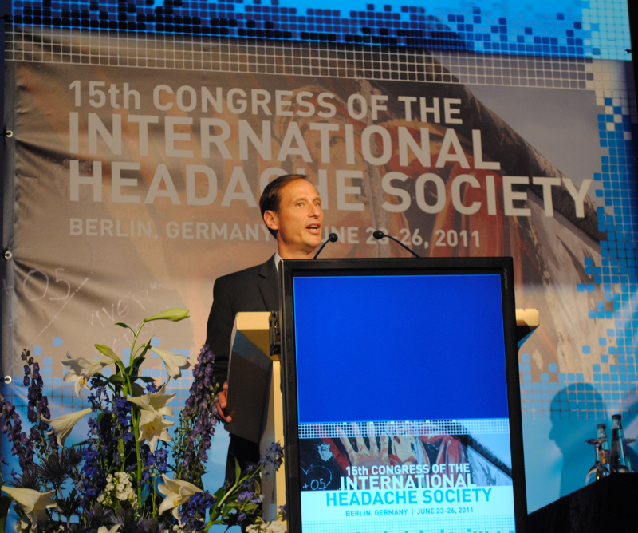

Bei 10 Millionen US-Dollar denkt man nicht an den Nikolaus. Dafür wäre es auch zwei Tage zu spät. Am 8. Dezember bekam Andrew Charles, Inhaber des Luskin-Lehrstuhls für Migräne und Kopfschmerzforschung der University of California, Los Angeles (UCLA), 10 Millionen US-Dollar für seine Migräneforschung. Gespendet wurden das Geld aus privater Hand, von Leonard und Wendy Goldberg.

Dr. Andrew C. Charles, Professor der Neurologie und Director des »Headache Research and Treatment Program« der Universität von Kalifornien, Los Angeles.

Schon 2011, kurz nach dem 15. internationalen Kopfschmerzkongress in Berlin, von dem das Bild oben stammt, wurde eine noch höhere Spende bekanntgegeben werden, 100 Millionen US-Dollar. Diese stammen von Meyer und Renee Luskin, deren Tochter Andrea unter Migräne leidet. Doch zunächst seien kurz die aktuellen Spender vorgestellt:

Leonard J. Goldberg kennt man in Deutschland zumindest indirekt. Er hat u.a. die Fernsehserien “*Drei Engel für Charlie*”, “*Starsky und Hutch*” und “*Hart aber herzlich*” entwickelt und produziert. Außerdem war er Programmchef des Fernsehsenders ABC und Präsident der Filmgesellschaft 20th Century Fox. Seine Frau Wendy Goldberg ist als Ko-Autorin von zwei Büchern wohl eher in den USA bekannt: *“Marry Me! Courtships and Proposals of Legendary Couples*” und “*The Blue Bloods Cookbook: 120 Recipes That Will Bring Your Family to the Table*”.

Leonard und Wendy Goldberg haben, so erzählen sie, sowohl bei Freunden als auch bei Familienmitglieder erlebt, wie stark behindernd eine Migräneerkrankung sein kann.

10 Millionen US-Dollar ist wirklich sehr viel, doch ungewöhnlich ist so eine Spende in den USA nicht. Beispielsweise kenne viele Migräneerkrankte (zumindest auch indirekt) den Physiker Robert Fischell, der ein tragbares Gerät zu transkraniellen Magnetstimulation (TMS) gegen Migräne erfunden hat. Robert Fischell hat 30 Millionen US-Dollar an die University of Maryland College Park Foundation gespendet für ein neues Institut für biomedizinische Geräte.

100 Millionen US-Dollar sind allerdings schon eine etwas größere Hausnummer. (Spendet man noch deutlich mehr, macht man eher seine eigene Stiftung auf.) Für UCLA war es die zweitgrößte Einzelspende. Sie wurde auch nur zu einem Teil für die Migräneforschung aufgewand, nämlich für den erwähnten Luskin-Lehrstuhl für Migräne und Kopfschmerzforschung. Des Weiteren floss das Geld in Bildungsprojekte der UCLA. Und es fließt weiter. Denn ausgegeben wird das Geld nicht, sondern angelegt und verzinst, so dass Migräneforschung und Bildung nachhaltig profitieren.

Meyer Luskin ist ein in Los Angeles ansässiger Unternehmer, der mit Recycling von abgelaufene Backwaren zu Tierfutter zu Geld kam. Seine Spende sieht er als Investition für seine Enkel. Seine Begründung finde ich wirklich bemerkenswert.

Für mich ein schöner Jahresabschluss hier im Blog:

„Bildung ist die Quelle des guten Lebens. Es ist die Quelle, die wir suchen sollten. Und wenn eine Person ein gutes Leben hat, verbessert sie die Gesellschaft. Also mache ich eine Investition für das, was ich denke, was wichtig für die Gesellschaft ist, für die Zukunft, für eine Welt, in der meine Enkel leben. Ich mache viel mehr für sie, wenn ich versuche die Gesellschaft zu verbessern, als ihnen ein paar extra Dollar zu geben, die nicht wirklich viel bedeuten – es könnte sie verwöhnen. Das ist die beste Investition, die ich machen kann.“
