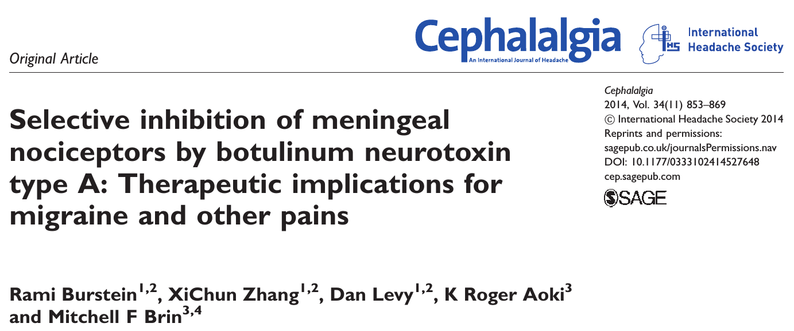

Botulinumtoxin, besser bekannt als Botox, wird nicht nur zur Faltenglättung eingesetzt. Laut Studien wirkt Botox auch gegen Migräne [1-3] sowie gegen Inkontinenz und gegen einige weitere Leiden. Insgesamt ein [diverses Anwendungsprofil](http://en.wikipedia.org/wiki/Botulinum_toxin#Medical_uses) im klinischen Spektrum.1

## Botox bei chronischer Migräne?

Bei Migräne wurde eine Wirkung von Botox in klinischen Studien bisher nur bei der chronischen Form nachgewiesen. Das heißt, eine Wirkung von Botox konnte nur belegt werden, wenn Betroffene an fünfzehn oder mehr Tagen an Kopfschmerzen leiden, ohne dass ein Medikamentenübergebrauch besteht. Dieser Zustand muss außerdem über mindestens drei Monate hinweg bestanden haben. Erst dann leidet man an der chronischen Form der Migräne.  
Allerdings wurden diese Studien heftig kritisiert wegen [angeblich mangelhaften Studiendesigns](http://www.medscapemedizin.de/artikelansicht/4903625) und weil der Wirkungsmechanismus von Botox noch unklar ist, denn „[Botulinumtoxin A sei kein Schmerzmittel, die Begeisterung darüber [sei also] eine einzige Selbsttäuschung](http://www.medscapemedizin.de/artikelansicht/4903625)“.

## Offengelegung der Interessenskonflikte

Nun hat eine tierexperimentelle Studie versucht, diesen Wirkungsmechanismus aufzudecken. Demnach scheint Botox doch auch ein Schmerzmittel zu sein. Zwar hat der führende Wissenschaftler dieser Studie, Rami Burstein, Forschungsgelder vom Allergan erhalten, dem Hersteller von Botox. Er ist auch als Berater dort tätig. Beide Interessenkonflikte wurden selbstverständlich in der Veröffentlichung offengelegt. Doch halte ich persönlich die Ergebnisse über den Wirkmechanismus von Botox auf die Schmerzrezeptoren für solide, weil ich Rami Bursteins Arbeiten von vielen Tagungen kenne und ihn auch schon in seinem Labor in Boston besuchte. (Ein Interessenkonflikt liegt bei mir übrigens nicht vor – ich habe zu Allergan keinen Kontakt und sehe deren Marketing-Kampagne als eher kontroproduktiv an.1 Außerdem glaube ich persönlich, dass der Placeoeffekt eine große Rolle bei Botox spielt, aber wahrscheinlich nicht alles erklärt.)

Diese Studie wurde vor einem Monat auf dem Internationalen Kopfschmerzkongress in Valencia im Rahmen des Cephalalgia Award Lecture vorgestellt. Sie klärt den Wirkungsmechanismus von Botox und legt nahe, dass Botox auch vorbeugend gegen Migräne und andere Schmerzzustände helfen könnte.

https://twitter.com/CephEditorial/status/599604551210160128

## Zentrale Ergebnisse …

Die Studie liefert direkte Nachweise, wie Botox die Schmerzempfindung hemmt. Gefunden wurde eine Wirkung nur bei mechanischer Schmerzempfindung, nicht aber bei thermischer Schmerzempfindung. Gehemmt werden dabei die langsamen, nicht-myelinisierten Fasern, die sogenannten C-Fasern. Und zwar nur selektiv für überschwellige Schmerzreize, C-Fasern wurden von Botox nicht gehemmt, wenn sie eine normale mechanische Stimulation übertragen sollten. Soweit passt alles gut zur Migräne.

## … und der tierexperimentelle Weg dahin

Diese Resultate stammen von einem Tiermodell der Migräne. Was heißt das? Man muss dies konkret erklären. Es ist eins der vielen Beispiele, an denen man sich die moralische – oder unmoralische, darüber kann man streiten – Rechtfertigung der Einschränkung von Tierrechten sehr deutlich vor Augen führen kann und sollte. Tiere verfügen über Schmerzfähigkeit – und sicher auch über eine Leidensfähigkeit.

Es wurden in der Studie gezielt Schmerzzustände erzeugt, die einer Migräneattacke ähneln. Dies geschieht über eine Schädigung der Hirnhäute. Man nimmt an, dass es bei Migräne zu der Ausschüttung einer Vielzahl von chemischen Stoffen kommt, einer sogenannten „Entzündungssuppe“ (Engl. *inflammatory soup*). Mit Hilfe einer künstlichen inflammatory soup, die dem Tier direkt auf die Hirnhäuten appliziert wird, kann man die Schmerzentstehung† studieren, sowie deren nachgeordneten Konsequenzen im zentralen Nervensystem. Das nennt man ein Tiermodell.

Sind Nervenfasern durch wiederholte Anwendung einer künstlichen inflammatory soup Überempfindlichkeit, wird dieser Effekt durch Botox wieder umgekehrt und Botox verhindert diese Überempfindlichkeit, wenn es vorher angewandt wird.  Außerdem hemmt Botox, wenn es außerhalb des Schädels appliziert wird (wie beim Menschen), die Schmerzrezeptoren innerhalb des Schädels, nämlich in der Hirnhaut und zwar bei jenen Nerven, die durch den Schädelknochen hindurch verlaufen [4].

Damit wurde erstmal ein Wirkunsmechanismus beschrieben, nach dem Botox eben doch auch ein Schmerzmittel ist. Ein überaus überraschendes Ergebnis. Das allein belegt jedoch noch nicht, dass die Wirkung von Botox bei Migräne wirklich über diesen Wirkmechanismus abläuft.

## Fußnoten

1  Der Europa-Chef des Botox-Herstellers Allergan, Paul Navarre wünscht sich noch breitere Anwendungen. Navarre wird in der [FAZ zitiert](http://www.faz.net/aktuell/wirtschaft/antifaltenmittel-botox-fuer-deutschland-13187562.html) mit „Market creation“ als Bezeichnung für eine Migräne-Kampagne, die der NDR nach eine Recherche zusammen mit der Süddeutschen Zeitung als „[verdeckte Kampagne für Botox gegen Migräne](https://www.ndr.de/nachrichten/investigation/Verdeckte-Kampagne-fuer-Botox-gegen-Migraene,botox134.html)“ titulierte. Dieser Kontext macht es noch schwieriger den Einfluss von Allergan auf die Studien einzuschätzen. In einem Folgebeitrag werde ich über eine weitere aktuelle Studie vom 22. Mai schreiben, die ebenfalls in Cephalalgia veröffentlicht wurde.

† Hier stand zuerst Schmerz*erzeugung*. Schmerzent*stehung* ist das richtige Wort. (Dank an eine aufmerksame Leserin.) Erzeugt wird der Prozess experimentell, durch die künstliche inflammatory soup entsteht dann der Schmerz. In den Kommentaren unten ist der ursprüngliche Text zitiert.

## Literatur

[1] Diener, H. C., Dodick, D. W., Aurora, S. K., Turkel, C. C., DeGryse, R. E., Lipton, R. B., … & Brin, M. F. (2010). OnabotulinumtoxinA for treatment of chronic migraine: results from the double-blind, randomized, placebo-controlled phase of the PREEMPT 2 trial. Cephalalgia, 30(7), 804-814.

[2] Aurora, S. K., Dodick, D. W., Turkel, C. C., DeGryse, R. E., Silberstein, S. D., Lipton, R. B., … & Brin, M. F. (2010). OnabotulinumtoxinA for treatment of chronic migraine: results from the double-blind, randomized, placebo-controlled phase of the PREEMPT 1 trial. *Cephalalgia*, *30*(7), 793-803.

[3] Dodick, D. W., Turkel, C. C., DeGryse, R. E., Aurora, S. K., Silberstein, S. D., Lipton, R. B., … & Brin, M. F. (2010). OnabotulinumtoxinA for Treatment of Chronic Migraine: Pooled Results From the Double‐Blind, Randomized, Placebo‐Controlled Phases of the PREEMPT Clinical Program. *Headache: The Journal of Head and Face Pain*, *50*(6), 921-936.

[4] Schueler, M., Messlinger, K., Dux, M., Neuhuber, W. L., & De Col, R. (2013). Extracranial projections of meningeal afferents and their impact on meningeal nociception and headache. *Pain*, *154*(9), 1622-1631.
