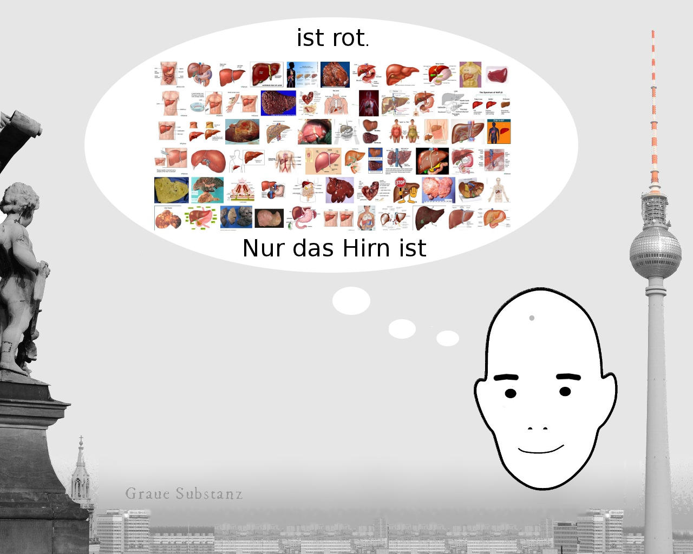
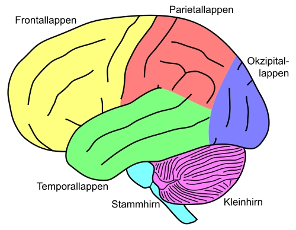
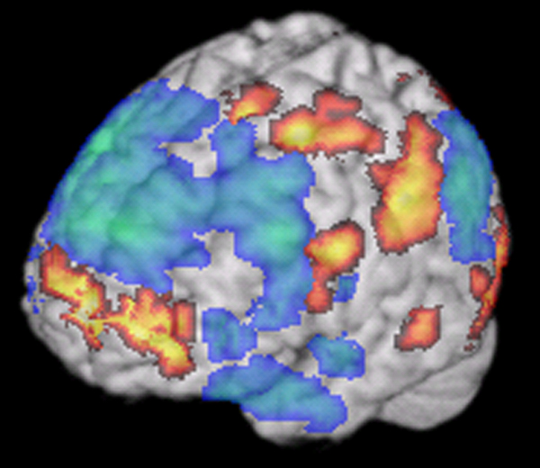
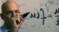
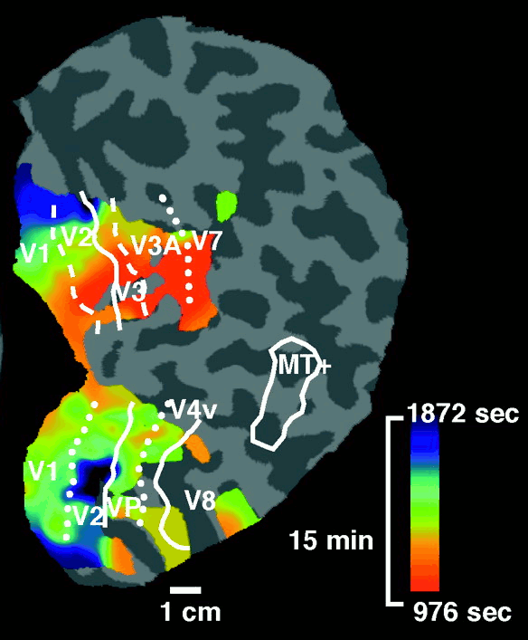
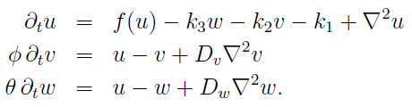

„[Legt das Gehirn alles fest?](http://www.brainlogs.de/blogs/blog/menschen-bilder/2011-03-26/legt-das-gehirn-alles-fest-einleitung)„, fragt der Neurophilosoph Stephan Schleim im Nachbarblog. Nein, sage ich, im Zweifelsfall gibt es ja noch Herz und Leber.\* Diese sind übrigens beide rot wie Blut. Das Gehirn nicht. Verantwortlich dafür ist die Blut-Hirn-Schranke. Sie stand sozusagen Pate bei meinem Blog, der *Grauen* Substanz.

Googlen wir nun aber – ich hab‘ das mal gemacht, um ganz sicher zugehen, ergibt sich ein anderes Bild:

Oh Schreck, das Gehirn ist bunt. Wie das? Zum einem wird gerne die grobe Unterteilung des menschlichen Gehirns, z.B. die vier Hirnlappen, farblich gekennzeichnet. Das ist schlicht praktisch. Mehr nicht.

**Fleckologie**

Dann aber sehen wir auch solche Bilder.

  
*([Photo von US-Gesundheitsbehörde, Charles J. Limb and Allen R. Braun, NIDCD](http://www.nih.gov/about/almanac/historical/galleries/nidcd_photos.htm).)*

Jetzt wird es bunt. Hier wird Gehirnaktivität in einer Farbkodierung gezeigt. Wobei Aktivität auch heißen kann, dass alle hemmenden Nervenzellen besonders aktiv sind und nicht die erregenden Nervenzellen. Wie diese absoluten Aktivitätsmuster sich in Gehirnfunktionen übersetzen, ist zunächst unklar, zumal dies natürlich ein sich zeitlich sehr schnell änderndes Muster ist; wir sehen eine Momentaufnahme oder auch einen zeitlichen Mittelwert.

[*Fleckologie* nennt Henning Scheich](http://www.wiwo.de/technik-wissen/blick-ins-gehirn-106256/), ein führender deutscher Gehirnforscher, gerne diese Lehre – Kunst wohl eher – der Interpretation dieser Kernspintomographie-Bilder, ohne dies wirklich abschätzig zu meinen, aber doch klar mit der Warnung verbunden, dass wir ohne theoretische Konzepte solche bunten Bilder nicht interpretieren können.

Diese theoretischen Konzepte müssen nicht notwendigerweise auf mathematischen Modellen basieren. Doch fällt es mir schwer, Konzepte mir anders vorzustellen. Wir laufen schnell Gefahr, den bunten Bildern viele Worte eloquent beizugesellen, beides — Bilder und Worte — rein deskriptive Ansätze ohne die dahinter stehenden Prinzipien zu erkennen.

Die Physiker gehen in der Regel einen andern Weg, einen mathematischen. Sie suchen z.B. die Weltformel, das heißt, wir wollen Dinge möglichst vereinheitlichen, wie Sibylle Anderl in „[Kritik der reinen Physik(3): Weltformel gesucht](http://faz-community.faz.net/blogs/planckton/archive/2011/04/07/auf-der-suche-nach-der-weltformel.aspx)“ schreibt:

> Die hinter dem Streben nach Vereinheitlichung stehenden Beweggründe scheinen vielfältig zu sein. Zunächst einmal steckt dahinter „Ockhams Rasiermesser“: das Prinzip der Sparsamkeit. Unter verschiedenen Theorien, die das gleiche erklären können, ist diejenige vorzuziehen, die mit weniger Größen auskommt.
>
> Das kann zum einen heißen, dass die Theorie selbst möglichst einfach sein sollte, also z.B. mit möglichst wenigen Gleichungen auskommt. Zum anderen sollte sie möglichst wenige physikalische Objekte postulieren. Je komplizierter eine Theorie ist, desto stärker ist die Skepsis und Unzufriedenheit unter den Physikern.

Mit solchen bunten Bildern allein kann ein Physiker also nur unzufrieden sein. Bilder aus dem Weltall sind ähnlich bunt, deren Theorien sind es nur im übertragenen Sinn. Letztlich sind es mathematische Gleichungen.

Was mich betrifft, soll es nicht die Weltformel und auch nicht die Gehirnformel sein. Aber wenigstens die Migräneformel, auf deren Suche, [so wurde es mal anmoderiert](http://www.youtube.com/watch?v=Aj7buaAViqY), sei ich. Und so ist es. Sie zu finden wäre schön.

Die Migräneformel also. Und zwar eine um dieses bunte Bild aufzuklären. Eine Aufnahme der Migräne mit funktioneller Kernspintomographie.

  
*Kernspintomographie: Migräne in der Hirnrinde  ([N. Hadjikhani et al. PNAS 2001](http://dx.doi.org/doi:10.1073/pnas.071582498))*

Ich sehe die Sache so:

Beides zusammen ergibt ein wissenschaftliches Bild, über das ich mal im Detail bloggen könnte. Später.

**Keine Bunt-Hirn-Schranken und keine für Mathematik**

Denn die Migräneformel ist nur ein Beispiel. Ich plädiere allgemein für mehr Mut zu mathematischen Konzepten in den Neurowissenschaften. Ich fürchte selbst viele *Computational Neuroscience*-Ansätze, so wie sie heute stark verfolgt werden, produzieren bunte Abbildungen, wir brauchen aber zusätzlich ein analytisches Verständnis der Vorgänge und nicht nur Simulationen und bildgebende Verfahren. Dieses analytische Verständnis liefert uns die Mathematik.

**Fußnote**

\* Natürlich sehe ich den Punkt um den es Stephan Schleim in seinem Buch und Blog geht. Auch philosophische Konzepte brauchen wir in den Neurowissenschaften. Herz und Leber decken diese nicht in Gänze ab.

**Bildquelle**

Inset-Bild mit gefärbten Hirnlappen:  [Wikipedia, Urheber:  Nutzer NEUROtiker](http://de.wikipedia.org/wiki/Gehirn)
