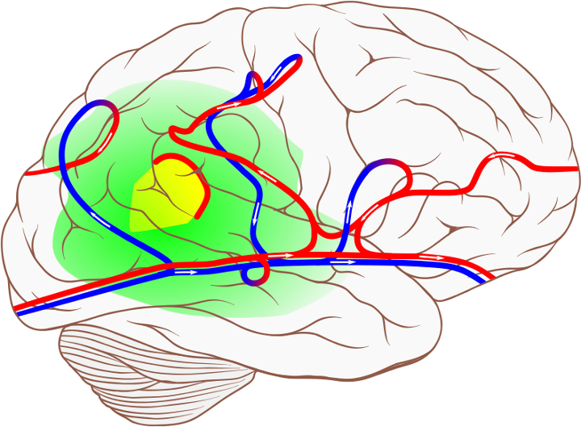

We put a [new manuscript on arxiv](http://arxiv.org/abs/1404.6126). Its central message is that in migraine we should expect a blurring of usually opposing distinctions such as trigger and symptom. Migraine is an inherently dynamical disease with a complex network of interdependent events. There is no linear course from upstream to downstream events. In this manuscript, we describe a behavior caused by a ‘tipping point’ and how it explains causality confusion between triggers and particular premonitory symptoms in migraine. This “mystery” was also recently addressed in a [Nature New Feature](http://www.nature.com/nm/journal/v19/n9/full/nm0913-1083.html).

In fact, it’s not mysterious at all. Causality confusion because of tipping points is well known for the earth climate system.

The ‘premonitory symptoms’ of climate change are the ‘early warning signals’. So what are these signs? It could be *cold* winters even when we predict a global *warming*. It is easy to mistake cold winters for contradicting global warming, while in fact, severe winters like the ones of 2005-06 and 2009 do not conflict with the global warming picture, but rather supplement it as part of large fluctuations near a tipping point.

There are no simple answers to simple questions in nonlinear systems and a causality interpretation is hard. It is also easy to mistake eating chocolate for a trigger while it actually is as a food craving symptom, or light flashes during photophobia (sensitivity to light) for a trigger and so on. In all cases, large fluctuations explain this causality confusion even if this is heard to believe for patients affected.

To be more concrete, let me employ another analogy. Consider changes (over decadal time scales) that involves the ocean’s conveyor belt, the thermohaline circulation. We proposed earlier that migraine pain caused by central sensitization can be described in analogy as an abrupt overturning circulation that lead to [changes in nerve traffic of the brain’s migraine generator network](http://dx.doi.org/10.1063/1.4813815). The times scales are in this case, of course, only of several hours to a few days. Based on a [unitary hypothesis that identifies a subnetwork for multiple migraine triggers](http://dx.doi.org/10.1002/cne.20688) we suggested that a tipping point exists and causes large and correlated fluctuations in the limbic system as well as the pre- and postganglionic parasympathetic neurons that control the sympathestic/parasympathestic balance.

:   Like the ocean’s conveyor belt, the thermohaline circulation, brain traffic can overturn.

In fact,  tipping points can be found in medicine, financial markets and their crashes, in traffic systems causing traffic inefficiencies, in power grid systems to which a large amount of renewable energy is introduced and that may fail therefore, in the ecosystems where wildlife populations may be threatened, and in the global climate system, to name but a few examples.

Computer models and quantitative modeling approaches are becoming ever more established to study these complex systems. At the same time, the clinical research audience faces the difficult task, if not to penetrate mathematical concepts, at least to take away the message relevant for their own research.

[Read one the whole manuscript](http://arxiv.org/abs/1404.6126).
