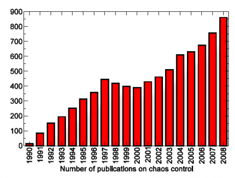

Beim Wandern auf einem Grat führt jeder falsche Schritt sofort zum Absturz. Unzählige solcher Wege sind im Chaos verborgen oder besser gesagt in Systemen die chaotisches Verhalten zeigen. Diese Wege nennt man auch *unstable periodic orbits* (UPOs), aber dazu erst am Ende mehr.

Chaotische Systeme dienen wegen ihrer vielen Wege mit Absturzgefahr als Testsysteme für Verfahren die eine inhärent gefährliche (weil instabile) Gratwanderung kontrolliert ermöglichen, selbst wenn man mal daneben tritt. Solche Verfahren nennt man Chaos-Kontrolle, und zwar auch dann, wenn sie auf nicht-chaotische Systeme mit instabilen Lagen angewandt werden.

Wenn also zum Beispiel normale Gehirnaktivität instabil wird und außer Kontrolle gerät, stellt sich die Frage, ob diese wieder mittels der Chaos-Kontrolle in den physiologischen Bereich reguliert werden kann.

**Chaos und Migräne**

In meinem Blogbeitrag [Migraine and Chaos](http://www.scilogs.eu/en/blog/gray-matters/2009-11-25/migraine_and_chaos) habe ich sehr ausführlich darüber geschrieben. In diesem Beitrag will ich angeregt durch eine [Diskussion](http://netz.schmerzklinik.de/groups/migraeneaura/forum/topic/transcranielle-magnetstimulation-bei-aura/) im Forum [Migräne und Kopfschmerznetz](http://netz.schmerzklinik.de/) zumindest die obige Abbildung erklären, die seit einiger Zeit meine [Homepage](http://www.itp.tu-berlin.de/?dahlem) ziert, also den Unterschied zwischen klassisch medikamentöser Behandlung und den neuen Ansätzen, an denen ich arbeite.

In dem Forum wurde ich von der Moderatorin, Frau Bettina Frank gefragt, was ich als Physiker von der transcraniellen Magnetstimulation (TMS) bei Migräne halte. Hier ein Auszug meiner Antwort:

> *… Ein Medikament können Sie nur einmal schlucken, warten und vielleicht später erneut einnehmen. Man kann aber nicht eine Tablette in 600 Teile zerhacken und diese Teile dann nacheinander innerhalb einer Sekunde einnehmen. Und selbst wenn man es könnte, ergebe dies keinen Unterschied zu der Einnahme einer ganzen Tablette. Mit TMS können wir aber schon mit 600 Magnetfeldpulsen pro Sekunde stimulieren.*
>
> *In der aktuellen Studie wurde die Aktivität der Nervenzellen mit zwei kurzen Pulsen moduliert. Für mich als theoretischer Physiker stellt sich die Frage, wieso gerade zwei und nicht drei oder sehr viele Pulse, oder gar eine komplizierte Melodie von Magnetfeldpulsen?*
>
> *In der Zukunft wird es daher um zwei Fragen gehen. Welche Folge von TMS-Pulsen kann die Hirnaktivität bei Migräne optimal beruhigen? Und gibt es vielleicht andere Möglichkeiten, mit nicht-invasiven Methoden die Hirnaktivität bei Migräne zu beruhigen, etwa mit Lichtreizen bestimmter Frequenz?*

Frau Frank erwiderte zurecht

> *Beim Gedanken an Lichtreize bekomme ich schon fast beim Lesen Migräne. Die Theorie ist ja nicht neu und bis jetzt scheint es ja keinerlei Erfolge zu geben.*
>
> *Ich finde das alles sehr interessant, aber auch ungemein schwierig in der Umsetzung. Es ist eine **extreme Gratwanderung**, durch Stimulierung des eh schon übererregten Migränikergehirns nicht sogar das genaue Gegenteil zu provozieren.* [Fettdruck von mir]

Meine Antwort gebe ich hier ungekürzt wieder, allerdings zur besseren Lesbarkeit ohne sie als Zitat hervorzuheben.

In der Tat könnten die meisten Stimulationen die Attacke eher verschlimmern, so dass Ihr Beispiel der “Gratwanderung” genau die Situation trifft. Aus Sicht der Physik ist die Bewegung auf einem schmalen Grat schlicht eine instabile Lage, da jedes Abweichen nach links oder rechts sofort zum Absturz führt.

Genau das, die *Stabilisierung instabiler Gratwanderungen* ist der Ansatz, der seit Anfang der 1990er Jahren in der sogenannten Chaos-Kontrolle verfolgt wird. Auch wenn der Name es suggeriert, geht es hier letztlich gar nicht um Chaos, sondern um im Chaos versteckte, instabile Pfade, die man stabilisieren will (und damit dann das Chaos unterdrückt). Der Clou ist hierbei, dass man dazu den Ort des instabilen Pfades gar nicht kennen muss.

Das nun in einfache Worte für die Migräne-Therapie mittels TMS zu übersetzen ist gar nicht so einfach. Aber grob gesagt, haben wir Hoffnung mit ganz bestimmten Stimulationen nicht nur auf dem Grat erfolgreicher Unterdrückung der Migräne zu bleiben, sondern, dass diese Stimulationen den Grat auch selber finden.

**Forum und Blog**

Hier endet meine Antwort. Letztlich suchen die Menschen in den Migräne-Foren unmittelbare Hilfe und einen Erfahrungsaustausch. Zum Beispiel Montags im [Live-Chat mit Prof. Göbel](http://netz.schmerzklinik.de/groups/live-chat-vom-06-09-2010/), der morgen wieder stattfindet. Nicht unbedingt aber werden Informationen von der vordersten Forschungsfront dort erwartet, wie in meinem Blog. Zum einen scheitern viele dieser neuen Ansätze irgendwann dann doch, und zum andern, selbst wenn nicht, sind diese erst in ferner Zukunft erreichbar.

**Blind zum Ziel – das ist Zauberei**

Zum Abschluss noch ein paar Bemerkungen zur Zauberei bei der Chaos-Kontrolle.

   
 *Mit Erfindung der GOY-Methode 1990 steigt die Zahl der Publikationen zur Chaos-Kontrolle. 2009 waren es schon über 1000.*

Die erste Methode von Ott, Grebogi, und Yorke wurde 1990 vorgestellt [1] (auch OGY-Methode genannt). Die OGY-Methode  ist noch recht aufwendig und vereinfacht will ich diese als Gratwanderung mit weit offenen Augen titulieren.

1992 wurde dann von Pyragas eine neue Methode gefunden [2]. Diese grenzt an Zauberei. Nicht nur, dass hier ein Zielzustand (ein UPO) blind gefunden wird, die Kontrollkraft verschwindet auch noch, sobald der Zielzustand erreicht ist. Damit ist diese Methode minimal-invasiv, den eine Korrektur erfolgt erst, falls ein falscher Schritt gemacht wird.

Die Auflösung der Zauberei liegt in der Selbstkontrolle, also einer geschlossenen, aber zeitverzögerten Rückkopplungsschleife. Damit imitiert das Verfahren von Pyragas letztlich, was die Natur selber schon tausendfach zuvor erfunden hat, Systeme die sich selbst regulieren. Das Studium dieser Systeme in lebenden Organismen nennt man natürlich – und hier schließt sich ein anderer Kreis – [*Physiologie*](http://www.scilogs.eu/en/blog/gray-matters/2010-08-04/what-is-physiology).

**Literatur**

[1]  Edward Ott, Celso Grebogi, and James A. Yorke, *Controlling chaos*, [Phys. Rev. Lett. 64, 1196 (1990)](http://prl.aps.org/abstract/PRL/v64/i11/p1196_1).

[2] Pyragas,Continuous control of chaos by self-controlling feedback**,** [Physics Letters A, **170**, 421-428 (1992)](http://dx.doi.org/10.1016/0375-9601(92)90745-8)
