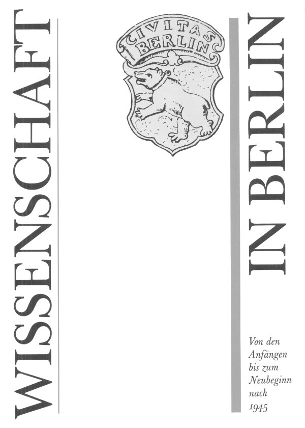
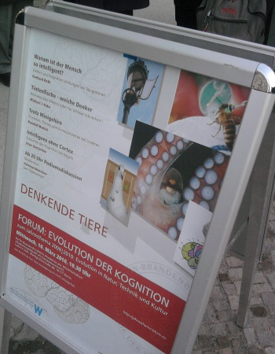
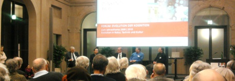
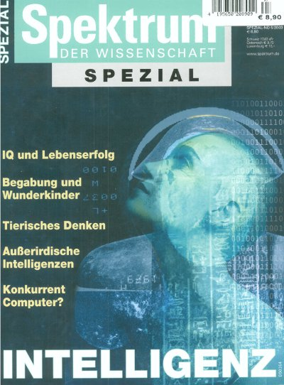

 "*In die Geschichte der Wissenschaft hat Berlin in den letzten Jahrhunderten und bis in die jüngsten Tage hinein unauslöschliche Spuren eingetragen.*"  
 So las ich gestern Abend im Umschlag meines gerade in einem Antiquariat am Gendarmenmarkt neu erworben Buches "Wissenschaft in Berlin" (Dietz, 1987). Ich war etwas zu früh dran und wartete auf den Beginn einer Veranstaltung der Berlin-Brandenburgischen Akademie der Wissenschaften. Da sah ich das Buch, kaufte es spontan, schmökerte und die Idee, Berichte aus der Berliner Neurowissenschaft von Gestern bis Heute zu schreiben, war geboren.

Die Idee lag nah, da ich mir vornahm von dem "FORUM: [Evolution der Kognition. Denkende Tiere](http://jahresthema.bbaw.de/kalender/forum-evolution-der-kognition-denkende-tiere)", auf dessen Beginn ich wartete, zu berichten. Bisher habe ich ausschließlich über meine eigene Forschung geschrieben. Warum nicht aktuelles und zusätzlich kurze historische Rekonstruktionen der Neurowissenschaft im 19. Jahrhundert einbinden? Aus dieser Zeit hinterließ Berlin mit Johannes Müller,  Emil du Bois-Reymond und Hermann von Helmholtz (und natürlich noch vielen mehr) Spuren, die mir heute gar nicht so unauslöschlich erscheinen. Diesen Spuren muss nachgegangen werden, um sie zu vertiefen. Ich denke insbesondere an die vielen Vertreter der Berliner Schule, die die Physiologie als eine *organische Physik*, also als mathematische Naturwissenschaft betreiben wollten.

Das 19. Jahrhundert war in einer Weise interdisziplinär, die heute gar nicht mehr vorstellbar ist. Heinrich Wilhelm Waldeyer zum Beispiel, Direktor der Friedrich-Wilhelms-Universität, der heutigen Humboldt-Universität zu Berlin, der den Begriff Neuron geprägt hat, war Anatom. Das überrascht zunächst nicht. An der Universität Göttingen hat er aber zunächst Mathematik und Naturwissenschaften studiert bevor er zur Medizin wechselte. Alles andere als ein untypischer Lebensweg damals. Mit der Expansion an Wissen driften die Disziplinen seitdem auseinander. Die Kommunikation untereinander ist rotverschoben, so scheint es mir. SciLog kann versuchen zu übersetzen.

Damit ist auch gleich mein Themenumfeld eingegrenzt: Mathematik, Physik und Physiologie natürlich nur wenn alles zusammengehört, ob gestern oder heute.

*Denkende (Alpha)Tiere.*

Sie merken schon, es lohnt kaum, eigentlich gar nicht, vom "FORUM: [Evolution der Kognition. Denkende Tiere](http://www.bbaw.de/bbaw/Veranstaltungen/Veranstaltungsseite_ansehen.html?terminid=1241)" zu berichten. Die Vortragenden, das waren Gerhard Roth, Michael J. Kuba, Randolf Menzel und Onur Güntürkün, versprachen einen unterhaltsamen und spannenden Abend. Jedoch wurde ich enttäuscht. Zumindest spannend wurde es nie. Das lag wahrscheinlich weniger an den einzelnen Vortragenden selbst. Das Thema "Denkende Tiere" war für Unterhaltung zwar gut aber zum kontroversen Diskurs reichte es nicht mehr. Zu einig waren sich alle.

Die Vorträge des Abends wurden als [Filme](http://jahresthema.bbaw.de/mediathek/forum-evolution-der-kognition) ins Internet gestellt. Sie können sich eine eigene Meinung bilden.

Mein neues Buch jedenfalls hat alle meine Erwartungen erfüllt.

Ach ja, und wenn Sie einen etwas umfassenderen Ausblick zum Thema Intelligenz wollen, den gab es im *Spektrum der Wissenschaft Spezial Intelligenz* schon 1999. Das Heft kann auch noch [bestellt](/blatt/d_sdwv_kontakt&id=849289) werden. Hier gehts zum [Inhaltsverzeichnis](http://www.spektrumverlag.de/artikel/849289).

*Titelbild des unverändertern Nachdrucks, vom 28. November 2003*
