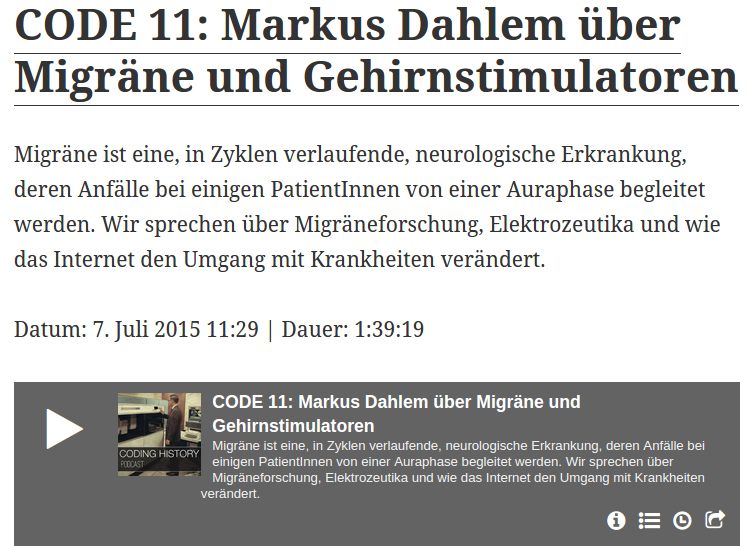

Daniel Meßner lud mich ein, um über Migräne, Gehirnstimulatoren und alles drumherum zu sprechen, nachzuhören [im Podcast Coding History](http://codinghistory.com/podcast/code11/). Coding History widmet sich der Geschichte von Software und ihrer Programmierung.

Daniel und ich, wir trafen und erstmals auf der Herrenhäuser Konferenz „[Big Data in a Transdisciplinary Perspective](https://www.volkswagenstiftung.de/veranstaltungen/veranstaltungsarchiv/detailansicht-veranstaltung/news/detail/artikel/herrenhaeuser-konferenz-big-data-in-a-transdisciplinary-perspective.html)“. Bei dieser Konferenz der Volkswagenstiftung ging es darum zu verstehen, was Big Data ist und wie Big Data die Gesellschaft, Wirtschaft und Wissenschaft verändert. Daniel geht es mit Coding History auch genau darum. Er geht dabei allerdings von der digitalen Welt aus, während bei mir die Digitalisierung des Körpers und seiner Fehlfunktionen im Vordergrund steht.

Herausgekommen ist nun ein [fast 1:40 Stunden langes Gespräch, das von Daniel nochmal in 20 kurze Abschnitte unterteilt wurde.](http://codinghistory.com/podcast/code11/)

