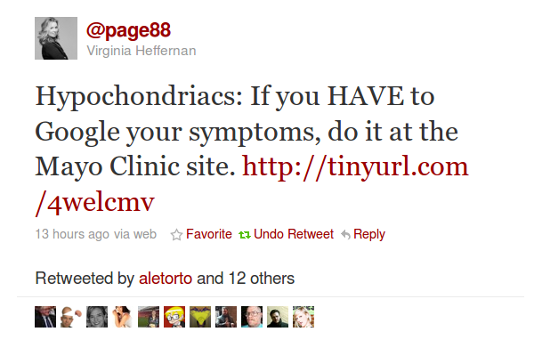
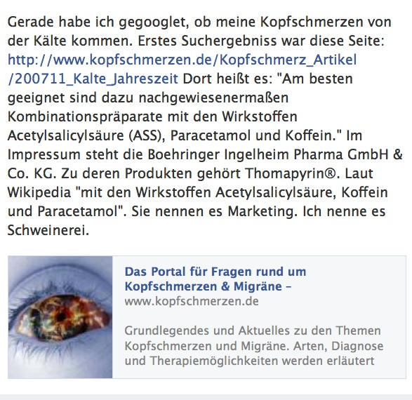

Virginia Heffernan, ehemals Kolumnistin des New York Times Magazine („The Medium“), sah im Googeln nach Krankheitssymptomen einen [Zeitfresser für Hypochonder](https://scilogs.spektrum.de/blogs/blog/graue-substanz/2011-02-06/zeitfresser-fuer-hypochonder), sie unterschied aber zwischen guten und – in ihren Augen – schlechten Angeboten und dies nach einem schlagend einfachen Kriterium:

Treibt ein Webauftritt zur Hysterie oder zu Medikamenten?

   
 About.com, WebMD und Mayo Clinic? Unabhängig ist MedlinePLus.

Angemäkelt wurde damals, dass auch die New York Times mit About.com in diesem Markt tätig sei. Aber Heffernan selbst empfahl die Webseiten der Mayo Clinic. Leider kannte sie wahrscheinlich gar nicht das beste englischsprachige Angebot: MedLine Plus.

Gute Websites stehen oft (noch) nicht vorne in den Hitlisten der Suchmaschinen. Bei denen, die oben stehen, ist nicht immer unmittelbar transparent erkennbar, wer dahinter steckt. Wer liest schon immer sofort das Impressum. Das ist ärgerlich, die Suchposition aber lässt sich zumindest nur auf einem Weg ändern.

Wer nach „Kopfschmerzen“ oder „Migräne“ googelt wird zum Beispiel schnell auf www.kopfschmerzen.de landen (www.migraene.de wird dahin umgeleitet). Das brachte gestern [Malte Welding](http://www.malte-welding.com/), deutscher Autor, Kolumnist und Blogger zu einer ganz ähnlichen Reaktion, wie die von Virginia Heffernan: Unmut, um es mal vorsichtig auszudrücken. 

Ich bin kein Mediziner, aber wenn ich den Verdacht hätte, meine Kopfschmerzen kommen von der zur Zeit bitteren Kälte, würde ich mir wohl eine dickere Mütze kaufen. Als Laie würde ich mich freuen, diesen Rat auch so zu lesen. Denn natürlich ist die Frage berechtigt, ob Kälte ein Kopfschmerzauslöser sein kann. Und wo, wenn nicht im Internet guckt man zuerst mal schnell nach.

Wenn dann das reflexartig erwartete „*zu Risiken und Nebenwirkung fragen Sie…*“ fehlt, gehe ich wahrscheinlich immer noch unbewusst davon aus, dass die dortige Information über Medikamente (oder Wirkstoffe) **nicht** von einem Pharmaunternehmen stammt, ohne dass ich gleich vermute, dass die Information direkt von einem Arzt oder Apotheker kommt. Hier das Zitat, das den Unmut auslöste:

> Unabhängig davon, welche Kälteursache die Beschwerden ausgelöst hat, warten Sie bei akuten Beschwerden nicht zu lange mit der Tabletteneinnahme. Die beginnende Schmerzkaskade sollte frühzeitig unterbrochen werden. Am besten geeignet sind dazu nachgewiesenermaßen Kombinationspräparate mit den Wirkstoffen Acetylsalicylsäure (ASS), Paracetamol und Koffein. Sie haben ein breites Wirkspektrum und decken sehr viele Arten von Kopfschmerzen ab, sogar leichte Migräne. Außerdem wirken sie schnell bei guter Verträglichkeit, denn die einzelnen Wirkstoffe können durch die Kombination niedriger dosiert werden.  
> [Zitiert von http://www.kopfschmerzen.de/Kopfschmerz\_Artikel/200711\_Kalte\_Jahreszeit ]

Risiken und Nebenwirkungen? Fehlanzeige. Der Hinweis auf die warme Mütze fehlt auch. Da frage ich mal mit Virginia Heffernan: Treibt dieser Webauftritt zur Hysterie und zu Medikamenten? Die Antwort kann jeder hier persönlich kommentieren.

In meinem Beitrag [10 Fakten über Migräne](https://scilogs.spektrum.de/blogs/blog/graue-substanz/2011-08-17/10-fakten-ueber-migraene) habe ich das Angebot im Internet vor dem klar gegebenen ökonomischen Hintergrund betrachtet. Wir reden über jährlich 25€ Millionen. Ein Fazit: Vertrauenswürdige Informationen zur Selbstmedikation findet man z.B. in der gemeinsamen Empfehlung diverser, unabhängiger Gesellschaften1, konkret hier: „[Selbstmedikation bei Migräne und beim Kopfschmerz vom Spannungstyp](http://www.dmkg.de/dmkg/sites/default/files/migraene%20und%20spannungskopfschmerz.pdf)„. Der beste Rat bleibt aber: Im Zweifelsfall immer einen Arzt aufsuchen.

Sicher hat die Boehringer Ingelheim Pharma GmbH, die beide Domains (www.kopfschmerzen.de und www.migraene.de) besitzt, ein legitimes Interesse an den Domainnamen.2 Vor allem aber war Boehringer Ingelheim einfach schlicht schneller als alle anderen, sie sicherten sich die Domainnamen frühzeitig. (Ich versuchte es 2000, da waren sie schon weg.3) Und sie können die Mittel leicht aufbringen, die Seiten Suchmaschinen optimiert zu positionieren. Eigentlich geht es auch nicht um die Domainnamen, das ist geschenkt. Die rechtliche Lage, ob hier Werbung mit einen „*zu Risiken und Nebenwirkung fragen Sie…*“ zu versehen ist, kann ich nicht beurteilen. Ich gehe aber schwer davon aus, dass es so letztlich noch im Rahmen des Erlaubten stattfindet.

Es geht letztlich um guten Inhalt und dessen Auffindbarkeit. Hier sehe ich durchaus eine sehr gute Entwicklung. Denn im Web 2.0 sind viel mehr aktive Nutzer, die zu einem großen Teil selbst, durch ihr Verhalten, die Suchpositionen bestimmen werden. Diesen Monat ist mein Blog in Liste der Wissenschaftblogs z.B. auf [Rang 17](http://labs.ebuzzing.de/top-blogs/wissenschaft) geklettert (in einem Ranking, dass ich selbst nicht so ganz ernst nehme, gefreut hat es mich trotzdem sehr). Das liegt letztlich nur an den externen Links, Tweets, Facebook posts etc. Teilen erfüllt also einen Zweck.

In diesem Sinne hier erneut meine Empfehlungen für Webseiten über Kopfschmerzen:

* [Deutsche Migräne- und Kopfschmerzgesellschaft e.V.](http://www.dmkg.de/),
* [Schmerzklinik Kiel](http://www.schmerzklinik.de/),
* [Deutsche Ausgabe der Website der Migraine Aura Foundation](http://www.migraine-aura.org/de/index.html),

und das Forum

* [Headbook – Migräne und Kopfschmerznetz](http://netz.schmerzklinik.de/).

**Disclaimer**

Migräne ist Schwerpunktthema in diesem Blog ([Link zu allen Beiträge](https://scilogs.spektrum.de/blogs/blog/graue-substanz/migrane)). Auf [www.migraine-aura.org/de/](http://www.migraine-aura.org/de/) sind die deutschsprachigen Seiten der „Migraine Aura Foundation“ zu Migräne, die Dr. med Klaus Podoll und ich betreiben. Keines dieser Angebote wird von dritter Seite unterstützt.

**Fußnote**

1 Deutschen Migräne und Kopfschmerzgesellschaft (DMKG), Deutschen Gesellschaft für Neurologie (DGN), Österreichischen Kopfschmerzgesellschaft (ÖKSG) und Schweizerischen Kopfwehgesellschaft (SKG).

2 Boehringer Ingelheim forschte aktiv an einer zukünftigen Wirkstoffgruppe zur Behandlung der Migräne, [Gepant](https://scilogs.spektrum.de/blogs/blog/graue-substanz/2010-08-17/gepant) genannt. In dem oben verlinkten Ratgeber zur Selbstmedikation findet man, dass die Wirksamkeit der Substanzkombinationen aus Acetylsalicylsäure, Paracetamol und Koffein bei einer Migräneattacke wissenschaftlich belegt ist. Boehringer Ingelheim ist also als forschendes Unternehmen mit dem Thema Kopfschmerzen völlig zurecht im Internet vertreten. Ich kenne auch alle anderen Seiten von den großen forschenden Pharmaunternehemen im Bereich Kopfschmerzen relativ gut und sehe keine großen Unterschiede. Der Unmut traf also hier wahrscheinlich eher exemplarisch eine Webseite.

3 Den Namen www.migraene-aura.de gab ich mittlerweile wieder auf, s. Disclaimer für Informationen meiner eigenen Aktivitäten.
