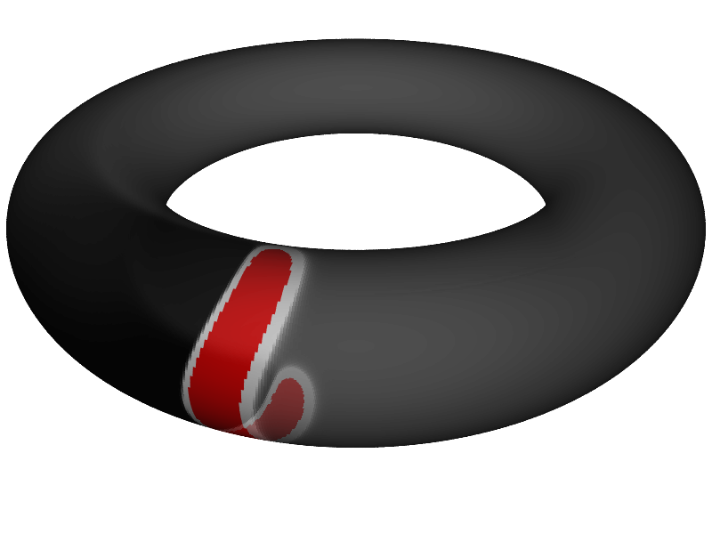

Wir haben eine neue Veröffentlichung im *New Journal of Physics* ([open access](http://iopscience.iop.org/1367-2630/16/5/053010/)). Dort betrachten wir eine idealisierte Fragestellungen, nämlich das Gehirn als Schwimmreifen\*. Klingt jetzt erstmal nicht so ideal.

Wir betrachten Ausschnitte der Rinde unseres Großhirns, den Kortex, als geformt wie bestimmte Teilflächen eines Schwimmreifens (Torus). Das stimmt nur in einer Annäherung, außerdem vernachlässigen wir Unterscheide in der Dicke der Hirnrinde. Dies und weitere Annahmen sind Idealisierungen.

Mit diesen Annahme leiten wir Aussagen über den wahrscheinlichen Ort des Ausbruchs [krankhafter Übererregung](https://scilogs.spektrum.de/graue-substanz/wie-gehirnzellen-dampf-ablassen/) bei Migräne ab. Diese Aussagen lassen sich dann für realistisch geformte Großhirnrinden verallgemeinern. Es folgt bald ein Paper in Zusammenarbeit mit der neurochirurgischen Klinik des Universitätsklinikums Heidelberg in dem wir Daten zum Vergleich heranziehen können.

Unten im Bild ist die menschliche Sehrinde gezeigt, genauer die primäre Sehrinde der linken Großhirnrinde; eine ungefähr Kreditkarten große und dreimal so dicke Schicht grauer Substanz. Dieses Areal ist die erste Station in der Großhirnrinde, die Informationen aus der Netzhaut des Auges bekommt und sie erhält dabei eine Abbildung unseres Gesichtsfeldes. Dies alles und viel mehr kann man in entsprechenden Lehrbüchern nachlesen. Aber sieht man auch, wie man einen Schwimmreifen zerscheiden kann und seine Ausschnitte an diese graue Fläche schmiegen kann?

Die Sehrinde. 3D-Rekonstruktion mit Hilfe der Kernspinntomographie [1].

Die Sehrinde als Fläche denke ich mir zusammengesetzt aus vielen kleinen Teilflächen, die alle auch aus einem kleinen Schwimmreifen ausgeschnitten sein könnten. Außen zum Beispiel ist der Schwimmreifen gekrümmt wie ein Schutzblech. Er hat dort eine positive Gaußsche Krümmung.

Positive Gaußsche Krümmung (Schutzblech) der Sehrinde.

Innen ist der Torus gekrümmt wie der Ausguss einer Teekanne (negative Gaußsche Krümmung).

Negative Gaußsche Krümmung (Teekannenausguss).

Auf einen Torus lassen sich bestimmte pathologische Prozesse der Migräne besser mathematisch beschreiben. Denn die Metrik, ein Maß für Abstände in einer Fläche, ist dort sehr einfach, zumindest wenn ein elegantes Koordinatensystem gewählt wird.

So lassen sich zum Beispiel Form, Größe und Wachstum von pathologischen Erregungszuständen (unten, rot) berechnen. Außerdem kann auch bestimmt werden, ob die Schwelle für diese Migränewelle von der Gaußschen Krümmung abhängt. Das ist eine zentrale Farge. Gibt es Orte, die eine höhere Neigung zur Entstehung von Migränewellen haben? Das wären Orte, an denen [neuartige Therapieansätze](https://scilogs.spektrum.de/graue-substanz/zwei-tragbare-geraete-gegen-migraene/) besonders wirkungsvoll sind.

In Computermodellen lassen sich diese pathologischen Zustände und deren Ausbreitung simulieren. Im Anhang des Papers befinden sich insgesamt sechs Filme, die alle auch auf YouTube stehen.

Ein Ergebnis unserer Modellbildung ist, dass bei negativer Gaußschen Krümmung die Migränewellen leichter ausgelöst werden. Der Extremwert negativer Gaußschen Krümmung findet sich meist am Eingang zur Sehrindenfurche. An dieser Stelle liegt auch das Zentrum im Gesichtsfeld repräsentiert, d.h. es ist meist ca. 1cm davon lateral entfernt, was in diesem Bereich ca. 1 Grad Sehwinkel ausmacht. Dies könnte auch ein Erklärungsansatz bieten, warum Migränewellen meist vom Zentrum des Gesichtsfeldes aus starten.

 

**Fußnote**

\*Dieser Beitrag ist erstmals am 23.8.2010 erschienen, damals hatten wir wesentliche Ergebnisse schon verstanden, die Publikation hat sich aber sehr verzögert, eingereicht haben wir das fertige Manuskript erst am 25. Oktober 2013. Deswegen habe ich den Beitrag überarbeitet und veröffentliche ihn nochmal. [Den alten lasse ich zum Vergleich stehen.](https://scilogs.spektrum.de/graue-substanz/das-gehirn-ist-ein-torus/)

**Weitere Literatur**

[1] Dahlem MA, Hadjikhani N (2009) [Migraine Aura: Retracting Particle-Like Waves in Weakly Susceptible Cortex](http://www.plosone.org/article/info%3Adoi%2F10.1371%2Fjournal.pone.0005007). PLOS ONE 4(4): e5007. doi:10.1371/journal.pone.0005007

**Weiterlesen**

[Ich sehe was, was du nicht siehs](http://www.brainlogs.de/blogs/blog/graue-substanz/2009-12-01/migraenewellen). Hier wird näher auf den charakteristischen Verlauf der Sehstörungen bei Migräne im Gesichtsfeld eingegangen.
