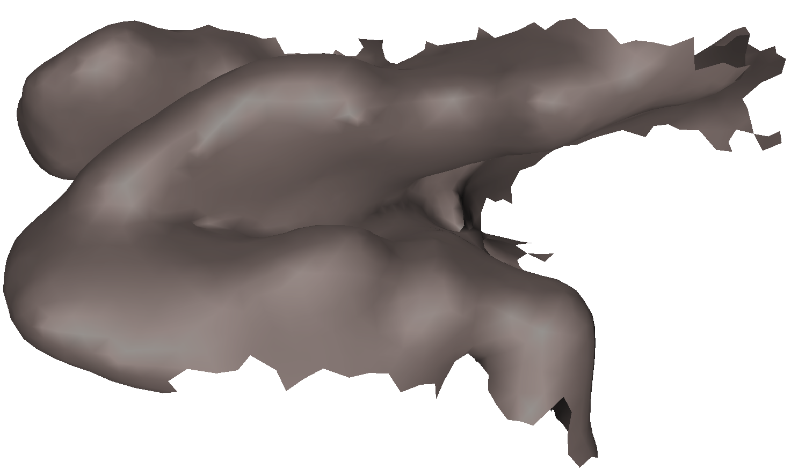
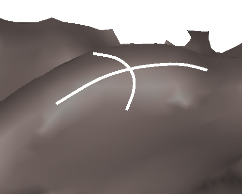
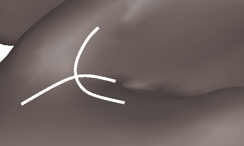

Wie mache ich als theoretischer Physiker Migräneforschung?

Nun zum Beispiel in dem ich folgende Annahme mache: Das Gehirn ist ein Torus. Also dass Ausschnitte der Großhirnrinde idealisierterweise die Form einer Teilfläche  eines Torus (Schwimmreifen) haben. Auf dieser Annahme basierend leite ich Aussagen über pathologische Erregungszustände bei Migräne ab und verallgemeinere diese dann für real geformte Hirnrinden.

**Neurologisch-*metrische* Diagnostik**

Unten ist die Sehrinde gezeigt, genauer, die primäre Sehrinde der linken Großhirnrinde; eine ungefähr Kreditkarten große und dreimal so dicke Schicht grauer Substanz. Es ist die erste Station in der Hirnrinde, die Informationen aus dem Auge bekommt und sie erhält dabei eine Abbildung unseres Gesichtsfeldes.  

   
 *Die Sehrinde. 3D-Rekonstruktion mit Hilfe der Kernspinntomographie [1].*

Dies alles und viel mehr kann man in entsprechenden Lehrbüchern nachlesen. Aber sehen Sie auch die Torusausschnitte?

Die Sehrinde als Fläche denke ich mir zusammengesetzt aus vielen kleinen Teilflächen, die alle auch aus einem Torus ausgeschnitten sein könnten. Außen zum Beispiel ist der Torus gekrümmt wie ein Schutzblech. Er hat dort eine positive Gaußsche Krümmung.

   
 *Positive Gaußsche Krümmung (Schutzblech) der Sehrinde.*

Innen ist der Torus gekrümmt wie der Ausguss einer Teekanne (negativer Gaußsche Krümmung).

   
 *Negative Gaußsche Krümmung (Teekannenausguss).*

Auf einen Torus lassen sich bestimmte pathologische Prozesse der Migräne besser mathematisch beschreiben. Denn die Metrik, ein Maß für Abstände in einer Fläche, ist dort sehr einfach, zumindest wenn ein elegantes Koordinatensystem gewählt wird.

So lassen sich zum Beispiel nicht nur Form, Größe und Wachstum von pathologischen Erregungszuständen (unten, rot) berechnen. Es kann auch bestimmt werden, ob die Schwelle für die Entstehung unerwünschter Erregung von der Gaußschen Krümmung abhängt. Ob es also Orte gibt, die eine höhere Neigung zur Entstehung von Migränewellen haben, oder Orte, an denen Therapieansätze besonders wirkungsvoll sind.

In Computermodellen lassen sich diese pathologischen Zustände und deren Ausbreitung simulieren (und sind einfach nett anzuschauen).

Ein Ergebnis ist, dass bei negativer Gaußschen Krümmung die Migränewellen leichter getriggert werden. Der Extremwert der negativen Gaußschen Krümmung findet sich meist am Eingang zur Sehrindenfurche. An dieser Stelle liegt auch das Zentrum im Gesichtsfeld repräsentiert, d.h. es ist meist ca. 1cm davon lateral entfernt, was in diesem Bereich ca. 1 Grad Sehwinkel ausmacht. Dies könnte also ein Erklärungsansatz bieten, warum Migränewellen meist vom Zentrum des Gesichtsfeldes starten.

**Vereinfachung ist eine schwierige Kunst**

Dies ist natürlich nur ein Beispiel wie theoretische Physiker in der Neurologie forschen. Es ist insbesondere ein Beispiel für das, was wir auch *mathematische* Neurowissenschaften nennen. Diese Disziplin unterscheidet sich von der üblichen Vorgehensweise in der *Computational* Neuroscience. Jack Cowan einer der Väter meines Gebietes gibt eine Erklärung, mit der ich gerne abschließe [2]:

> Well I’ve just been trying to apply the methods of mathematical physics to thinking about how the brain works. By that I mean that there is a way in which physicists approach the world, theoretical physicists, that I think really, really works and is really interesting. They don’t try to put in every detail of what the phenomenon is like. They, if they have good taste, they select only those details that are really important for the questions they want to answer. And they construct what are sometimes called toy models, which aren’t facing reality, to quote the title of a book by a friend of mine, Sir John Eccles, but they abstract from reality just what is needed to understand something. And I think that’s what I’ve been trying to do with respect to brain mechanisms: try to make toy models that contain enough details to answer questions about and give you ways to think about what’s going on in the brain. It’s not, I mean, it’s not something that’s commonly done. A lot of the time people do computational neuroscience where they put in a lot of details and make simulations and study what goes on. I don’t do that. I tend to put in as few details as possible and say things that are interesting with few details rather than put in a lot of details.

**Fußnote**

Die Überschrift "Neurologisch-metrische Diagnostik" ist eine Anspielung auf Peter Duss‘ Neurologisch-topische Diagnostik [3], bei der ebenso wie in meinen Ansatz die Klärung der Krankheitsursache (Ätiologie) außen vor bleibt und nur auf Grund der Symptome der Ort der Schädigung diagnostiziert werden kann.

**Literatur**

[1] Dahlem MA, Hadjikhani N (2009) [Migraine Aura: Retracting Particle-Like Waves in Weakly Susceptible Cortex](http://www.plosone.org/article/info%3Adoi%2F10.1371%2Fjournal.pone.0005007). PLoS ONE 4(4): e5007. doi:10.1371/journal.pone.0005007

[2] [Cybernetics, hallucinations, and the mathematics of the mind](http://thesciencenetwork.org/programs/the-science-studio/jack-cowan)

[3] [Neurologisch-topische Diagnostik](http://www.thieme.de/viamedici/rezensionen/3135358089.html), Thieme, 8. Aufl. 2003

**Weiterlesen**

[Ich sehe was, was du nicht siehs](http://www.brainlogs.de/blogs/blog/graue-substanz/2009-12-01/migraenewellen). Hier wird näher auf den charakteristischen Verlauf der Sehstörungen bei Migräne im Gesichtsfeld eingegangen.
