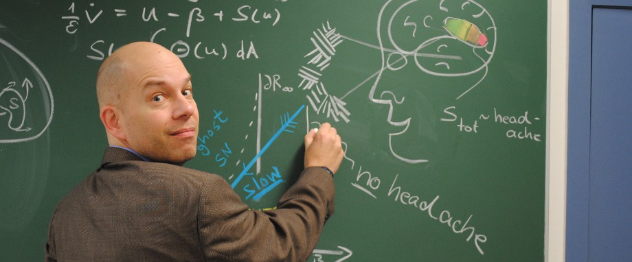

Slartibartfaß, Planetenarchitekt (u.a. bekannt im Universium für seine Fjorde in Norwegen, Planet Erde), wusste natürlich, dass Mäuse die Erde regieren.1 Das [Beweisfoto veröffentlichte ich allerdings erst am Ende meines letzten Beitrages](http://www.brainlogs.de/blogs/blog/graue-substanz/2011-07-15/auf-der-maus-grimassen-skala-eine-4). Leider wird das Experiment der Mäuse abgebrochen werden. Darüber berichtet Stefan Rahmstorf in seiner [KlimaLounge](http://www.wissenslogs.de/wblogs/blog/klimalounge). Hier geht es im Allgemeinen um Migräne, heute im Speziellen um Berlin als Welthauptstadt der Mathematik.

  
 Königin der Wissenschaft und Volkskrankheit Migräne.

Beides sind nämlich Themen in der heute erschienen Zeitschrift "[Bild der Wissenschaft](http://www.wissenschaft.de/wissenschaft/home.html)". Unter dem Titel "Tsunami im Kopf" wurde in der Heftvorschau angekündigt:

> Bei jedem fünften von Migräne Geplagten geht dem Beginn der Kopfschmerzen eine „Aura“ voraus: ein blinkendes Zickzackmuster vor den Augen. Auslöser ist eine elektrische Erregungswelle in der Großhirnrinde. Nervenzellen, die diese Welle erfasst, werden vorübergehend entladen. Forscher suchen nach der Ursache des seltsamen Phänomens.

Desweiteren wird für dieses Heft der Beitrag mit dem Titel "Welthauptstadt Berlin" angekündigt:

> Ob Chip-Design, Flugzeugbau oder Gesichtschirurgie – ohne die „Königin der Wissenschaften“ geht kaum etwas. Eine Hochburg für mathematische Forschung und ihre Anwendungen ist Berlin. Dort haben sich mehrere Hundert Experten zum „Matheon“-Verbund zusammengeschlossen. Die deutsche Metropole ist die Welthauptstadt der Mathematik.

Damit sind meine beiden Forschungsschwerpunkte abgedeckt, ich kann diese Woche in den Urlaub fahren, das Leben genießen und meine Leser zum Kiosk schicken.

**Fußnote**

1Für alle Nicht-Douglas-Adams-Fans sei hier auf das Buch "[Per Anhalter durch die Galaxis](http://de.wikipedia.org/wiki/Per_Anhalter_durch_die_Galaxis)" verwiesen und natürlich auf das dritte Buch von Adams "Das Leben, das Universum und der ganze Rest", von dem ich meinen Titel frei übernommen habe.

**Link**

Kurze URL zu diesem Beitrag

http://goo.gl/DMJ1v
