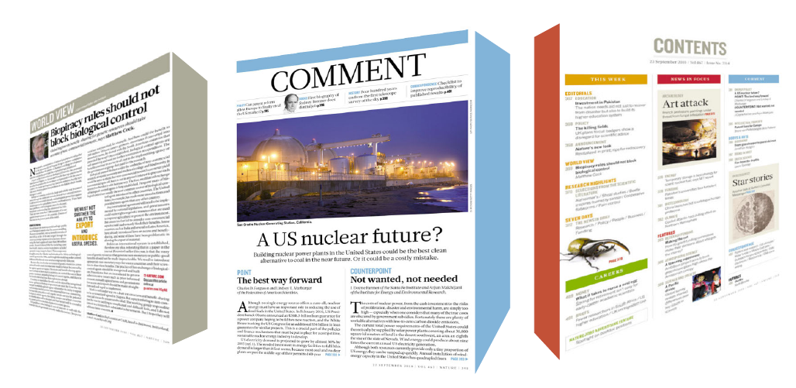
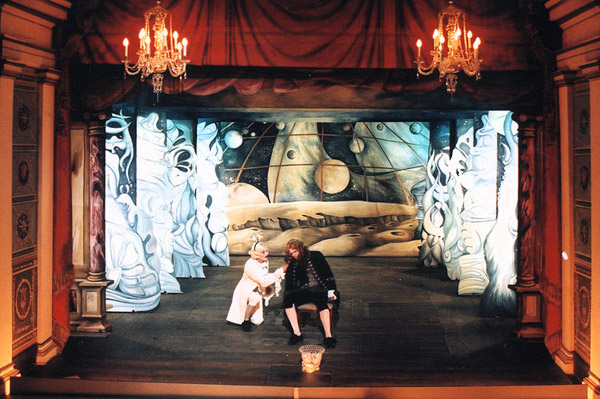
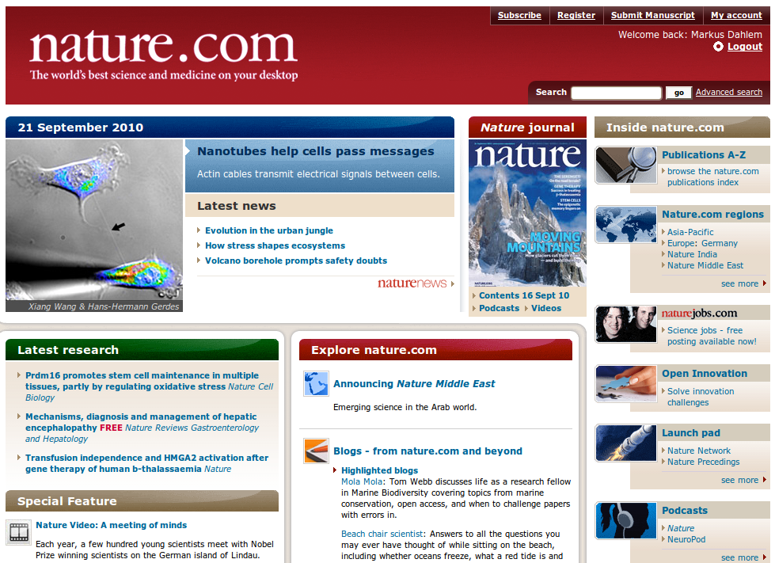

Der Fachzeitschriftenmarkt für Naturwissenschaften, Technische Wissenschaften und Medizin ist riesig. Einige Anbieter stechen hervor. Die  Nature Publishung Group (NPG) war für mich schon zuvor ein Giuseppe Galli da Bibiena des wissenschaftlichen Bühnenbilds. Heute hat die NPG ihre Zeitschrift [Nature](http://www.nature.com/nature/index.html) noch einmal fein mit einem Redesign herausgeputzt. Das Bühnenbildbildnis betrifft weniger die Ästhetik umsomehr aber den strukturellen Umbruch, der eine neue Sicht für den Leser eröffnet und es sogar erlaubt, mit ihm in einen Dialog zu treten.

Dieser Umbruch bei Nature ist schon früh vonstatten gegangen. Zum einen in der *front half* ist das zu sehen. Dort werden schon lange journalistische Beiträge und Meinungen den Orginalarbeiten vorangestellt. Stärker noch verzweigte sich das Angebot mit neuen Diensten seit dem 1997 die Website online ging. Es gibt [Nature Podcast](http://www.nature.com/nature/podcast/), [Nature Video](http://www.nature.com/nature/videoarchive/index.html), [Nature Blogs](http://blogs.nature.com/), [Nature Jobs](http://www.nature.com/naturejobs/index.html) und vieles mehr.

Er dagegen, der Bühnenbildner des 18. Jahrhunderts, brach mit der Zentralperspektive und nutzte eine Übereckstellung geschickt zu mehreren Fluchtpunkten. Nature hat auch weit mehr als die Zentralperspektive auf die wissenschaftlichen Originalarbeiten zu bieten.

  
 *Es braucht verschiedene Perspektiven, um Wissenschaft umfassend darzustellen.*

Giuseppe Galli da Bibiena war auch der erste, der transparente Materialien im Bühnenbild nutzte. Nichts anderes tat die NPG. Jene Transparenz erzeugte eine Vielschichtigkeit und lies den Zuschauer Dinge sehen, die eigentlich versteckt liegen. So dient auch diese neue Transparenz zweifach. Vielschichtig wird in "This Week", "World View", "News in Focus", "Comment", "Highlights", das moderne Wissen aber auch alles drum herum, wie z.B. wissenschaftliche Förderlandschaften und Karrierewege, Laien wie Wissenschaftskollegen näher gebracht. Erkenntnisse, die in den folgenden Originalarbeiten hinter einer Fachsprache von den Autoren versteckt werden, durchleuchten diese weiteren journalistischen Zusatzangebote.

  
 *Bühnenbild von [Sandra Linde](http://www.sandralinde.de/galerie.html).*

Unendlichkeit wird im Theater vorgetäuscht. Wie schön das geht. Auf dem Wissenschaftsmarkt muss unendlich viel Publiziertes aktuell und kompakt abgebildet werden. Beides keine leichte Aufgabe. Im neuen Gewand schafft die home page von Nature nun mehr Ordnung. Ich gehe jetzt selbst mal auf Entdeckungsreise in das neue Theater.

   
 *So sah es noch gestern aus.*

  
 *Und so wird ab heute das Erscheinungsbild sein.*

In drei [Videos](http://www.nature.com/rediscover/) wird durch die Fülle dieses Angebotes im neuen Design geführt.  Ich gucke schon.

