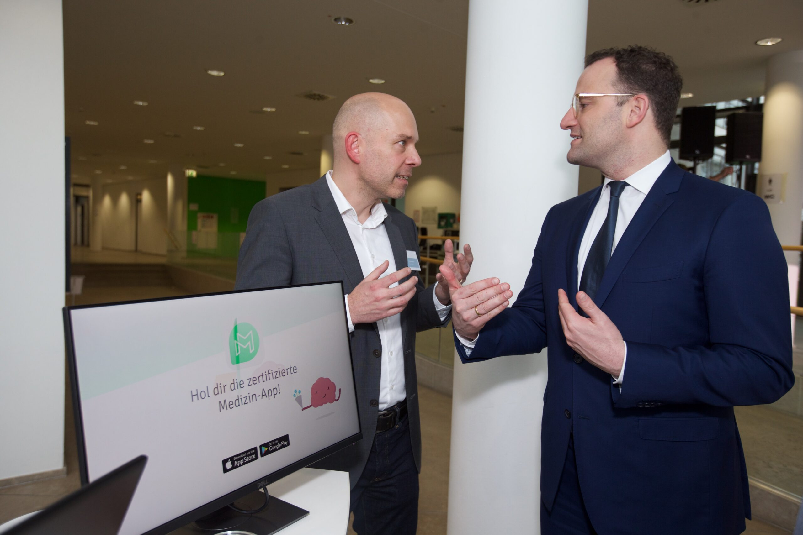

Als theoretischer Physiker und Migräneforscher fing ich 2009 an, dieses Wissenschaftsblog zu schreiben. Eingeladen wurde ich von Lars Fischer vermutlich nicht zuletzt aufgrund meiner etwas ungewöhnlichen fachlichen Kombination. In meinen [ersten Beitrag](https://scilogs.spektrum.de/graue-substanz/geist-einer-sattel-knoten-verzweigung/) fasste ich einen Vortrag zusammen, den ich damals auf Einladung der amerikanischen Gesundheitsbehörde NIH in Chicago hielt. Es ging um Migräne als dynamische, also zeitabhängige Krankheit. Wie lassen sich aus rein physikalisch-mathematischen Prinzipien Therapieansätze herleiten, die den Krankheitsverlauf herumdrehen? Können Wirkstoffe aus der Mathematik kommen und ganz ohne Moleküle auskommen, in dem sie lokal im Körper die Zeit zurückdrehen? 

## Wissenschaft und Wirtschaft

Heute, zwölf Jahre später, bin ich Unternehmer. Schon als Wissenschaftler waren mir [Interessenkonflikte beim Bloggen](https://scilogs.spektrum.de/graue-substanz/verhaltenskodex/) bewusst. Als Unternehmer sind solche noch einmal größer und vor allem anders gelagert. Daher veröffentlichte ich sehr wenig auf SciLogs, nachdem ich 2016 mein Unternehmen aus der Wissenschaft heraus gründete. — Doch so wichtig ein klarer Verhaltenskodex ist, nicht über Wissenschaft und Wirtschaft zu schreiben ist eine verpasste Chance.

Einige Branchen, die Gesundheitsbranche ist da ein gutes Beispiel, brauchen Wissenschaft und Wirtschaft. Für Wissenschaftler ist es also nicht verkehrt, den Blick auf die Wirtschaft zu richten und kennenzulernen, welche Fähigkeiten dort benötigt werden. Wie gründe ich selbst ein Unternehmen? Und vielleicht wichtiger: Warum?

Jens Spahn hat Digital Health nicht erfunden. Doch hat er mit dem Digitale-Versorgung-Gesetz »Apps auf Rezept« als Weltneuheit in Deutschland eingeführt.

Mein Arbeitsbereich gehört zur Gesundheitsbranche. Es ist ein Unterbereich, der heute in Deutschland vor allem durch Jens Spahn als »Digital Health« bekannt wurde. Der Ursprung liegt in der Tat in Berlin, er lässt sich zurückverfolgen zur sogenannten [Berliner Schule](https://scilogs.spektrum.de/graue-substanz/organische-physik/), um den Mediziner und Physiker Hermann von Helmholtz und den weniger bekannten aber vielleicht noch wichtigeren Emil du Bois-Reymond. [Mit Blick auf digitale Migränetherapien](https://scilogs.spektrum.de/graue-substanz/blitzableiter-fuer-hirngewitter/) gibt es noch früherer Ansätze.   
Als Wissenschaftler an einer Universität konnte ich meine Arbeit nicht erfolgreich zu Ende führen. Es lag an Vielem. Ein Punkt darunter war, dass ich die Technologie hinter den Wirkstoffe aus der Mathematik — digitale Wirkstoffe — nicht nur zur Marktreife bringen, sondern auch vermarkten wollte. Digitale Produkte wachsen nur im Markt zum vollen Potential. So ist das auch bei digitalen Therapien. Sie müssen im ersten Gesundheitsmarkt, oft als »App auf Rezept« bezeichnet, im Real-World-Setting erforscht und weiterentwickelt werden.

## Vom Wissenschaftler zum Wissenschaftler-Unternehmer

Mit dieser Erkenntnis verließ ich die akademische Welt. Eine Übergangszeit von einem Jahr half. An der Humboldt-Innovation, ein Startupservice meiner Universität, gab es erste wichtige Kontakte zur Wirtschaft und Gesellschaft.  Wir bekamen zudem eine EXIST Seed-Finanzierung. Über dieses Programm EXIST des Wirtschaftsministeriums und uns als Gründerteam berichtete das Wissenschaftszeitschrift Nature in ihrer Rubrik „Career Guide“ mit der Überschrift »[No more career headaches](https://www.nature.com/articles/d41586-019-00924-1)«. Die Überschrift stimmt so natürlich nicht. Die karrierebezogenen Kopfschmerzen sind als Unternehmer nur andere. Richtig ist: »[Außerhalb der Uni gibt’s auch schöne Labore](http://www.qiio.de/ausserhalb-der-uni-gibts-auch-schoene-labore/)«. So titelt letzte Woche Qiiu, ein Magazin, das in Zusammenarbeit mit der Deutschen Bank herausgebracht wird und mich zum Thema Ausgründung aus der Wissenschaft interviewt hat. Der ganze Beitrag ist lesenswert. Einen Auszug will ich hier hervorheben.

> „Ausgründen ist nicht für jeden etwas”, gibt Dahlem zu bedenken. „Die Forschung hat man dann zunächst verlassen.” Als Geschäftsführer wird es dann wichtig, Wagniskapital anzuwerben, Personal einzustellen und beides hinter einer Idee zu vereinen. Kurz: „Das Unternehmen unternehmensfähig bekommen”, sagt Dahlem.

Was benötigt ein (leidenschaftlicher) Wissenschaftler, um zugleich ein (erfolgreicher) Unternehmer zu sein? Was habe ich mitgenommen? Eine Antwort auf diese Frage inspiriert vielleicht andere, es zu wagen. Neben meiner Art zu Denken sind es Werte, die ich nicht für ungewöhnlich halte unter Wissenschaftler:innen und die auch weiterhin für mich als Unternehmer wertvoll sind, weil sie mir meinen Kompass geben.

## Denken in First Principles

Als Wissenschaftler-Unternehmer geht es um das Denken in First Principles. Die Wissenschaft kennt viele First Principles. Für mich ist ein wichtiges der zweite Hauptsatz der Thermodynamik. Bevor das zu viele Nicht-Physiker abschreckt, formuliere ich, wie dieser Hauptsatz mir hilft ganz allgemein. 

Das bekannte Gelassenheitsgebet von Reinhold Niebuhr, bringt den Einsatz dieses Prinzips gut auf einen Punkt. Nur muss ich Gott durch die Thermodynamik ersetzen: »*Die Thermodynamik gibt mir die Gelassenheit, Dinge zu akzeptieren, die nicht rückgängig gemacht werden können, den Mut, Dinge umzukehren, die umkehrbar sind (wie gewisse Krankheiten in gewissen Stadien), und die Weisheit, das eine vom anderen zu unterscheiden.*«

Der zweite Hauptsatz der Thermodynamik definiert, welche Prozesse irreversible sind. Er gibt den Zeitpfeil vor. Er führt auch zu der Feststellung, dass unser Universum einmal im Wärmetod endet. Das konnte ich als Student so natürlich nicht akzeptieren. Ich wählte daher meinen akademischen Forschungsschwerpunkt in der Thermodynamik fernab des Gleichgewichts. Dort vermutete ich, einen Ausweg zu finden. Und so ist es auch. Wir entkommen dort, also fernab des thermodynamischen Gleichgewichts, zwar nicht dem zweiten Hauptsatz der Thermodynamik. Doch können wir mit diesem Wissenschaftszweig erklären, warum Strukturen neu entstehen. Der Zeitpfeil wird quasi kurzzeitig und lokal umgedreht. Eine Frage im Besonderen faszinierte mich dann im Laufe des Studium besonders: sind Krankheitsverläufe umkehrbar? 

Mein akademischer Hintergrund hilft mir also bei der Beantwortung der grundlegenden Frage: Ergibt die Wissenschaft hinter der Therapie einen Sinn? Die Thermodynamik und insbesondere das Nachdenken über den Zeitpfeil hilft bei der kühnen Frage: Wie können wir Krankheiten rückgängig machen? Das heißt nichts anderes, als dass wir das Paradigma von der Therapie zur Heilung ändern.

# Mit einer Krankheit anfangen

Wir müssen mit einer Krankheit anfangen. Erkrankungen des Gehirns sind miteinander verbunden. Die American Brain Foundation hat daher den Ansatz “[Cure One, Cure Many](https://www.americanbrainfoundation.org/what-is-cure-one-cure-many/)” formuliert. Migräne ist die perfekte Krankheit, um diesen Ansatz  zu verfolgen. Ihre Symptome bilden »eine ganze Enzyklopädie der Neurologie« (Zitat von Oliver Sacks).

Können wir das Gehirn therapeutisch neu programmieren, um die Migräne zu verlernen? In diesem Bestreben einer digitalen Therapie ist die Migräne für mich ein Brückenkopf, von dem aus wir zu einem neuen Ufer kommen, dem der organischen Physik. Eigentlich ist es ein altes Ufer, doch die alten Brücken zur Berliner Schule der organischen Physik kennen nicht mehr viele heute. 

## Prinzipien und Werte

Viele Branchen brauchen allerdings keine Wissenschaft! Gründungsprojekte ohne technologie- oder wissensbasierten Ansatz müssen zwar auch alles hinter einer Idee vereinen. Es wird die »North Star Metric«, das »Igel-Prinzip« oder einfach das »Why« gesucht. Viel Literatur existiert, am Ende hilft jedoch nur die Praxis. Doch First Principles meint etwas darüber hinaus. Es ist ein wissenschaftlicher Methodenansatz, der nur in Kombination mit einer bestimmten Basis an Werten erfolgreich ist.

Neben meinem Denken in First Principles begleiten mich als Unternehmer die gleichen drei Werte, wie schon als Wissenschaftler. Ich stelle jedoch unterschiedliche Widerstände fest.

Der erste Wert ist kontinuierliches Lernen. Kontinuierliches Lernen bedeutet zum einen, mich den Gedanken großer Vordenker auszusetzen. Da ist zum einem Rudolf Clausius, der den 2. Hauptsatz der Thermodynamik und damit den Zeitpfeil einführte. Wichtig ist mir auch Emil du Bois-Reymond, der Vater der organischen Physik. Und schließlich John Hughlings Jackson, der sich als Tollhaus-Theoretiker sah, andere erhoben ihn in den Rang eines Albert Einsteins. Nennen wir ihn schlicht den Vater der evolutionären Neurologie. Um nur drei meiner Wissenschaftshelden Helden zu nennen. Heute habe ich auch Unternehmer als Vorbilder. Kontinuierliches Lernen bedeutet zum anderen auch über Hypothetisches nachzudenken, ohne durch bisherige Erfahrungen, Wissen und Vorbilder eingeschränkt zu sein.

Der zweite Wert ist Respekt. Respekt bedeutet nicht konformistisch oder entgegenkommend zu sein, sondern meinen Mitmenschen positive Aufmerksamkeit zu schenken, ihnen zuzuhören mit der Absicht zu verstehen, nicht zu reagieren. Bei diesem Wert spüre ich eine größere Herausforderung, seitdem ich ein Unternehmen und keine wissenschaftliche Arbeitsgruppe mehr anführe.

Über allem steht die Gelassenheit. Jeden Zweifel hinter mir zu lassen und zu wissen, was ich tue, als Grundlage, aus der vielleicht sogar einmal Weisheit wachsen könnte. Noch gibt es viele Gelegenheiten, bei denen meine Gelassenheit gestört wird. Dann kehre ich zum kontinuierlichen Lernen zurück.

Es geht darum, alles hinter einer Idee zu vereinen, als Wissenschaftler wie als Unternehmer.
