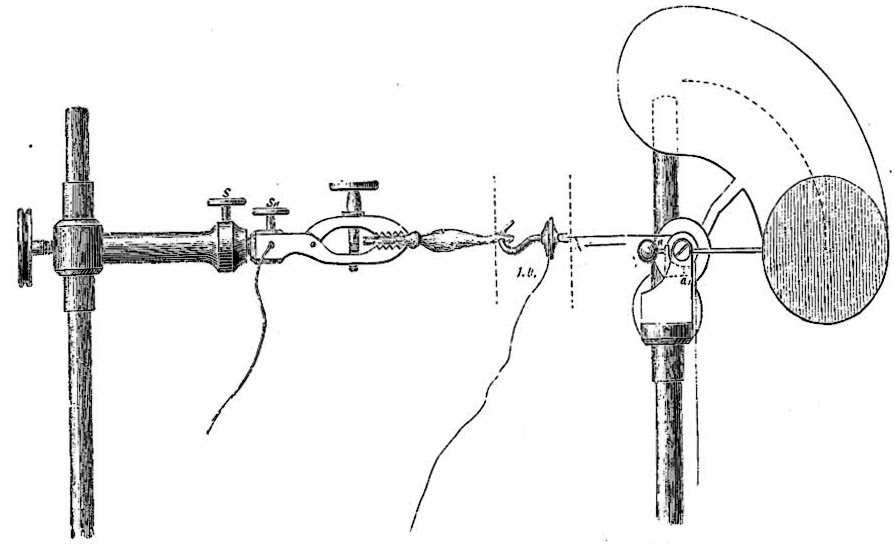

Gleich zur ersten Vorlesungsstunde des Jahres, am vorletzten Montag um 10:00 kam der Höhepunkt – im wörtlichen Sinn. Ich berichtete vorab im Beitrag „[Vom Orgasmus und anderen Rhythmen](http://www.brainlogs.de/blogs/blog/graue-substanz/2010-10-16/vom-orgasmus-und-anderen-rhythmen)“ von dieser *Physik*vorlesung an der TU Berlin. Nun das Nachspiel.

Die Aufzeichnungen der analen und vaginalen Muskelkontraktionen, die ich in diesem Zusammenhang zeigte, wurden mit der physiologischen Schreibmaschine erfasst, mit dem Kymographen also.

  
*Ein Kymograph aus der [Historischen Instrumentensammlung](http://medphysiol.charite.de/service/instrumentensammlung/) der Charité.*

Da ich mit dem Stoff dieser Vorlesung eine knappe Viertelstunde zu früh fertig wurde (für Spott ist hier Platz), konnte ich noch ausschweifen und den Studenten über den vermeintlich freien Willen des Froschweckers erzählen. Auch hier zuckt es gewaltig.

Der Kymograph hat einen Vorgänger: Emil du Bois Reymonds *Myograph*, auch Froschwecker genannt.

Ein periodisch zuckender, in eine Streckvorrichtung eingespannter Forschschenkel schlägt eine Glocke. Dong, Dong, Dong.

Johann Halske, der für Du Bois-Reymond elektromedizinische Geräte baute und zusammen mit Werner Siemens die *Telegraphen-Bauanstalt von Siemens & Halske* in Berlin gründete, erinnert sich an eine Vorführung, bei der die Entladung eines elektrischen Fischs den Froschwecker in Gang setzte [1, Seite 112f]:

> Es fällt mir noch ein Besuch bei Dir auf der Universität ein, der mich sehr erheiterte. Du zeigtest mehreren hochgelehrten Herrn Versuche mit Zitterfischen und nach einem gelungenen Knalleffekt wurde die bescheidene Anfrage eines Anwesenden gestellt: „Ja, aber womit schlägt der ihn denn?“

Ja womit? Das werde ich auch die Studenten in der Prüfung fragen.[^1]

Sven Dierke, Autor von *Wissenschaft in der Maschinenstadt* [1], erinnert an die Anekdote von Du Bois Reymond über einige Bauern, die beim Anblick einer Dampfmaschine erstaunt ausriefen: „Da sind doch Pferde drin!“

Diese aus gegensätzlichen Richtungen kommenden Fragen markieren den Anfang vom Ende des Vitalismus. (Mit Vitalismus bezeichnen wir die Lehre lebendiger Organismen ohne diese Komplexität allein auf chemische und physikalische Grundprinzipien zurückzuführen sondern eine *Lebenskraft* zu postulieren.)

Der Froschwecker also klingelte die Wissenschaftsräson wach und läutete so das Ende des Vitalismus ein. Oder doch nicht?

Der Vitalismus lebt, sagt Anthony R. Cashmore in seinem Antrittsartikel für PNAS [2], den er heute vor einem Jahr einreichte. Er vergleicht und dann identifiziert das Konzept des freien Willens, an dem wir so hängen, mit dem Konzept des Vitalismus. Welche Folgen hat es, wenn z.B. ein Mensch zuschlägt? Hat er mehr freien Willen als der Froschwecker? Wir sind geneigt, dies zu bejahen. War aber nicht doch sein Zitterfisch die Elternstube? Wenn ja, welche Konsequenzen hat dies für unser Rechtssystem?

An diese Stelle war dann aber die Vorlesung vorbei und ich beende dieses Nachspiel auch jetzt wieder. Was meinen Sie, sind da Pferde drin?

**Literatur**

[1] Wissenschaft in der Maschinenstadt. Emil Du Bois-Reymond und seine Laboratorien in Berlin, Sven Dierig, Wallstein Verlag, 2002

[2] Anthony R. Cashmore, [The Lucretian swerve: The biological basis of human behavior and the criminal justice system](http://dx.doi.org/doi:10.1073/pnas.0915161107), *PNAS*, **107**: 4499–4504, (2010)

**Link**

Diesen Beitrag einfach verlinken:

http://goo.gl/pqDac

[^1]: Womit sich einmal mehr zeigt, Blogs lesen lohnt. Hier Nicht nur in diesem Beitrag, sondern auch in meiner Vorlesung verate ich die Frage und eine gute Antwort: Die Hopf-Bifurkaktion schlägt zu, die auch schon bei den Muskelkontraktionen des Orgasmus verantworlich war. Ich würde dann fragen, ob es denn eine sub- oder superkritische Hopf-Bifurkaktion ist und wie wir das herausfinden können. Wer dies beantwortet und dabei noch die [*Saddle-node bifurcation on invariant circle*](http://www.scholarpedia.org/article/Ermentrout-Kopell_canonical_model) ins Spiel bringt, geht sicher mit einer guten Note nach Hause.

[Änderung aufgrund eines völlig berechtigten Hinweis von Stephan Schleim.]
