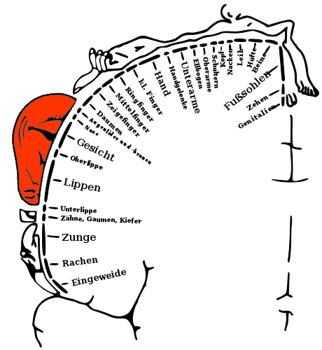
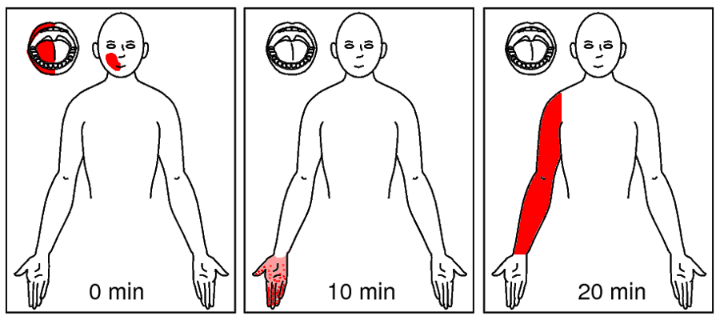
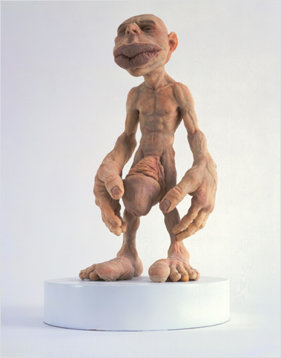
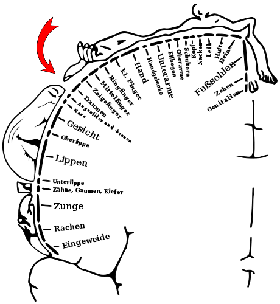
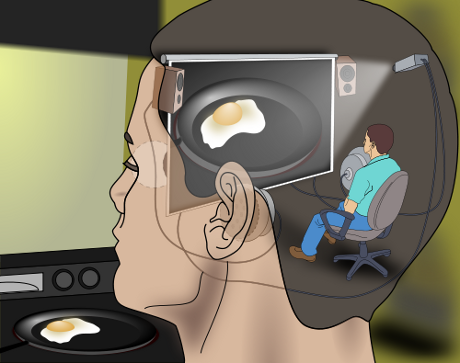
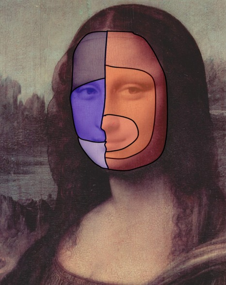

Das Stück heißt: „Der Homunculus ein Daumenlutscher?“. Es wird aufgeführt in diesem sonderbaren kartesischen Theater – Migräne mit Aura genannt. Für mich ein Theaterstück mit einer fantastischen Choreografie, die uns lehrt, was wir über das Gehirn wissen können selbst ohne millionenteure Kernspintomographen – nämlich zum Beispiel, dass eine Ikone der Hirnforschung Kopf steht.

Wenn Sie schon mal in diesem Theater waren, wenn Sie unter Migräne leiden, dann kennen Sie es vielleicht: eine somatosensorische Aura. Wenn nicht, seien Sie auf diese sonderbare Theaterwelt gespannt.

Recht gut bekannt – den Lesern dieses Blogs allemale – sind visuelle Auren bei Migräne; man bezeichnet damit flackernde Erscheinungen gefolgt von kurzfristiger Blindheit, also bestimmte Sehstörungen. Dem ähnlich kann es auch zu einem Kribbeln und anschließenden Taubheitsgefühl auf der Körperoberfläche kommen: die somatosensorische Aura. Diese könnte zum Beispiel, das ist nicht untypisch für diese Modalität, im Mund und um die Lippen herum starten und dann plötzlich zu den Fingerspitzen scheinbar *springen* – ob dies ein Sprung ist oder der Homunculus am Daumen lutscht und warum er dazu kopfstehen oder den Kopf zumindest drehen müsste, sehen wir gleich.

„Soma“ bedeutet Körper, „sensorisch“ die Sinnesmodalitäten (sehen, hören, fühlen etc) betreffend. Bittet man jemanden, der die somatosensorische Aura erlebt hat, seine betroffenen Bereiche in einer Körperkarte einzuzeichnen, bekommt man solche Zeichnungen.

  
Möglicher Verlauf der Aura, oben Links der Mundraum.

Heute bitte ich Sie, meine Leserinnen und Leser, solche Zeichnnugen anzufertigen, dazu in einem kurzen Addendum mehr und dem nachfolgend ein eigener Beitrag.

Der Verlauf des Kribbeln und der Taubheit für sich genommen scheint gar nicht so exotisch, zumindest auch nicht exotischer als [die visuelle Aura](https://scilogs.spektrum.de/blogs/blog/graue-substanz/2009-12-01/migraenewellen). Doch schauen wir uns genauer den modernen Homunculus an, dann wird es wirklich interessant.

Den Homunculus kennen Sie noch nicht? Ich stelle ihn Ihnen gerne vor.

Er ist dem Aussehen nach dem Troll nicht unähnlich. Jeder hat ihn in sich, nicht den Troll, den Homunculus, das kleine Menschlein. Zumindest metaphorisch hat man ihn in sich, das ist ein wichtiger Punkt, zu dem ich noch komme werde. Solange nenne ich diesen metaphorischen Homunculus einfach, wie schon oben geschehen, den *modernen* Homunculus. Hier ist er.

  
So einiges ist groß am Menschlein.

Gucken wir ihn uns an. Wird uns nicht fast alles sofort klar?

Seine Körperproportionen entsprechen in ihrer Größe bestimmten Gebieten. Nämlich in der menschlichen Großhirnrinde jeweils den Feldern, die diese Körperteile in den sogenannten somatosensorischen Arealen repräsentieren. Anders gesagt: große Hände, viel Hirnrinde für Hände. Großer … ich glaube Sie haben es verstanden.1

Nun steht der Homunculus aber nicht aufrecht herum, er liegt. Er liegt im Parietallappen entlang der markanten Zentralfurche, die diesen Hirnlappen von dem Frontallappen trennt. Die Hirnlappen sind grobe Unterteilungen des Cortex (Großhirnrinde). Der Homunculus kann sich entlang einer im wesentlichen eindimensional langgestreckten Furche nun aber nicht allzu bequem hinfläzen. Sein Daumen liegt neben dem Augenbereich (roter Pfeil), zumindest zeigen das so alle Bilder, die ich von ihm kenne.

Insgesamt wirkt er ein wenig zerstückelt. Der Homunculus, d.h. die Somatotopik, ist für mich ein noch recht neues Forschungsgebiet, daher weiß ich nicht ganz genau, wie ortstreu diese schematischen Darstellungen heute noch wirklich gemeint sind. Die Somatotopik ist aber an sich schon lange bekannt und gut erforscht. Die Idee einer Entsprechung von Körperregionen und Hirnrindenfeldern kommt aus der Beobachtung klinischer Symptome, so wie ich es nun wieder vorschlage (s. Addendum). Sie geht zurück auf den englischen Epilepsieforscher John Hughlings Jackson und die Zeichnung oben auf den Neurochirurgen Wilder Penfield.

Bleiben wir bei dem Daumen. Seine Lage in diesem obigen Schema nach Penfield machte für mich eigentlich schon immer wenig Sinn. Denn wo ist eigentlich der Daumen? Genau, im Mund! Zumindest ist er dort sehr oft, bei Kleinkindern, Säuglingen und auch schon ab der 7. Woche beim Embryo. Zumindest ist er dort in schon in der Nähe des Mundes. Es ist ja nicht unwichtig saugen zu lernen. Da fängt man besser früh an.

Es gibt folglich gute Gründe anzunehmen, dass auch die Hirnrindenfelder von Daumen und Mund ganz unmittelbar benachbart und nicht von Augen- und Stirnfeldern getrennt sind.2 Einer dieser Gründe ist, dass genau diese Nachbarschaft Migräniker erleben in diesem sonderbaren kartesischen Theater, der somatosensorischen Aura. Wie oben beschrieben: Es kommt zu einem Kribbeln im Mundbereich und plötzlich springt dieses Kribbeln zu den Fingerspitzen. Dieser Verlauf der Aura belegt, dass der Homunculus am Daumen lutscht, d.h. dass die Hirnrindenfelder dieser beiden Körperbereiche unmittelbar benachbart sind, und eine Übererregung, die sogenannte Spreading Depression, durchwandert beide Bereiche der Hirnrinde während der Migräne und regt Nervenzellen so zu Trugwahrnehmungen an.

  
Steht der Kopf im Kopf Kopf? Wahrscheinlich liegt er und guckt daumenlutschend nach oben!

Das bedeutet nicht zwangsläufig, dass der Kopf des Homunculus im Kopf auf dem Kopf steht. Er könnte auch um etwa 90° gedreht sein,3 damit der Daumen zum Mund findet. Die Zeichnung von Penfield gehört sicher zu Recht zu den Ikonen der Hirnforschung, das heißt aber nicht, dass man sie nicht mehr [kritisch hinterfragen sollte](http://scienceblogs.com/sciencepunk/2011/09/five_iconic_science_images_and.php).

Zum Abschluss sind noch zwei zusammenhängende Fragen offen. Was hat es mit dem *kartesischen* Theater auf sich? Und zweitens, warum liegt der Homunculus nur metaphorisch in uns?

Nun, der Begriff [kartesisches Theater wurde von Daniel C. Dennett geprägt](http://www.spektrum.de/artikel/822253) und geht auf eine alte philosophische Theorie der Wahrnehmung zurück, d.h. eigentlich einem klassischen Fehlschluss. Dieser wurde so wunderbar illustriert, dass man kaum Worte braucht.4

Der klassische – nicht der moderne, metaphorisch gemeinte – Homunculus sitzt gemütlich im Kopf und erlebt die Welt. Das wäre ein Thema für sich. Einsichtig ist schnell, dass selbst wenn dieser klassische Homunculus im Kopf die Außenwelt vorgespielt bekommt, die Frage, wie er dies denn wahrnimmt nur verschoben wurde und so völlig unberüht bleibt.

So wenig also der klassische Homunculus im kartesischen Theater als Theorie erklären kann, die Migräne mit Aura ist in einer sonderbaren Art und Weise wirklich solch eine Theateraufführung. Allein die Tatsache, dass es dieses –  im klinischen Sinne – Theater gibt, erklärt aber noch nichts, sondern es sind die Inszenierungen, die uns in einer faszinierenden Vielzahl5 jeweils eine eigene Geschichte über die Funktionsweise des Gehirns erzählen. Wir können noch viel von der Migräne lernen. Das mag ein Trost für die sein, die den Eintrittspreis zahlen.

**Addendum**

Wenn Sie unter Migräne mit Aura leiden und insbesondere auch somatosensorische Aura schon erlebt haben, können Sie bei meiner Forschung helfen. Dazu werde ich nochmal einen gesonderten Beitrag veröffentlichen. Hier finden Sie zwei PDF-Dateien als Vorlagen, eine [für zuhause](https://docs.google.com/viewer?a=v&pid=explorer&chrome=true&srcid=0B4GgPIxRvwshNjQ1MmI4NDItMGJlYS00MGU1LTg3Y2EtMjI5YjdlOWE5NDFh&hl=en_US), eine [für unterwegs](https://docs.google.com/viewer?a=v&pid=explorer&chrome=true&srcid=0B4GgPIxRvwshYmIyZmE0ZmMtMzAzNy00YjViLTgyM2MtYjBiY2RkOTYyMTRm&hl=en_US).  Eine erste kurze Anleitung befindet sich in den Dateien.

**Fußnoten**

1 Wer nun neugierig das nicht offensichtliche fragt, ja auch das ist bekannt, siehe: Komisaruk BR, Wise N, Frangos E, Liu WC, Allen K, Brody S. [Women’s Clitoris, Vagina, and Cervix Mapped on the Sensory Cortex: fMRI Evidence](http://dx.doi.org/10.1111/j.1743-6109.2011.02388.x). *J Sex Med.* 2011 (druckfrisch!)

2 Ein anderer Grund ist, dass man sich die Entstehung des Homunculus über ein unüberwachtes Lernverfahren durch synchrone Reize trainiert  denkt, im Sinne einer Selbstorganisierende Karte (z.B. Kohonennetz). Dann wäre die räumliche nähe von Baumen und Mundbereich in der Gebärmutter relevant und dies könnte der Somatopik der Gesichtssensorik dienen, wie in der folgenden Fußnote beschrieben. Leider kenne ich dazu nicht den neusten Stand der Forschung genau genug, um zu sagen, ob dies längst belegt oder zu diesem Zeitpunkt noch eine Hypothese ist. Es scheint mir aber mindestens eine plausible Hypothese zu sein.

3 Der dritte Grund, der die These  des Daumenlutschers plausible macht (neben Aura und Fußnote 2), steckt im Nervus trigeminus. Zwei Äste von diesem Drillingsnerv innervieren u.a. den unteren und oberen Mundbereich (Nervus mandibularis und Nervus maxillaris), der Dritte, der Augenast (Nervus ophthalmicus), innerviert, wie sein Name schon sagt, die Augengegend (links in der Mona Lisa von unten nach oben: N. mandibularis, N. maxillaris, N. ophthalmicus). Kurz vor dem Eintritt am Pons (Brücke) in die Gehirnoberfläche wird der nun zu einem Nervenstrang gebündelte Nervus trigeminus medial verdreht (Radix sensoria), so dass der Kopf des Homunculus um 90° gedreht wird und so im Hirnstamm zum  liegen kommt, d.h. im Nucleus spinalis wird nach sogenannten Sölder-Linien sortiert, die die Somatopik der Gesichtssensorik nach einer anderen Koordinate ordnet: von caudal nach cranial (unten nach oben) wie Zwiebelschalen von außen nach innen (rechts in der Mona Lisa).

4 Die Illustration wurde auf Wikipedia als wertvollste Darstellung seiner Art ausgezeichnet (s.u. Bildnachweis 5).

5 Die im Internet vollständigste Liste aller Symptome bei Migräne mit Aura ist hier in der [überlangen linken Menüspalte](http://www.migraine-aura.org/content/e27891/e27265/e26585/index_en.html) zu sehe.

**Bildquellen**

1. Verlauf der Aura [CC BY-NC-SA 3.0](http://creativecommons.org/licenses/by-nc-sa/3.0/) (Bitte beachten, Bildidee inspiriet von einer Abbildung in Egilius L.H. Spierings, Management of Migraine, 1996, vgl. z.B. [hier](http://www.humgen.nl/lab-frants/migraine/Introduction.htm)).

2. Homuculus: Linked von dem ScienceBlog.com [The Omnibrain](http://www.scienceblogs.com/twominds).

3. Homunculus im Parietallappen. Die Abbildung geht auf Wilder Penfield zurück ([Wikipedia](http://en.wikipedia.org/wiki/Cortical_homunculus)).

4. Embryo [Wikipedia](http://de.wikipedia.org/wiki/Embryo),  [CC-BY-SA 2.0](http://creativecommons.org/licenses/by-sa/2.0/).

5. Kartesisches Theater: [Wikipedia Homuculus](http://en.wikipedia.org/wiki/Homunculus), [CC-By-SA-2.5](http://creativecommons.org/licenses/by-sa/2.5/).

6. Mona Lisa mit Somatopik (in der Fußnote 3) [Wikipedia](http://de.wikipedia.org/wiki/Nervus_trigeminus).

**Zitieren**

Sie können den Beitrag zitieren.

Dahlem, Markus A., Der Homunculus ein Daumenlutscher?, *Graue Substance*, 2011-09-26.

Eine archivierte Form (WebCite®) ist hier verfügbar: [http://www.webcitation.org/61z9V50Lm)](http://www.webcitation.org/61z9V50Lm), nutzen Sie aber bitte für Links die URL:

https://scilogs.spektrum.de/blogs/blog/graue-substanz/2011-09-26/der-homunculus-ein-daumenlutscher

© 2011, Markus A. Dahlem

(Der Beitrag kann auf Nachfrage zur Übernahme freigegeben werden.)
