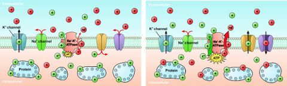
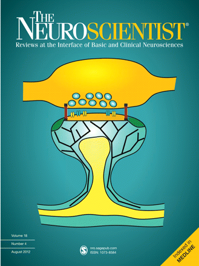

Im [Kinderzimmer](https://scilogs.spektrum.de/blogs/blog/graue-substanz/2012-01-06/wiege-und-wege-des-wissen) ist es samstagabends soweit, die maximale Unordnung wird erreicht. Maximale Unordnung, so lautet eine andere Formulierung des Wärmetodes. Solange diese Unordnung nur lokal erreicht ist, gibt es Hoffnung. Wie fleißige Eltern – oder Großmutter in unserem Fall – verhindern Ionenpumpen den Wärmetod im Gehirn. Darum geht es in einer Arbeit, die gerade publiziert wurde.\*

Wir schlagen vor, die elektrophysiologischen Vorgänge im Gehirn nach einem Schlaganfall als einen eben solchen Wärmetod anzusehen, um so einen thermodynamischen Referenzwert zu erhalten, bezüglich dem wir andere krankhafte Ereignisse im Nervengewebe messen können.

Nervenzellen beziehen ihre Energie aus einem Gefälle von elektrisch geladenen Teilchen, den Ionen. Außen sind viele Natrium- und Chlorid-Ionen. Die waren schon immer da, schon zu Zeiten als nur die Einzeller im kochsalzhaltigen Meer schwammen. Im Inneren der Zellen werden diese Ionensorten des Kochsalzes dagegen in deutlich geringer Konzentration gehalten und das geht nicht ohne Aufwand, da diese Ionen in die Zellen hinein diffundieren können, in der Richtung, die das Gefälle in der Konzentration ausgleichen würde. Also müssen aktive Ionenpumpen genau dies verhindern. Denn wenn alles gut durchmischt wird, ist dieses perfekte Gleichgewicht an Konzentrationen der Wärmetod.

Die Ionenpumpen brauchen für ihre Aufgabe Energie.

Wenn diese Energie fehlt, weil zum Beispiel die Blutversorgung verstopft ist, geht alles seinem thermodynamisch geregelten Gang dem Gleichgewicht entgegen. Die perfekt ausgeglichene Mischung setzt die Gibbs-Energie frei (früher freie Enthalpie genannt). Das ist die frei verfügbare Energie mit der Nervenzellen normalerweise kommunizieren. Dass alles ist eigentlich gar nicht wirklich neu.

Unbekannt war dagegen, wie zwei grundlegende, pathologische Ereignissen im Nervengewebe als Annäherung hin zu den thermodynamischen Gleichgewicht zu betrachten sind: epileptische Aktivität und die Ausbreitung von Depolarisationen (auch Spreading Depression genannt), wie sie u.a. bei Migräne eine Rolle spielen. Bei beiden ist noch Gibbs-Energie verfügbar. Nur wie viel?

Bei epileptischer Aktivität sogar noch recht viel. Bei Migräne dagegen kommt es zur nahezu vollständigen Freisetzung der Gibbs-Energie. Unsere Berechnungen zeigen bei einem schrittweisen Übergang von dem physiologisch gesunden Zustand zunächst sehr schnell die epileptische Aktivität und erst viel später die migränöse Depolarisation bis schließlich die Gibbs-Energie vollkommen freigesetzt wird. Das sind nicht wirklich schrittweise Übergänge. Zum einen unterscheidet sich die Epilepsie in vielen Aspekten vom Schlaganfall und Migräne. Zum anderen kann man die Migräneaura und den ischämischen Schlaganfall eher als ein Kontinuum betrachten.

Trotzdem kann man vereinfacht Epilepsie und Migräne als des Wärmetodes kleine Brüder sehen, wobei die Migräne der größere der beiden ist, der sich energetisch kaum unterscheidet. Wenn der Tod 22 Jahre alt ist, dann ist Migräne 19.5 Jahre, Epilepsie dagegen ist ein Kleinkind, noch keine 3 Jahre alt. Die elektrophysiologischen Vorgänge bei Migräne mit Aura erscheinen uns als ein Dämmerzustand dem Tode sehr nahe. Es ist eine der spannenden Fragen, warum (zum Glück) das Gehirngewebe immer noch gerade rechtzeitig die Kurve kriegt und sich von Migräne mit Aura erholt.

**Referenz:**

\* Dreier J.P., Isele T., Reiffurth C., Offenhauser N., Kirov S.A., Dahlem M.A., Herreras O. „Is Spreading Depolarization Characterized by an Abrupt, Massive Release of Gibbs Free Energy from the Human Brain Cortex?“ *Neuroscientist.* 2012 Aug 20. [doi](http://dx.doi.org/doi:10.1177/1073858412453340)
