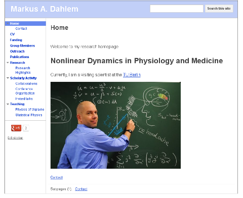
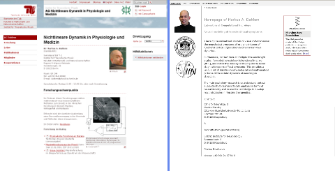

Umzüge sind lästig, ob Wohnung oder Homepage. Da ich ab Oktober für einige Zeit in die USA gehe, stellt sich die Frage, wohin mit meiner Homepage. Diese immer wieder mit umzuziehen, ist nicht nur Arbeit, es dauert auch, bis Google einen wieder findet. Einige Informationen kann man manchmal gar nicht mehr oder nur umständlich anbieten, da man sich dem  Corporate Design-Korsett der neuen heimatlichen Universitätswebsite anpassen muss. (Und dann ist da noch Typo3. Als ob man durch Marmelade geht.)

Also habe ich meinen CV mit einigen Bildern aus Vorträgen und Blog zusammen geschnürt. Herausgekommen ist meine [neue wissenschaftliche Homepage](https://sites.google.com/site/markusadahlem/), die unabhängig von der jeweils gerade aktuellen Institution bestand haben soll.

Kritik und Hinweise aller Art gerne hier in den Kommentaren. Wer sucht welche Informationen? Ich habe versucht, die Informationen zu bieten, die ich auch in einen detaillierten wissenschaftlichen Lebenslauf einbringe. Zusätzlich ein paar [Research Highlights](https://sites.google.com/site/markusadahlem/research/research-highlights), was hoffentlich für Studenten, die sich für eine Arbeit entscheiden, und auch andere Kooperationspartner interessant ist. Einige der Themen hatte ich zuvor im Blog schon aufgegriffen und ich weiß, dass viele Studenten das als Entscheidungshilfe lesen.

**Anhang**

So sahen übrigens zwei alte aus, ein kleines Andenken.

