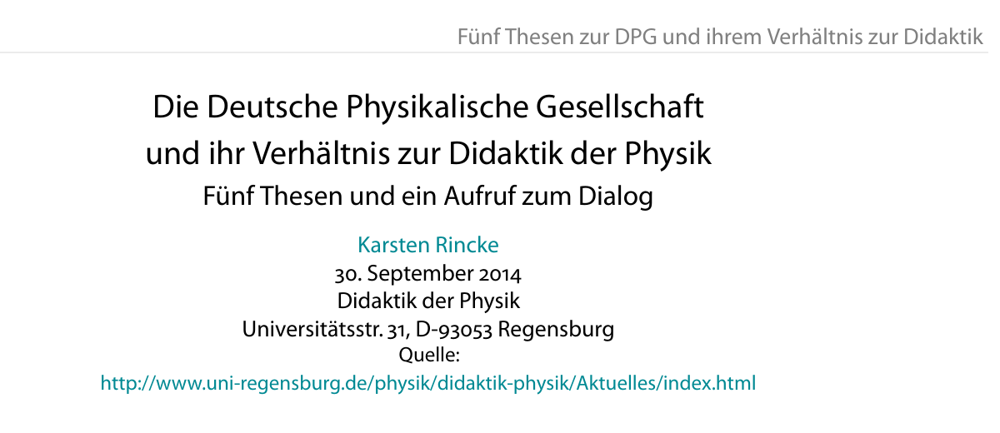

Längst geht es um mehr als nur um einen Physikkurs. Entwürdigt und nun erkennbar um Fassung bemüht will und kann eine Seite die Debatte nicht als beendet erklären. Schon gar nicht als [nach erzielter Einigung](http://www.dpg-physik.de/veroeffentlichung/stellungnahmen_gutachter/bericht-treusch.pdf) beigelegt. Zuletzt hatte die Fachdidaktik der Deutschen Physikalischen Gesellschaft (DPG) vorgeworfen, Defizite in ihrer wissenschaftlichen Diskussionskultur zu zeigen. Der Vorwurf war höflich, weil er in der rhetorischen Figur einer These und als Aufruf zum Dialog vorgetragen wurde. Trotzdem, Fachphysiker der DPG ficht das nicht mehr an, sie halten die Angelegenheit wohl längst für erledigt. So kann man das Schweigen interpretieren.

Hätte man nochmal eine Reaktion erwarten dürfen, oder ist Schweigen klüger? Worum geht es denn mittlerweile überhaupt noch, der Streit ist ja nun schon fast zwei Jahre alt?

Darauf gibt das [neue Thesenpapier](http://www.physik.uni-regensburg.de/forschung/rincke/Allgemeines/dpg-thesen-diskussion01.pdf) Anworten. Wenn man sieht, dass viele Fachdidaktikerinnen und Fachdidaktiker in den angehängt gleich mitveröffentlichten Kommentaren zustimmen, kann man zu dem Schluss kommen, dass sich die in insgesamt fünf Thesen formulierten scharfen Anmerkungen und Vorwürfe an die DPG wahrscheinlich nicht ignorieren lassen werden. Von einem Riss und tiefer Resignation ist die Rede, von Respekt versagen und überkommenen Sichtweisen das Wort reden, im Subtext sei der Verbleib der Didaktikerinnen und Didaktiker in der DPG in Frage gestellt, die Legitimität und Qualität eines Gutachten wird angezweifelt und all das gipfelt dann im testierten Defizit der wissenschaftlichen Diskussionskultur.

Es geht um die „Begeisterung für das Fach und … [den] Wunsch nach gelingender Vermittlung“ – soweit ist man sich auch noch einig. (Nebenbei bemerkt: dieser Teil ist auch für viele Wissenschaftsblogger zentrale Motivation – dort ist es aber sehr still, siehe Linkliste unten.) Dann entzweien sich die Ansichten. Was gilt als empirischer Beleg gelungener Vermittlung? In welchen Maß bringt sich hier die Systematik des Faches oder die Systematik des Lernens gestaltend ein?

Dass zwei Menschen, die man mit Begeisterung für das Fach Physik und gelungener Vermittlung verbindet, in diesem von einigen Didaktikern als Posse gebrandmarkten Zerwürfnis vorkommen, wundert nicht und wundert dann doch.

Da ist zum einen der DFG Communicator-Preisträger von 2013, Metin Tolan. Ihm wird eine nicht geringe Rolle in der Debatte zugeschrieben. Zum anderen denkt man unwillkürlich an Richard Feynman. Feynman kommt natürlich nur indirekt vor, obwohl der Physikkurs schon so alt ist, dass theoretisch Feynman ihn fast noch hätte erleben können, in seinem Todesjahr 1988 wurde er erstmal in 20 Schulen erprobt.

Als ich einige Seiten des Karlsruher Physikkurses las, wurde ich sofort an die Feynman Lectures erinnert. Irgendwie war alles anders. Damit will und kann ich noch gar nicht sagen, dass ich den Karlsruher Physikkurs für ähnlich gut halte.

Auch die [DFG-Gutachter](http://www.dpg-physik.de/veroeffentlichung/stellungnahmen_gutachter/Stellungnahme_KPK.pdf) hatten offensichtlich die gleiche Assoziation.

> Wenn Autoren meinen, die Physik müsse anders dargestellt werden, weil andere Konzepte, andere Begriffe und andere Maßeinheiten adäquater seien – wofür es gute Gründe geben mag – dann kann diese Diskussion nur nach den seit über 400 Jahren bewährten Regeln der empirischen Naturwissenschaft Physik geführt werden. Andernfalls kann der Anspruch, Physik wissenschaftlich fundiert darzustellen, nicht eingelöst werden. Die Feynman Lectures oder der Berkeley Physics Course sind berühmte und erfolgreiche Beispiele, wie neue Konzepte der Darstellung sogar sehr befruchtend gewirkt haben.

Nun ist mir nicht bekannt, das Richard Feynman in Demut vor den seit über 400 Jahren bewährten Regeln die Wirkung seiner neuen Lehrkonzepte erst einer empirischen Forschung unterzog hätte, bevor er sie veröffentlichte. Aber genau an dieser Stelle würde man ja nun zunächst wieder zwischen der Vorherrschaft der Systematik des Faches oder der Systematik des Lernens auswählen müssen, bevor man das Argument jeweils auf eine Art sezieren kann.

Wenn ich es richtig verstehe, argumentiert die eine Seite, die Feynman Lectures aber nicht der Karlsruher Physikkurs (KPK) würden sich an die Systematik des Faches halten. Die anderen sagen, der Karlsruher Physikkurs behauptet nichts falsches (wie es ihm vorgeworfen wurde) und die Fachdidaktik bringt notwendigerweise jedoch auch die Systematik des Lernens als empirische Forschungsrichtung ein. An welcher Stelle die Empirie hineinkommt, scheint mir also der zentrale Streitpunkt zu sein.

Das will ich nicht weiter ausführen. Wer sich schnell einlesen möchte sollte u.a. nach der Frage schauen, ob sich der KPK-Impulsstroms bzw. seine Richtung messen lässt. Wenn dem nicht so wäre bzw. wenn dies in einigen statischen Situationen mit konzeptionellen Schwierigkeiten verbunden wäre (spiegelsymmetrische Situationen vs. willkürliche Definitionen), ist dies allein ein Verstoß gegen die Systematik des Fachs Physik? Dazu s. z.B. den Vortrag von Matthias Bartelmann, gelistet bei den [Dokumente zur Diskussion zwischen Unterzeichnern eines Schreibens von Theoretischen Physikern und den Autoren des Gutachtens](http://www.dpg-physik.de/veroeffentlichung/stellungnahmen_gutachter/dokumente.html).

Ich selbst habe mir noch nicht umfassend genug meine Meinung bilden können, um heute schon Stellung zu beziehen. Konkret kann ich auch nicht (hinreichend schnell) etwas zum KPK-Impulsstrom sagen sondern nur in einem Punkt auf den Karlsruher Physikkurs fachgerecht eingehen, nämlich in Bezug auf die angebliche Deutung der Entropie als „Wärme“. Dazu später mehr.

Ich würde gerne von weiteren Wissenschaftsbloggern wissen, ob und wie sie sich in dieser Debatte verorten können. Denn Wissenschaft wissenschaftlich fundiert darzustellen geht uns ja auch an. Eine Neustrukturierung des Physikunterrichts würde ja nie nur auf die Schule begrenzt bleiben. Wäre eine solche radikale Neustrukturierung wirklich klar überlegen, würde sie nicht nur in den Bereich der Wissenschaftskommunikation überwandern sondern natürlich hinein in die Hochschulen zu den Fachphysikern.

Fühlen sie sich davon bedroht?

## Linksammlung

[Gutachterliche Stellungnahmen](http://www.dpg-physik.de/veroeffentlichung/stellungnahmen_gutachter/index.html) (DPG Webseite)

[Die DPG-Aktion gegen den](http://www.physikdidaktik.uni-karlsruhe.de/kpk/Fragen_Kritik/DPG.html)*[Karlsruher Physikkurs](http://www.physikdidaktik.uni-karlsruhe.de/kpk/Fragen_Kritik/DPG.html)* (KPK Webseite)

[Fünf Thesen zur DPG und ihrem Verhältnis zur Didaktik](http://www.physik.uni-regensburg.de/forschung/rincke/Allgemeines/dpg-thesen-diskussion01.pdf) (von Karsten Rincke)

**Blogbeiträge (wird aktualisiert)**

* [DPG kritisiert Karlsruher Physikkurs](http://scienceblogs.de/mathlog/2013/03/01/dpg-kritisiert-karlsruher-physikkurs/) (Mathlog, Thilo Kuessner)
