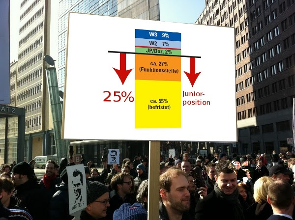

Dies ist für mich eine zentrale Frage. Eine Frage nach der Ehrlichkeit unseres deutschen Wissenschaftssystems und nicht nach der Ehrlichkeit seiner einzelnen Mitglieder. Ich halte diese für wichtiger und stelle sie mir seit langem. Erinnert wurde ich gestern daran durch ein Zitat Häberles in einem Artikel der Süddeutschen Zeitung [1].

> "*Der Doktorvater*", schreibt Häberle, 76, "*darf seine eigenen Wunschvorstellungen nicht in seinen Doktoranden projizieren, sondern muss gemeinsam mit ihm ein Thema finden, das dessen Talenten und Interessen, Möglichkeiten und Grenzen angemessen ist*." Dissertationen betrachtet er als "Gesellenstücke".

Meine Sorge gilt nicht Plagiaten im eigentlichen Sinn, sondern der Ausrichtung der Dissertation zwischen Auftragsarbeit und Gesellenstück. Wir haben heute mehr denn je die Möglichkeit Plagiate zu erkennen. In Zukunft erwarte ich durch das neue Bewusstsein dessen sogar einen deutlichen Rückgang.

Meine Befürchtung ist vielmehr, dass in Deutschland der Anteil der Dissertationen ohne eine eigene signifikante wissenschaftlich kreative Leistung höher ist als anderswo. Ich fürchte, dass Doktorväter wie Mütter Wunschvorstellung, ja ganze Forschungspläne auf ihre Doktoranden projizieren und diese sich artig anstellen diese Auftragsarbeit fertig zu stellen – handwerklich ohne Fehler und doch kein wissenschaftlich eigenständiges Gesellenstück.

Warum könnte dies im besonderen Maße ein deutsches Problem sein?

In Deutschland wird Forschung zu einem weit überdurchschnittlich hohen Anteil von wissenschaftlichen Mitarbeitern im Mittelbau betrieben. Also von Doktoranden und Postdoktoranden, die mit einem Anteil von 55% des hauptberuflichen wissenschaftlichen Personals das breite Fundament unserer Forschung bilden [2].

   
 *Quelle und weitere Information zur Grafik in [2].*

Letztlich liegt es natürlich in der Natur des Doktoranden (nicht nur in Deutschland) zur Gruppe der unselbständig Forschenden und Lehrenden zu gehören. Aber eine Unselbständigkeit aufgrund zahlreicher Beratungsgespräche, in denen der Fortschritt eingehend kontrolliert wird – um wieder mit Häberle zu sprechen – ist eine Sache. Eine andere die Unselbständigkeit aufgrund konkret vorgegebener Arbeitsschritte und Methoden, die es nur nach Schema auszuführen gilt, um dann an den unvermeidbar aufkommenden Hindernissen wieder eine kreativ den wegweisende Order zu erhalten.

Denn was ist das eigentliche Ziel einer Dissertation [3]?

> Ziel einer jeden Dissertation sollte sein, der Menschheit etwas grundlegend Neues mitzuteilen. Wenn von vornherein bei dem Doktoranden kein ernsthaftes Interesse daran besteht, eine wissenschaftliche Fragestellung über einen längeren Zeitraum hinweg vertieft zu betrachten, etwas wirklich Neues herauszufinden und sich durch Publikationen und Vorträge in der wissenschaftlichen Gemeinschaft zu etablieren, ist die Gefahr des Scheiterns groß. „Scheitern“ muss nicht unbedingt heißen, dass die Promotion nicht zustande kommt. Aber auch eine Promotion, die zwar abgeschlossen wurde, die aber im wissenschaftlichen Umfeld auf keinerlei Resonanz stößt, weil ihr kreativer Eigenbeitrag als beschränkt oder nicht relevant eingeschätzt wird, ist letztlich eine gescheiterte Promotion.

Anmerken möchte ich, dass wenn der größte kreative Beitrag vom Betreuer der Arbeit stammt, dies ebenso eine gescheiterte Promotion, wenn auch nicht eine gescheiterte wissenschaftliche Arbeit ist. Deswegen funktioniert das deutsche Wissenschaftssystem sehr gut.

Allein das Verhältnis zwischen selbständig und unselbständig Forschenden, also Professoren und Doktoranden ist in einer bemerkenswerten Schieflage. Die Ironie ist, dass es vielen selbständig Forschenden nur noch möglich ist, eigene Forschung zu machen, in dem sie ihre Ideen delegieren und damit einen Teil ihrer Doktoranden letztlich als Werkzeuge missbrauchen. Um *selbst* zu forschen fehlt die Zeit.  Forschung wird zur Betreuung. Die Lehre kommt dazu. Viel Zeit braucht auch die Beantragung neuer Drittmittel. Durchaus sinnvolle Zeit in der die ersten kreativen Ideen zu Forschungsplänen geschmiedet werden, die es dann auf die zusätzlichen Doktoranden zu projizieren gilt. Einen Teufelskreis in dem eigenständig forschen nicht mehr selbstständig genannt werden kann. Dadurch werden bei uns vermutlich mehr Doktorarbeiten zum unfreiwilligen Plagiat als in Ländern ohne diese Schieflage. Ein Problem dessen Ausmaß ich zwar nicht einschätzen kann, dass aber sicher größere ist, als das Ausmaß der echten Plagiate.

Dieses in der deutschen Wissenschaft wie Politik längst erkannte Strukturproblem [4] zu beheben ist eine Frage wir *ehrlich* wir Wissenschaft als Gesellschaft betreiben wollen. Es ist keine Frage wie erfolgreich wir Wissenschaft betreiben. Denn über die vernüpftigen Maße Doktortitel für die Wirtschaft und den Bundestag zu produzieren erzeugt zwar ganz sicher die falsche Erwartungshaltung Einzelner. Doch nicht notwendigerweise werden damit schlechte Ergebnisse in der Forschung erzielt. Zumindest dann nicht, wenn Professoren auch gute Manager sind.

Es lohnt auch ein Blick auf die Kostenrechnung um die Unehrlichkeit zu entlarven. Da drittmittelfinanzierte Doktoranden nicht Vollzeit bezahlt werden, sie sind schließlich *nur* für die Durchführung der vorgegebenen Forschungspläne eingestellt, die Durchführung der eigenständigen Dissertation erfolgt in der verbleibenden freien Privatzeit, ist dieses System sogar kostengünstig, da de facto weit *unter*tariflich finanziert. Zugleich führen wir den akademischen Karriereweg durch einen Flaschenhals. Dies verschärft die von Beginn an finanziel engen Lebenssituationen der Wissenschaftler auf ihren weiteren Weg und führt all zu oft in prekäre Arbeitsverhältnisse. Neulich wurde einem Kollegen von mir geraten "er müsse bereit sein auch mal ein halbes Jahr arbeitslos weiter zu forschen". Muss er nicht. Er ging.

Dies ist eine Frage der Ehrlichkeit, ja der Ehre unseres Wissenschaftssystems. Dies ist – für mich – die eigentliche Lüge der Bildungsrepublik.

**Facebook-Seite**

Mit dem Thema zwar verbunden aber letztlich davon unabhängig ist die Frage, wie hoch der Anteil des hauptberuflichen wissenschaftlichen Personals an deutschen Universitäten und gleichgestellten Einrichtungen eigentlich sein sollte. Dazu habe ich eine Facebook-Seite initiert.

Wenn Sie die Idee eines Anteils von ca. 25% des wissenschaftlichen Personals als akademische Juniorposition in Deutschland gut finden (dies sind nicht Stellen für Doktoranden, verbessert aber das Verhältnis Doktoranden zu Betreuern), klicken Sie bitte den Like-Button, oder besuchen Sie zunächste die [FB-Seite](http://goo.gl/4fRJt). Empfehlen möchte ich aber insbesondere die Lektüre [2] als Hintergrundinformation. Link als kurz URL: <http://goo.gl/4fRJt>

**Literatur und Quellen**

[1] "[Schmerzliche Entfremdung](http://www.sueddeutsche.de/karriere/guttenbergs-doktorvater-haeberle-schmerzliche-entfremdung-1.1064182)" von Rudolf Neumaier, Süddeutsche Zeitung, 24. Feb. 2011 (die Häberle-Zitate stammen aus "Pädagogische Briefe an einen jungen Verfassungsjuristen (Verlag Mohr Siebeck, 2010))

[2] Die Grafik bezieht sich nur auf das hauptberufliche wissenschaftliche Personal, also z.B. nicht auf Lehrbeauftragte, HiWis. Und auch nur auf solche an Universitäten und nicht auch auf Fachhochschulen u.ä.. Genauere Informationen sind in "[Die akademische Juniorposition zwischen Beharrung und Reformdruck](http://www.soziologie.uni-halle.de/kreckel/docs/kre-junpos-q.pdf)" von Prof. Reinhard Kreckel. Die Farbabbildung hier stammt allerdings aus "Zur Kooperation verpflichtet" von Prof. Reinhard Kreckel, *Forschung und Lehre*, 2009 Heft 5, Seite 331)

[3] "Warum promovieren wir?" von Prof. Oliver Günther, [*Forschung und Lehre*, 2009 Heft 7, Seite 484.](http://www.forschung-und-lehre.de/wordpress/Archiv/2009/07-2009.pdf)

[4] So ist z.B. die exzellente Analyse von Prof. Reinhard Kreckel [2] in den Bundesbericht zur Förderung des Wissenschaftlichen Nachwuchses ([BuWiN 2008](http://www.buwin.de/fileadmin/kisswin/download/BUWIN_download.pdf)) eingeflossen. Vergl. auch Website  "[Wissenschaftlicher Nachwuchs](http://www.gruene-bundestag.de/cms/hochschule/dok/352/352177.wissenschaftlicher_nachwuchs.html)" der Partei Bündnis 90/Die Grünen.

Quelle Bild im FB-Absatz: modifiziert – [Original](https://picasaweb.google.com/lh/photo/rgO6Iy6hV24DnnyPBWEhXA) von Guttbye-Demo am 26. 2. von Sebastian Jabbusch (CC BY-NC-SA 3.0)

**Link**

Kurze URL zu diesem Beitrag:

http://goo.gl/MADI0
