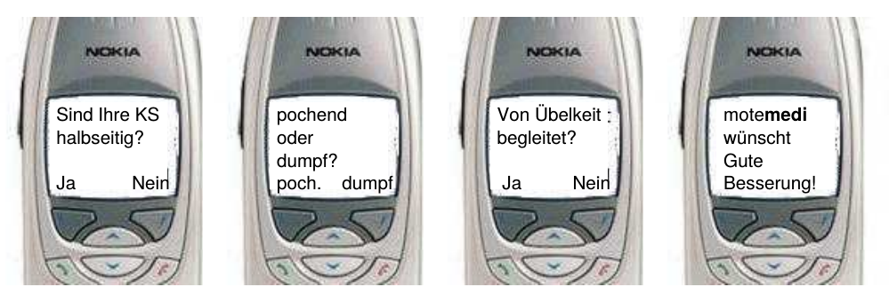
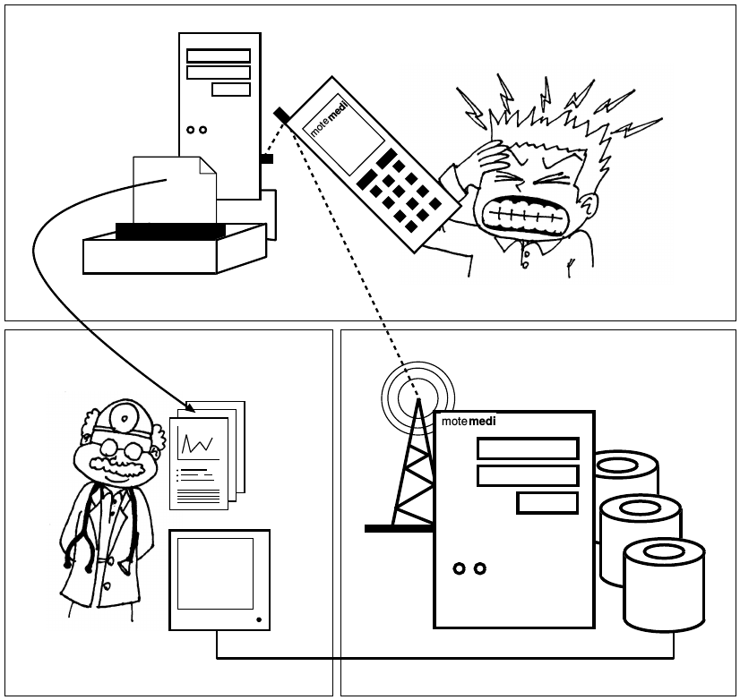
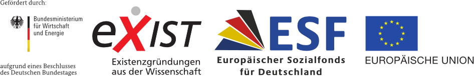
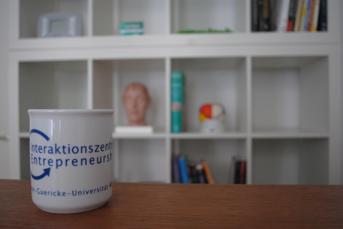

Als ich 2000 das erste mal darüber nachdachte, gab es Smartphones noch nicht. Apple sah seinen Pocket-PC „Newton“ nach als PDA an, einen Personal Digital Assistant. Das iPhone sollte erst sieben Jahre später auf den Markt kommen.

In dieser Zeit, wir reden nun vom Jahr 2003, wurde meines Wissens erstmals ein digitales Kopfschmerztagebuch in der Forschung eingesetzt. Dazu wurde Philips‘ PDA – der hieß Nino –  benutzt.1Ein Jahr später schrieb ich den ersten Geschäftsplan für „mote**medi**: *Mobile Telemedizinische Diagnostik*“.

Im Jahr 2000 hatte ich in meiner Doktorarbeit ein Verfahren entwickelt, das die Diagnose von Begleiterkrankungen bei Migräne-Patienten erleichtern kann2 und verfolge [das Thema Migräne-App bis heute](http://www.m-sense.de).

> *„Ihre Veröffentlichung ist die erste Darstellung meiner Sehstörungen, wie ich sie nenne, von Dritten. Dazu noch so treffend, wie ich sie selbst bislang noch nicht schildern konnte. Bisher musste ich sie immer den behandelnden Arzt beschreiben, was mir offensichtlich schlecht gelang und, wenn das richtig beurteile, immer auf gehörige Skepsis, teilweise Desinteresse, stieß.“*
>
> *(Auszug aus einem Leserbrief)*

Durch viele Gespräche mit Betroffenen und auch durch einige Leserbriefe, nachdem die Presse über meine Migräne-Forschung berichtete, wie dem oben gezeigten, wurde mir klar, wie groß das Bedürfnis von Menschen, die an Migräne leiden, ist, ihre Symptome besser den Ärzten kommunizieren zu können. Es war zudem schon absehbar, dass der Zusammenschluss drahtloser Kommunikationstechnik mit medizinischen Geräten hierbei helfen wird und damit die präventive Gesundheitsfürsorge radikal verändern könnte.

Anwendungen – heute sagt man Gesundheits-Apps – würden das Bild [des mündigen Patienten von einer ehemals visionären Vorstellung in ein reales Phänomen](http://www.aerzteblatt.de/archiv/56904/Arzt-Patient-Beziehung-im-Wandel-Eigenverantwortlich-informiert-anspruchsvoll) umsetzen. Jedoch noch nicht 2004.

Um zu jener Zeit wirklich mobil kommunizieren zu können, musste man statt eines PDAs ein Handy nutzen. Das sah dann so aus.

Die ertse Kopfschmerz-App: mote**medi**.

Migräne-App verbindet sich mit Referenzzentrum und synchronisiert Kopfschmerzdaten mit dem privaten PC. (Abb. aus Business-Plan „mote**medi**: *Mobile Telemedizinische Diagnostik*“, 2004)

Damals forschte ich an der Klinik für Neurologie der Otto-von-Guericke-Universität (OVGU) Magdeburg als Gruppenleiter des „Laboratory of Computational Neurology.“ Parallel nahm ich an einem einjährigen Qualifizierungsprogramm am [Interaktionszentrum Entrepreneurship](http://www.interaktionszentrum.de/Interaktionszentrum.html) teil. Das Zentrum gehört auch zur OVGU. Dessen Leiter, Prof. Matthias Raith, schaffte eine einzigartige, inspirierende Atmosphäre, in der viele Teams Ideen entwickeln konnten und noch heute können. In meinem fünfköpfigen Team dachten wir gemeinsam nach über die Möglichkeiten „mobiler telemedizischer Diagnoseverfahren, die einen entscheidenden Schritt zur erfolgreichen Behandlung chronischer Krankheiten leisten, indem sie automatisierte und zeitnahe Dokumentation der Krankheitssymptome ermöglichen“ (zitiert aus dem Executive Summary des Geschäftsplans von 2004).

Über zehn Jahre später – mit der notwendigen, weiteren Forschungsarbeit über [Computermodelle der Migräne, Biosignalverarbeitung und Datenassimilation](https://sites.google.com/site/markusadahlem/publications) – setzen wir nun [mit einem neuen Team](http://www.newsenselab.com/) den ursprünglichen Ansatz mit neuen Ideen gespickt gemeinsam um. Gefördert werden wir im Rahmen eines EXIST-Gründerstipendium vom Bundesministeriums für Wirtschaft und Energie, kofinanziert von den Europäischen Sozialfonds.

Wer Interesse an dem diesem Technologietransfer-Projekt hat, kann sich [in einen Newsletter eintragen](http://www.newsenselab.com/).

Als Uniprojekt mit einjähriger Laufzeit sind wir an der AG kardiovaskuläre Physik der Humboldt-Universität zu Berlin angegliedert. Diese AG hat sowohl in der Biosignalverarbeitung als auch in der Vorhersage extremer Ereignisse weltweit führende Forschungsarbeiten geleistet.

Das unten stehende Bild zeigt alt und neu: die Tasse des Interaktionszentrums Entrepreneurship in meinem neuen Büro in der [Humboldt-Innovation GmbH](http://www.humboldt-innovation.de/de/home.html), die genau wie die kardiovaskuläre Physik am Charité Campus in Berlin Mitte ihren Sitz hat.

## Literatur

1Giffin, N. J., et al., „[Premonitory symptoms in migraine: An electronic diary study](http://www.neurology.org/content/60/6/935.short).“ Neurology 60: 935-940; 2003.

2 M. A. Dahlem and E. P. Chronicle: A computational perspective on migraine aura, Prog. Neurobiol. 74, 351 (2004).
